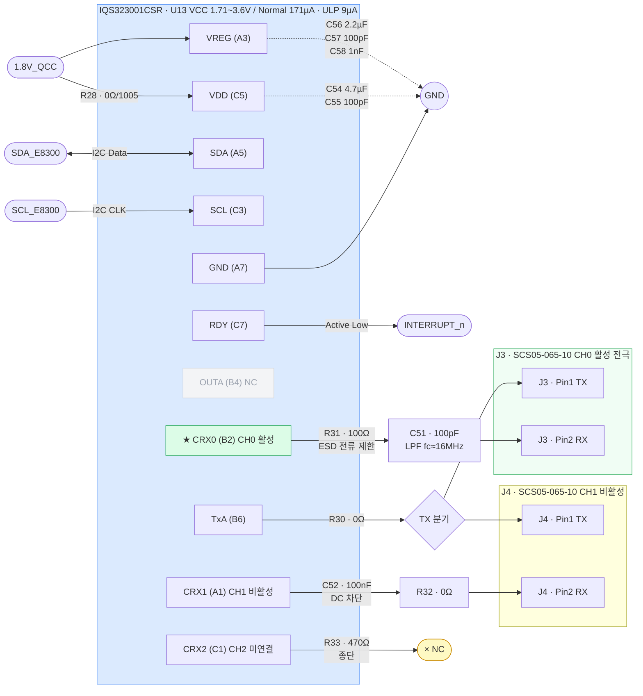

# IQS323 회로 구성 (Sound1)

**TL;DR**: IQS323001CSR(U13)을 1.8V_QCC로 구동. I2C(SDA/SCL/RDY)로 E8300에 연결. CH0(CRX0)만 활성 사용 — J3 커넥터를 통해 터치 전극 패드에 연결. CH1(CRX1)은 J4 커넥터에 배선 완료(비활성), CH2(CRX2)는 470Ω 종단 후 미연결.

---

## 0. 회로도



> [!NOTE]
> 점선(─ ─): 바이패스 캐패시터 경로. 실선(──): 신호·전원 경로. ★: 현재 활성 채널(CH0).

---

## 1. IC 기본 스펙

| 항목 | 값 |
|---|---|
| 부품 번호 | IQS323001CSR |
| 회로 레퍼런스 | U13 |
| VCC 범위 | 1.71 ~ 3.6V |
| VREG (내부 레귤레이터 출력) | 1.53V |
| 전류 소비 — Normal | 171 μA |
| 전류 소비 — Low | 50 μA |
| 전류 소비 — Ultra Low | 9 μA |

---

## 2. 핀 연결 요약

IQS323001CSR은 BGA 형태의 패키지로, 핀은 행(A·B·C) × 열(1·3·5·6·7) 좌표로 표기됩니다.

| 핀 좌표 | 핀 이름 | 연결 대상 | 비고 |
|---|---|---|---|
| C5 | VDD | 1.8V_QCC (R28 경유) | 전원 입력 |
| A3 | VREG | VDD 노드 (바이패스만) | 내부 레귤레이터 출력, 디커플링 필요 |
| A5 | SDA | SDA_E8300 | I2C 데이터 |
| C3 | SCL | SCL_E8300 | I2C 클럭 |
| C7 | RDY | INTERRUPT_n | 터치/RDY 이벤트 → E8300 인터럽트 (Active Low) |
| A7 | GND | GND | |
| B4 | OUTA | No Connect | 미사용 (X 마크) |
| B6 | TxA | R30 경유 → J3·J4 공통 | TX 전극 구동 |
| B2 | CRX0 | R31 → C51 → J3 | **CH0 — 현재 유일한 활성 채널** |
| A1 | CRX1 | C52 → R32 → J4 | CH1 — 배선 완료, SW 비활성 |
| C1 | CRX2 | R33 → No Connect | CH2 — 종단 후 미연결 |

---

## 3. 전원 회로

```
1.8V_QCC ──┬── R28 (0Ω/1005) ── VDD(C5)
           │                      │
           │        C54 4.7μF/0603 ┤
           │        C55 100pF/0603 ┤ → GND  (VDD 바이패스)
           │
           └─── VREG(A3)
                      │
                C56 2.2μF/0603 ┤
                C57 100pF/0603 ┤ → GND  (VREG 바이패스)
                C58   1nF/0603 ┘
```

- **R28**: 0Ω 점퍼 (1005 크기). 필요 시 페라이트 비드 교체 또는 전류 측정용 끊기 지점으로 활용 가능
- **C54/C56**: 대용량 벌크 캡 (저주파 안정화)
- **C55/C57**: 소용량 캡 (고주파 노이즈 억제)
- **C58**: 1nF 초고주파 필터

---

## 4. 디지털 인터페이스

| 신호 | 방향 | 연결 |
|---|---|---|
| SDA_E8300 | 양방향 | E8300 I2C 마스터 ↔ IQS323 슬레이브 |
| SCL_E8300 | E8300 → IQS323 | I2C 클럭 |
| INTERRUPT_n | IQS323 → E8300 | RDY 핀 (Active Low, 터치 이벤트 및 설정 완료 알림) |

> [!NOTE]
> `INTERRUPT_n`은 코드에서 Window-mode로 polling하거나 인터럽트로 활용 가능. 현재 구현은 `tdc_drv_iqs323_read_status()`에서 poll 방식 사용.

---

## 5. 아날로그 채널 회로

### 5.1 TxA — TX 전극 구동

```
TxA (B6) ── R30 (0Ω/0603) ──┬── J3 Pin 1
                              └── J4 Pin 1
```

- R30은 현재 0Ω (단락). TX 경로에 저항 삽입이 필요할 경우 교체 가능한 위치
- TxA는 J3·J4 두 커넥터의 동일 핀에 공통 연결 → 두 전극에 동일 TX 신호 인가

### 5.2 CH0 (CRX0) — 활성 채널

```
CRX0 (B2) ── R31 (100Ω/0603) ── C51 (100pF/0603) ── J3 Pin 2
```

- **R31 (100Ω)**: ESD 전류 제한 + 고주파 필터용 직렬 저항
- **C51 (100pF)**: RC 저역통과 필터 (fc ≈ 1/(2π × 100 × 100p) ≈ 15.9 MHz), 고주파 노이즈 차단
- **J3**: SCS05-065-10 스프링 핀 커넥터 → 제품 PCB의 터치 전극 패드로 연결

### 5.3 CH1 (CRX1) — 비활성 채널 (배선 완료)

```
CRX1 (A1) ── C52 (100nF/0603) ── R32 (0Ω/0603) ── J4 Pin 2
```

- **C52 (100nF)**: CH0(100pF)보다 1000배 큰 값 — DC 차단 또는 환경 노이즈 흡수 목적으로 추정
- **R32 (0Ω)**: 필요 시 저항 삽입 가능한 위치
- **J4**: SCS05-065-10 스프링 핀 커넥터 — 제2 전극 패드로 연결. SW에서 현재 미사용

> [!NOTE]
> C52가 100nF으로 CH0(100pF)과 값이 크게 다름. 직렬 100nF은 DC 및 저주파 신호 차단 특성이 있어, CH0과 다른 동작 방식(예: AC 결합, 노이즈 기준 채널 등)으로 설계된 것으로 보임. 실제 사용 전 데이터시트 확인 필요.

### 5.4 CH2 (CRX2) — 미연결

```
CRX2 (C1) ── R33 (470Ω/0603) ── No Connect (X)
```

- 470Ω 종단만 있고 전극 연결 없음 → 완전 미사용

---

## 6. 커넥터 정보

| 레퍼런스 | 부품 번호 | 핀 수 | 연결 채널 | 비고 |
|---|---|---|---|---|
| J3 | SCS05-065-10 | 2 | TxA(Pin1), CRX0(Pin2) | 활성 — 터치 전극 패드 |
| J4 | SCS05-065-10 | 2 | TxA(Pin1), CRX1(Pin2) | 비활성 — 배선만 완료 |

- **SCS05-065-10**: 스프링 핀 타입 보드-투-보드 커넥터. 제품 PCB와 센서 서브보드 간 탄성 접촉 방식으로 연결.

---

## 7. 현재 SW 사용 현황

| 채널 | HW 상태 | SW 상태 | 비고 |
|---|---|---|---|
| CH0 (CRX0) | J3 연결 완료 | **활성** | 터치 감지에 사용 |
| CH1 (CRX1) | J4 연결 완료 | **비활성** | `sensor_setup()`에서 CH1 disable 처리 |
| CH2 (CRX2) | No Connect | 비활성 | HW 자체 미연결 |

코드 위치: `tdc_drv_iqs323.c` → `sensor_setup()` 내 채널 설정 레지스터 참조.

---

## 8. ESD 관련 메모

현재 회로의 ESD 방어 요소:
- **R31 (100Ω)**: CRX0 직렬 저항 — ESD 방전 전류를 제한해 IC 입력 핀 보호
- **C51 (100pF)**: 고주파 노이즈 차단
- **R28 (0Ω)**: 전원 경로 페라이트 비드 미삽입 상태 — 전원 경유 ESD 취약

ESD 누적 문제 맥락:
- 실제 제품에서 2~3회 절전 반복 후 터치 먹통 발생 (GND 쇼트 시 정상 복귀)
- SW RESEED로는 해결 불가 — HW 개선 필요 (상세: [`IQS323-RESEED.md`](IQS323-RESEED.md))
- **향후 개선 검토안**: CH1(J4)을 guard electrode(능동 실드)로 활용 — PCB 상 CH0 전극 주변에 guard ring 패드 추가, TxA와 동위상으로 구동해 ESD 차폐
