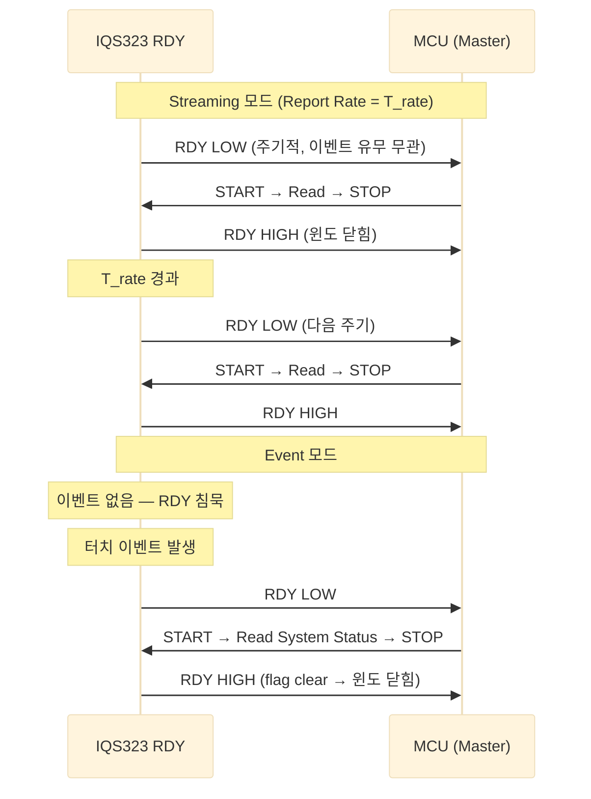
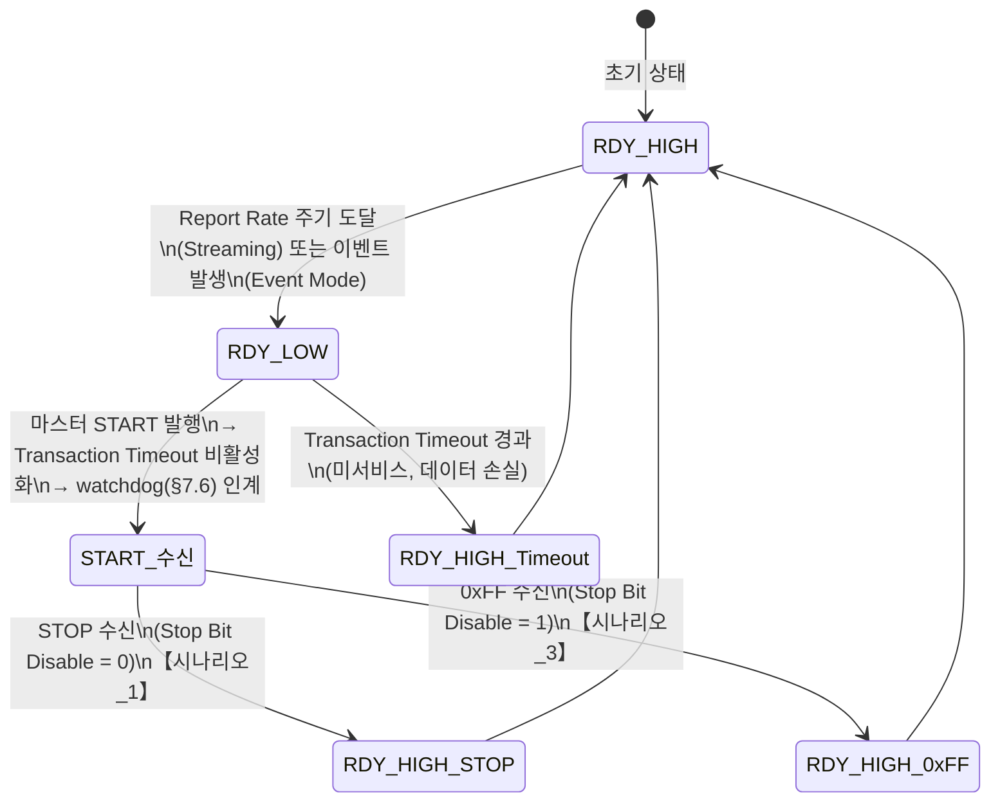

# IQS323 I²C Streaming 모드 RDY 타이밍 분석

> **TL;DR**: Streaming 모드에서 RDY LOW 주기 = 전력 모드별 Report Rate. ULP는 `Auto Prox Cycle Select × ULP Report Rate`가 실효 주기. 통신 윈도 닫힘 조건은 STOP·Transaction Timeout·0xFF 세 가지이며, t_Low는 "마스터 서비스 완료까지" 또는 "Timeout 경과까지(기본 200 ms)"로 결정된다. t_High = 주기 − t_Low이므로 report rate < timeout이면 이론상 윈도가 닫히기 전에 다음 주기가 도달하는 모순 — 실제로는 report rate를 transaction timeout보다 짧게 설정하지 않는 것이 전제임.

> [!NOTE]
> 원문 근거 표기 규칙: 섹션 번호 직접 명시. 원문에 없는 추론은 **"원문 미명시 — 논리적 추론"** 으로 구분.

## 실행 메타

| 항목 | 내용 |
|---|---|
| 역할(페르소나) | 스트리밍 모드 메커니즘 분석가 (노드 02) |
| 서브에이전트 | general-purpose |
| 모델 · Effort | Sonnet (claude-sonnet-4-6) · 목표 high — Agent 도구에 effort 인자 부재로 호출 미지정, 세션 기본값 상속 |

---

## 1. Streaming vs Event 모드 차이

### 1.1 RDY LOW 조건 비교

| 항목 | Streaming 모드 (§8.11.1) | Event 모드 (§8.11.2, §8.12) |
|---|---|---|
| RDY LOW 트리거 | 전력 모드별 Report Rate마다 **무조건** | 활성화된 이벤트 중 하나 이상 발생 시 + 디바이스 리셋 시 |
| 이벤트 없을 때 | RDY 계속 토글 (매 주기) | RDY 침묵 |
| 사용 권장 | 개발·디버깅 단계 임시 | **운영 환경 기본** (마스터가 불필요한 인터럽트 원치 않음) |

**원문 근거**

> §8.11.1: *"In I2C streaming mode data is constantly reported at the relevant power mode report rate"*

> §8.11.2: *"In event mode the RDY line will only go low when one or more of the enabled events are triggered or if the device resets."*

> §8.12: *"The global event flags are cleared when the master reads them via I2C. When they are set, the IQS323 will continuously provide ready windows."*

### 1.2 타이밍 다이어그램



---

## 2. Streaming 모드 RDY 주기 = Report Rate

### 2.1 전력 모드별 Report Rate 대응

§8.11.1 원문: *"data is constantly reported at the relevant power mode report rate specified in milliseconds by the Normal Power Report Rate, Low Power Report Rate and Ultra Low Power Report Rate registers."*

| 전력 모드 | Report Rate 소스 레지스터 | RDY 주기 | 비고 |
|---|---|---|---|
| **NP (Normal Power)** | `Normal Power Report Rate` | T_NP ms | 빠름, 높은 CPU 부하 |
| **LP (Low Power)** | `Low Power Report Rate` | T_LP ms | NP보다 느림 |
| **ULP (Ultra Low Power)** | `Auto Prox Cycle Select` × `Ultra Low Power Report Rate` | T_ULP ms (수식 참고) | 아래 §2.2 참고 |

### 2.2 ULP 실효 주기 공식

§8.11.1 원문:

> *"In ULP power mode the report rate is: (Auto Prox Cycle Select × Ultra Low Power Report Rate) ms"*

> *"Where Auto Prox Cycle Select is defined in the Prox Input and Control register."*

$$T_{\text{ULP}} = \text{Auto Prox Cycle Select} \times \text{Ultra Low Power Report Rate (ms)}$$

**의미**: ULP에서는 지정된 채널만 `Ultra Low Power Report Rate` 주기로 샘플링하고, 전체 채널 보고(RDY 토글)는 `Auto Prox Cycle Select`번에 1회만 일어난다. 즉 wake-up 채널은 촘촘하게 샘플링하되 마스터에 보고하는 주기는 그것보다 훨씬 길게 설정할 수 있는 구조다 (§5.2 ULP 설명과 일치).

**예시** (원문 미명시 — 논리적 추론):
- `Ultra Low Power Report Rate = 10 ms`, `Auto Prox Cycle Select = 50`이면
- T_ULP = 50 × 10 ms = **500 ms** → RDY가 0.5초마다 LOW

---

## 3. Communication Window 닫힘 조건별 t_Low 시나리오

### 3.1 윈도 열림 조건 (공통)

§8.7: *"When the device has data for the master, it will pull the RDY line low. This indicates that the device has opened its communications window."*

→ **t_Low 시작**: IQS323이 RDY를 LOW로 구동하는 순간

### 3.2 시나리오별 t_Low

| 시나리오 | 윈도 닫힘 조건 | t_Low 지속 시간 | 원문 근거 |
|---|---|---|---|
| **시나리오_1**: 마스터 정상 서비스 | I²C STOP 수신 | START → STOP 구간 (보통 수십 µs ~ 수 ms) | §8.9 *"A standard I²C STOP will close the current communication window."* |
| **시나리오_2**: 마스터 미응답 | I²C Transaction Timeout 경과 | Transaction Timeout 값 (기본 200 ms, 설정 범위 2~230 ms) | §8.8 *"If the communication window is not serviced within the time specified … the communications window is closed (RDY goes high)."* |
| **시나리오_3**: Stop Bit Disable 활성 시 0xFF 종료 | 0xFF end comm 커맨드 수신 | START → 0xFF 전송 완료 시까지 | §8.9 *"If the Stop Bit Disable bit … is set, the device will not respond to a standard I²C STOP … must be terminated using the end communications command (0xFF)"* |

> [!IMPORTANT]
> **시나리오_2에서 t_Low 측정 기준**: §8.8 원문 *"The I2C Transaction Timeout is measured from the start of the communications window (RDY goes low)."* — RDY LOW 구동 시점부터 타이머가 시작된다.

> [!NOTE]
> **시나리오_2 추가 규칙 (§8.8)**: 마스터가 START condition을 내보내는 순간 Transaction Timeout이 비활성화되고 §7.6 watchdog이 제어권을 넘겨받는다. 즉 t_Low는 "START 이전"과 "START 이후"로 타이머가 달라진다.

### 3.3 윈도 닫힘 조건 상태 다이어그램



---

## 4. t_High = 주기 − t_Low 관계 및 모순 해석

### 4.1 기본 관계

**원문 미명시 — 논리적 추론**:

Streaming 모드에서 RDY는 주기적으로 LOW가 되므로:

$$T_{\text{rate}} = t_{\text{Low}} + t_{\text{High}}$$
$$t_{\text{High}} = T_{\text{rate}} - t_{\text{Low}}$$

- `T_rate`: 전력 모드별 Report Rate (NP/LP/ULP)
- `t_Low`: RDY LOW 지속 시간 (윈도 열린 동안)
- `t_High`: RDY HIGH 지속 시간 (다음 주기까지 대기)

### 4.2 "Report Rate < Transaction Timeout" 모순처럼 보이는 상황 해석

**질문**: Transaction Timeout 기본값이 200 ms인데, Report Rate가 예컨대 20 ms라면 — 200 ms가 경과하기 전에 다음 윈도가 열려야 하는 모순이 발생하지 않는가?

**해석** (원문 미명시 — 논리적 추론 + §8.8 원문 구조 기반):

실제 동작 시나리오는 두 가지다:

> [!NOTE]
> **시나리오 A — 마스터가 정상 서비스하는 경우 (정상 케이스)**
>
> - RDY LOW → 마스터 START → STOP → t_Low 종료 (수 ms 이내)
> - t_High = T_rate − t_Low ≈ T_rate (대부분)
> - Transaction Timeout은 발동하지 않음 → 200 ms는 무관
> - 다음 주기에 다시 RDY LOW

> [!WARNING]
> **시나리오 B — 마스터가 미응답 + Report Rate < Transaction Timeout인 경우 (비정상)**
>
> - Report Rate = 20 ms, Transaction Timeout = 200 ms라고 가정
> - RDY LOW @ t=0 (1번째 윈도)
> - 마스터 미응답 → 200 ms 경과 전, t=20 ms에 IQS323이 다음 사이클 보고 시점 도달
>
> **이 시점에서 어떤 동작이 일어나는가?**
>
> 원문은 이 충돌을 명시적으로 설명하지 않는다. 그러나 §8.8이 "processing continues as normal"이라고 명시하고 §8.11.1이 "data is constantly reported at the report rate"라고 명시하는 점을 종합하면:
>
> **원문 미명시 — 논리적 추론**:
> 1. 이미 열린 윈도가 유지되는 동안 새 사이클 데이터가 내부에 갱신되지만 RDY는 이미 LOW 상태이므로 새로 LOW로 구동할 필요 없음
> 2. 실질적으로 하나의 긴 윈도가 지속되는 것처럼 동작할 가능성이 높음
> 3. 또는 IQS323 내부에서 기존 윈도를 닫고 즉시 새 윈도를 열어 데이터를 갱신할 수 있음 (RDY HIGH → 즉시 LOW의 짧은 펄스)
>
> **실용적 결론**: Report Rate는 Transaction Timeout보다 **충분히 길게** 설정하는 것이 설계 의도다. 즉 정상 운영에서는 마스터가 Transaction Timeout이 만료되기 전에 항상 서비스하거나, Report Rate 자체가 Timeout보다 길어야 한다. 반대로 Transaction Timeout을 Report Rate보다 짧게 설정하면 마스터가 서비스하지 않아도 IC가 자동으로 윈도를 닫고 다음 사이클을 진행할 수 있다.

### 4.3 권장 설정 관계 요약

```
정상 동작 조건 (원문 미명시 — 논리적 추론):

  Transaction Timeout  ≤  Report Rate

  예) NP Report Rate = 100 ms, Transaction Timeout = 50 ms
      → 마스터가 50 ms 안에 서비스 못 하면 윈도 닫힘
      → 100 ms 후 새 윈도 열림
      → t_High ≈ 50 ms (timeout) + (100−50) ms = 100 ms 총 주기 유지
```

---

## 5. 핵심 결론 요약

### 5.1 모드 차이

| 비교 항목 | Streaming | Event Mode |
|---|---|---|
| RDY LOW 조건 | 무조건 주기적 (Report Rate) | 활성화된 이벤트 발생 시만 |
| 이벤트 없는 구간 | RDY 계속 토글 | RDY 침묵 |
| 마스터 CPU 부하 | 높음 | 낮음 (권장) |
| 디버깅 편의성 | 높음 | 보통 |

### 5.2 주기 관계

$$T_{\text{RDY}} = \begin{cases}
T_{\text{NP Report Rate}} & \text{(Normal Power)} \\
T_{\text{LP Report Rate}} & \text{(Low Power)} \\
\text{Auto Prox Cycle Select} \times T_{\text{ULP Report Rate}} & \text{(Ultra Low Power)}
\end{cases}$$

### 5.3 시나리오별 t_Low 표

| 시나리오 | 닫힘 트리거 | t_Low | 원문 섹션 |
|---|---|---|---|
| **시나리오_1**: 정상 서비스 | I²C STOP | START 발행 ~ STOP 완료 (수십 µs ~ 수 ms) | §8.9 |
| **시나리오_2**: 마스터 미응답 | Transaction Timeout | RDY LOW부터 Timeout 값까지 (기본 200 ms, 범위 2~230 ms) | §8.8 |
| **시나리오_3**: Stop Bit Disable + 0xFF | 0xFF 커맨드 수신 | START 발행 ~ 0xFF 전송 완료 | §8.9 |

> [!NOTE]
> **시나리오_1 t_Low 세부**: START condition 수신 후 Transaction Timeout이 비활성화되고(§8.8) §7.6 watchdog이 인계받으므로, 실제 t_Low 상한은 Timeout이 아닌 watchdog 타이머가 결정한다.

> [!WARNING]
> **시나리오_2 데이터 손실**: §8.8 원문 *"the data for the closed window will be lost"* — Transaction Timeout으로 닫힌 윈도의 이벤트 데이터는 영구 손실된다.
