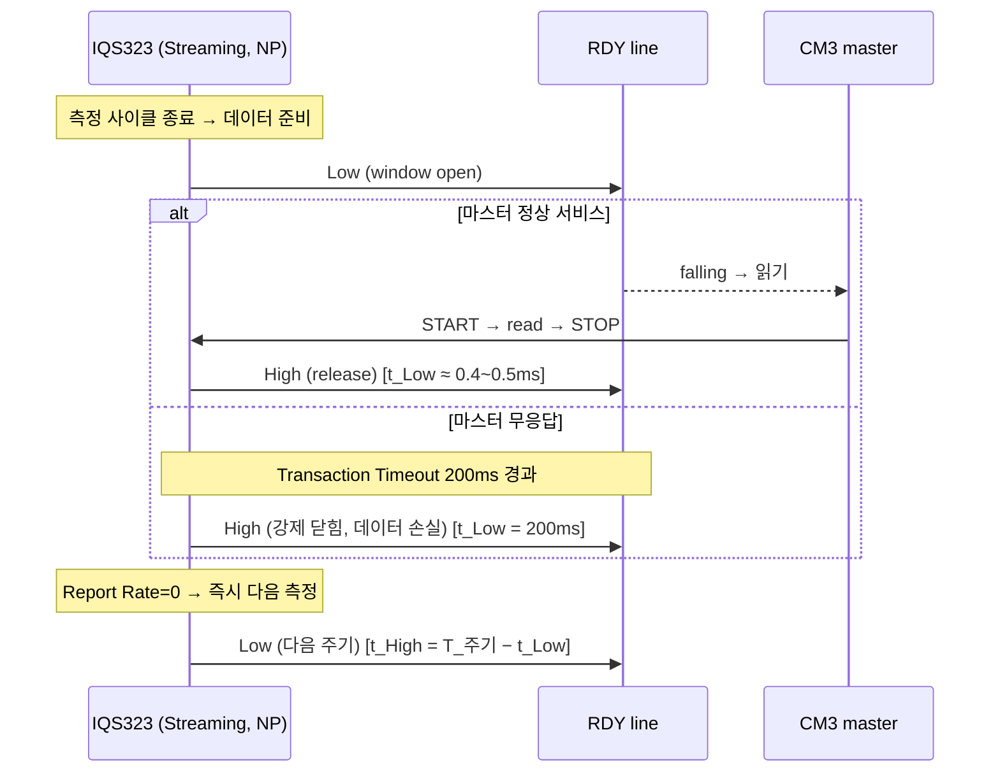

# IQS323 스트리밍 모드 RDY 윈도우 타이밍 — 종합 결론

> **TL;DR**: 기본 세팅(=Sound1 적용값)은 **Streaming + Normal Power + Report Rate 0ms + Transaction Timeout 200ms**. RDY는 **측정 사이클이 끝날 때마다 Low로 떨어져 통신 윈도우를 연다**. ▸ **t_Low**(통신 시) ≈ **0.4~0.5ms**(트랜잭션), 마스터 무응답 시 최대 **200ms**(Timeout)까지. ▸ **T_주기**는 Report Rate=0이라 "최대 속도"로 측정 사이클 시간에 좌우 → **실측 필요**(참고 상한 16ms 부근). ▸ **t_High = T_주기 − t_Low**.

> [!IMPORTANT]
> 본 결론은 데이터시트 원문(SSOT) + Sound1 코드 ground truth 교차검증 결과다. 근거·반론은 [`1_분석_*.md`](.) 5종과 [`2_검증_핵심수치.md`](2_검증_핵심수치.md) 참조.

---

## 1. 한눈에 보는 답

| 항목 | 값 | 비고 |
|---|---|---|
| 통신 모드 | **Streaming** | 매 측정 사이클마다 RDY Low (이벤트 유무 무관) |
| 전력 모드 | **Normal Power** | 자동 강하 없음(Timeout=0) |
| **T_주기** (RDY Low→다음 Low) | **= 1 측정 사이클 시간** (Report Rate=0 → "as fast as possible") | 데이터시트 단일값 없음. **실측 필요**. 참고: §3.4 self-cap 3ch NP 예시 16ms |
| **t_Low** (RDY Low = 통신 윈도우) | **정상 통신 시 ≈ 0.4~0.5ms** / **무응답 시 최대 200ms** | SCL≈128kHz·2~3byte 기준 / Transaction Timeout |
| **t_High** (RDY High = release) | **T_주기 − t_Low** | 통신을 빨리 끝낼수록 길어짐 |
| STOP 후 RDY High 복귀 | **원문 미명시** (open-drain RC 의존) | "~200µs"는 추정치, 원문 부재 |

## 2. RDY가 토글되는 메커니즘 (Streaming)

1. IQS323이 한 번의 **측정(conversion) 사이클**을 끝내면 새 데이터가 준비된다.
2. 데이터가 준비되면 **RDY 라인을 Low로 당긴다** → communication window **open** (§8.7).
3. 마스터(CM3)가 이 윈도우 안에서 I²C로 데이터를 읽는다.
   - **정상**: START→read→STOP → STOP 즉시 윈도우 닫힘 → RDY release(High). t_Low ≈ 트랜잭션 길이.
   - **무응답**: 마스터가 안 읽으면 **Transaction Timeout(200ms)** 경과 후 IC가 윈도우를 강제로 닫음(RDY High) → **그 사이클 데이터 손실**, 처리는 계속 (§8.8).
4. Report Rate=0이므로 IC는 즉시 다음 측정 사이클을 시작 → 다시 RDY Low. 이것이 주기 반복.

## 3. 핵심 해설

### 3.1 "주기"가 단일 숫자가 아닌 이유
Report Rate 레지스터(0xC1~C3)가 **0ms**(기본·Sound1)이면 IC는 보고를 지연시키지 않고 **측정이 끝나는 즉시** RDY를 내린다. 따라서 주기는 *측정 사이클 자체의 소요 시간*과 같고, 이는 **ATI Target·conversion frequency·활성 채널 수**에 따라 달라진다. 데이터시트 §3.4 전류표의 "self-cap 3ch, NP, 16ms"는 특정 측정 조건(ATI Target 512, Fxfer 500kHz, Event mode)에서의 예시 report rate이므로, Sound1 실제 주기의 **참고 상한**으로만 본다. 정확한 값은 RTT/오실로스코프 실측이 필요하다(미해결_1).

### 3.2 "Report Rate 0 < Transaction Timeout 200ms"는 모순이 아니다
두 파라미터는 독립이다. Timeout은 마스터가 **윈도우를 서비스하지 못했을 때만** 발동하는 안전장치다. 마스터가 매 윈도우를 200ms 안에 정상 서비스하면 Timeout은 절대 발동하지 않는다(검증반론 명제_3). 따라서 실사용 t_Low는 트랜잭션 길이(sub-ms)다.

### 3.3 Sound1 실무 함정 — 폴링 vs 고속 RDY
Sound1은 RDY를 인터럽트가 아닌 **GPIO busy-wait 폴링**으로 감지하며, 상위 터치 폴링 간격은 **200ms**(`TDC_TOUCH_POLL_INTERVAL`)다. IC는 Report Rate=0으로 RDY를 **고속 토글**하지만 마스터는 드물게 읽으러 간다.

> [!WARNING]
> 고속 RDY ↔ 저빈도 폴링의 불일치로 **대다수 통신 윈도우가 서비스되지 못하고 닫힌다**(데이터 손실은 정상 동작 — reference는 IC가 자체 갱신). 실시간 이벤트 포착이 필요하면 §8.11.2 **Event Mode + falling-edge 인터럽트** 전환이 데이터시트 권장 패턴이다(개선 스터디 [`../제어 재설계 분석·권고.md`](../제어%20재설계%20분석·권고.md) Phase 3와 연계).

## 4. 실측 권고 (남은 미해결 해소)

| 측정_번호 | 측정 대상 | 방법 |
|---|---|---|
| 측정_1 | T_주기 (RDY Low 간 간격) | 오실로스코프 RDY 핀 / RTT 타임스탬프 — NP·실제 채널 구성에서 |
| 측정_2 | t_Low (정상 트랜잭션 폭) | RDY Low↔STOP 구간 캡처 |
| 측정_3 | STOP 후 RDY High 복귀 지연 | RDY rising edge 캡처 (RC 시정수 확인) |

---

### 부록 — "기본 세팅" 양면 정리

| 해석 | 통신 모드 | 전력 | Report Rate | Timeout | 결론 |
|---|---|---|---|---|---|
| 칩 reset default | Streaming | NP | 0ms | 200ms | 동일 |
| Sound1 적용값 | Streaming | NP | 0ms(미변경) | 200ms(미변경) | **칩 default와 일치** |

→ 두 해석이 일치하므로 답은 단일하다.
