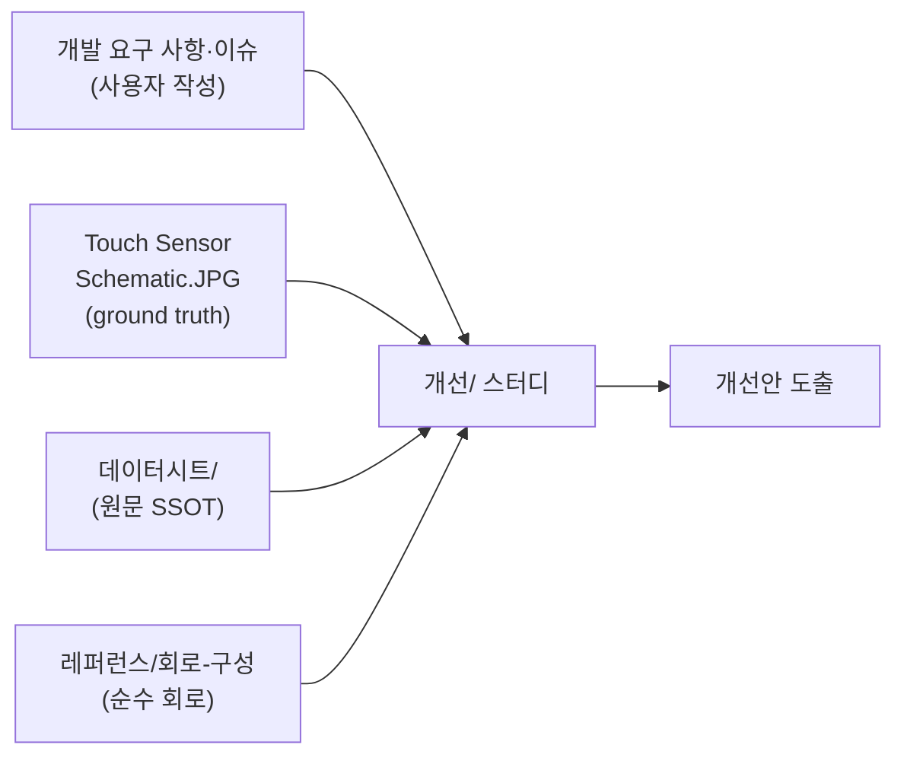

# IQS323 터치 개선 스터디 (색인)

> **TL;DR**: IQS323 터치를 전원 스위치로 쓰는 Sound1의 개선 스터디 공간. 회로·펌웨어·데이터시트 분석을 기반으로 **zero-base 다중 에이전트 재설계 탐구**를 수행해 [`제어 재설계 분석·권고.md`](제어%20재설계%20분석·권고.md)로 종합(2026-06-11). 결론: 진짜 문제는 `Reseed` 시점 baseline 오염 → "Reseed 노터치 게이트 + ATI Full 복귀" 단계적 권고.

> [!NOTE]
> 본 폴더는 **개선 스터디**(분석·검토 작업 공간)다. 순수 회로 레퍼런스는 [`../레퍼런스/IQS323-회로-구성.md`](../레퍼런스/IQS323-회로-구성.md), 데이터시트 원문은 [`../데이터시트/`](../데이터시트/), 사용 시나리오·이슈 원본은 [`../개발 요구 사항 및 예상 문제 정리.md`](../개발%20요구%20사항%20및%20예상%20문제%20정리.md), 과거 트러블슈팅은 [`../이슈해결/`](../이슈해결/).

---

## 목적

은수님 "해결방안 요구사항": ① 지금까지의 처리 방식(self-cap·FIXED·주기 방전·CalCap)이 **올바른지 검토**, ② 더 좋은 방법·개선안 도출. 이를 위해 회로·데이터시트·현재 구현·이슈를 한데 모아 단계적으로 스터디한다.

## 문서

| 문서 | 상태 | 내용 |
|---|---|---|
| [회로 구성·분석](회로%20구성·분석.md) | ✅ 작성 | 실제 회로도(JPG) 기준 회로 전수 + 데이터시트 권장 대조 + 현재 구현·이슈의 회로적 해석 + 개선 검토 포인트 |
| [펌웨어 구현·시퀀스 분석](펌웨어%20구현·시퀀스%20분석.md) | ✅ 작성 | 코드 ground truth 기준 SW 전수 — 2계층 구조·초기화·apply_settings 9단계·CH1 CalCap 더미·ATI FIXED·200ms 방전·전원모드 연계·통신 + 요구사항/데이터시트 대조 + SW 쟁점 |
| [**제어 재설계 분석·권고**](제어%20재설계%20분석·권고.md) ★ | ✅ 작성 | **zero-base 재설계 탐구 종합 권고** — 진단(진짜 문제=Reseed 오염원)·권고(Reseed 노터치 게이트 + ATI Full 복귀)·단계적 로드맵·실측 게이트 3종 |
| [**은수님 안 평결·하이브리드 권고**](은수님%20안%20평결·하이브리드%20권고.md) ★ | ✅ 작성 | 은수님 제안(auto-ATI+빠른BETA) 다관점 검증 평결 + 하이브리드 권고(은수님 통찰 ⊕ 이전 결론) |
| [생각정리/](생각정리/) | ✅ 17문서 | zero-base 탐구 과정 — 방법론·문제정의·설계안 6·비판 6·쟁점해결·타당성검증·종합결론 |
| [은수님 의견 비교 분석/](은수님%20의견%20비교%20분석/) | ✅ 9문서 | 은수님 안 검증 과정 — 입력·6 페르소나 분석·adversarial 검증·종합평결 |
| [**방전·autoATI 공존 권고**](방전·autoATI%20공존%20권고.md) ★ | ✅ 작성 | auto-ATI 중 CRX0 방전 공존 평결 — Full 상시 불가/auto Re-ATI 끄면 가능, **현재 방전 진위(0x30=VSS?) 실측 최우선** |
| [방전·autoATI 공존 검토/](방전·autoATI%20공존%20검토/) | ✅ 8문서 | 검토 과정 — 입력·5 페르소나 분석·adversarial 검증·종합평결 |
| [**J3 전하누적 가설 평결**](J3%20전하누적%20가설%20평결.md) ★ | ✅ 작성 | C51 DC블로킹→전하누적 가설 평결 — 회로 토폴로지 맞으나 단독 약함, **SW 드리프트(주)+C51 물리누적(부) 가산**, C51 단락 실측이 가름 |
| [J3 전하누적 가설 검토/](J3%20전하누적%20가설%20검토/) | ✅ 8문서 | 검토 과정 — 입력·5 페르소나 분석·adversarial 검증·종합평결 |
| [**RDY 윈도우 타이밍**](RDY%20윈도우%20타이밍.md) ★ | ✅ 작성 | 기본 세팅·Streaming RDY High/Low/주기 한 장 요약 — Low≈0.4~0.5ms/주기=측정사이클(실측), 200µs 원문부재 |
| [RDY 윈도우 타이밍 분석/](RDY%20윈도우%20타이밍%20분석/) | ✅ 8문서 | 분석 과정 — 입력·5 페르소나(데이터시트·스트리밍·레지스터·펌웨어·검증반론)·교차검증·종합결론 |

## 진행 현황 · 로드맵

> [!NOTE]
> **zero-base 재설계 탐구 완료(2026-06-11)** — 6관점 발산·18비판·6 blocking 검증·4해법 토론(다중 에이전트)을 거쳐 [제어 재설계 분석·권고](제어%20재설계%20분석·권고.md)로 종합. **진짜 문제는 `Reseed` 시점 baseline 오염**으로 수렴(autoATI·Release UI 아님).

| Phase | 작업 | 상태 |
|---|---|---|
| 0 | 문서·코드 정정(웜부트 B4 등) | 권고 |
| 1 ★ | Reseed 노터치 게이트 (이슈 1~4 진입오염) | 권고·최우선 |
| 2 | FIXED → ATI Full 복귀 (이슈 6·8·9 드리프트·카운트변동) | 권고 |
| 3 선택 | RDY 이벤트모드(폴링 폐지) | 권고 |
| 4 보류 | Release UI (실측 게이트 후) | 보류 |

**실측 게이트(선행 필수)**: ① 오염 실채널(auto-ATI vs Reseed) ② self-cap 1ch 전류·절전예산 ③ 0x30 LSB Linearise 비트.

## 참조 맵

