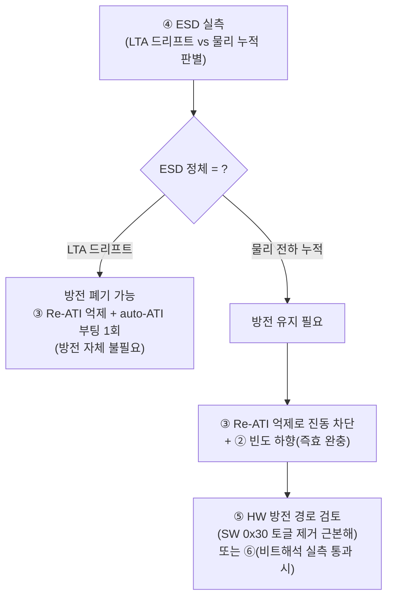

# C4 · 대안 설계자 — Q6 대안 6종 평가

> **TL;DR**: 공존(200ms CRX0 방전 + auto-ATI Full)은 **불가에 가까운 조건부불가**다. 방전(0x30 채널 토글)과 auto-ATI/Re-ATI는 같은 0x30·같은 LTA를 두고 충돌하고, Full auto-ATI는 I²C 무응답 실증까지 있다. 대안 6종 중 **단독 1등 해는 없고**, 권장 조합은 **③(Re-ATI 억제: 부팅 1회 ATI Full + 이후 ATI Disabled/수동 Re-ATI) + ④(ESD 실측으로 방전 존폐 결정) + ⑤(HW 방전 경로 — 실측이 방전 필요로 나올 때)**다. ②(빈도 하향)는 즉효 완충재, ①(시간분리)는 ③ 채택 시 거의 불필요, ⑥(다른 경로 방전)은 데이터시트 비트해석 미확정으로 게이트 뒤. 모든 판정의 분기점은 **"ESD가 LTA 드리프트인가 물리 전하 누적인가"** 실측 1건.

> [!IMPORTANT]
> 근거: 데이터시트 `02_proxfusion동작.md`(5.5.1 Reseed:350·LTA frozen:314·5.10 Re-ATI:641~667·ATI Mode 표:551·566·561), 펌웨어 분석 `펌웨어 구현·시퀀스 분석.md`(§6·§8), 검증 `4_타당성검증.md`(B1·B2·B4), 하이브리드 권고, 코드 `tdc_drv_iqs323.c`(`sensor_setup`:440·`reseed`:918·`discharge_crx0`:938·942~947). 데이터시트·코드 라인 인용, 추정은 "확인 필요" 명시.

---

## 0. 평가 전제 — 공존이 어려운 4가지 구조적 이유

대안 평가의 출발점으로, "왜 단순 공존이 안 되는가"를 데이터시트·코드로 고정한다.

| # | 충돌 축 | 근거 |
|---|---|---|
| 가 | **0x30 한 바이트 공유** | 방전은 `0x30 LSB 0x02→0x01` 토글(`discharge_crx0` 942~947). self-cap+Release UI는 같은 LSB의 Linearise(bit1)·Invert(bit3)를 켜야 함(B2). 200ms마다 이 비트가 클리어됨 → **0x30 read-modify-write 또는 방전 경로 분리 없이는 양립 불가**(B2 결론). |
| 나 | **LTA를 흔드는 방전** | 방전 후 CH0 enable 복원 시 카운트 튐 → 노터치 LTA가 ATI Band(`ATI Target ± Band`, 02:645~649) 밖으로 밀리면 **Re-ATI 자동 재트리거**(Q3 진동 위험). Re-ATI는 IC가 자율 발동(02:643). |
| 다 | **ATI 진행 중 채널 disable** | auto-ATI/Re-ATI 수렴 도중 200ms 토글이 CH0를 disable시키면 수렴 교란(Q1). ATI는 "올바른 모드로 수행되려면 트리거 전 채널 레지스터 확정 필요"(02:682) → 진행 중 토글은 그 전제 위반. |
| 라 | **Full auto-ATI = I²C 무응답 실증** | "Full 모드 ATI 실행 중 I²C 응답 지연"이 Sound1에서 확인됨(02:561·658, 드라이버 주석). 현 ATI Disabled 채택의 실증 이유. auto-ATI 재도입 자체가 통신관리 선행을 요구. |

> [!NOTE]
> **레이어 분리(Q5와 연결)**: 방전은 **IC 입력 핀의 물리 전하 제거**(0x30으로 CRX0를 VSS에 단락), auto-ATI/Re-ATI는 **측정 보정·LTA 재캘리브레이션**(02:532·645). 두 레이어가 다른 메커니즘이라는 점이 핵심 — auto-ATI가 방전을 **자동 대체하지 못한다**(A6). 단 ESD가 실제로 "물리 누적"인지 "LTA 드리프트"인지는 미확정(확인 필요). 이 1건이 대안 전체의 분기점.

---

## 1. 대안별 평가

### 대안 ① — ATI/Re-ATI 진행 중 방전 보류 (시간분리)

ATI Active bit(System Status 0x10 bit5)가 set인 동안 `discharge_crx0()` 호출을 스킵, 수렴 완료 후 재개.

| 항목 | 평가 |
|---|---|
| 효과 | 충돌 축 **다(ATI 진행 중 토글)**만 직접 해소. 축 가(0x30 비트)·나(Re-ATI 재트리거)·라(I²C)는 **미해소**. |
| 복잡도 | 낮음 — `discharge_crx0` 앞에 `is_auto_ati_done()`(코드 913 기존 함수) 게이트 1줄. |
| 위험 | **진동 가능**: 방전 재개 → 카운트 튐 → Re-ATI 재트리거 → 또 방전 보류 → … (축 나와 결합 시 무한 핑퐁, Q3). ATI 수렴 중 ESD 방전이 보류돼 그 구간 물리 전하 미제거. |
| 실측 의존 | 중 — Re-ATI 발동 빈도 실측 필요. |

**판정: 보조 수단**. 단독으로는 충돌 4축 중 1축만 막아 불충분. ③ 채택 시 Re-ATI 자체가 없어져 거의 불필요해진다.

### 대안 ② — 방전 빈도 하향 (200ms → ?)

폴링마다 방전하던 것을 N회마다(예 1s·2s) 또는 누적 카운트 이탈 감지 시에만 방전.

| 항목 | 평가 |
|---|---|
| 효과 | 충돌 빈도를 산술적으로 낮춤(축 나·다 완화). 근본 해소 아님. |
| 복잡도 | 매우 낮음 — 폴링 카운터 모듈로 분기. |
| 위험 | 방전 주기가 길수록 ESD 물리 누적이 임계 넘을 위험↑(방전이 실제 필요하다는 전제 시). "얼마나 자주 필요한가"는 ESD 정체율 실측 의존(확인 필요). |
| 실측 의존 | **높음** — ESD 누적 속도를 모르면 안전 주기를 정할 수 없음. |

**판정: 즉효 완충재**. 현 구조를 유지하며 auto-ATI 교란을 줄이는 최소 변경. 단 방전 필요성 자체(④)가 확정돼야 의미. 권장 조합의 튜닝 노브로 편입.

### 대안 ③ — Re-ATI 억제: 부팅 1회 ATI Full + 이후 수동 Re-ATI + 방전 유지 ★

부팅 시 ATI Full로 1회 캘리브레이션(양산 편차 자동 흡수) → 수렴 완료 후 **ATI Mode=Disabled로 전환**(자동 Re-ATI 차단) → 이후 방전 자유롭게 유지, 필요 시 SW가 `Re-ATI` bit 수동 트리거(02:667).

| 항목 | 평가 |
|---|---|
| 효과 | 충돌 축 **나(Re-ATI 재트리거) 완전 제거** + 축 다(진행 중 토글)도 부팅 이후엔 ATI 미진행이라 소멸. 방전과 측정 보정의 **시간 분리를 구조화**. |
| 데이터시트 정합 | 02:551·566 — ATI Disabled는 "고정 MULT/COMP + Reseed로 LTA 동기화"가 정석. 부팅 1회 Full로 MULT/COMP를 IC가 자동 결정하게 한 뒤 그 값을 고정하면, 현 FIXED 보드변종 의존(이슈 #8 실측편차)도 완화. |
| 복잡도 | 중 — 부팅 시 Full→수렴 대기→읽은 MULT/COMP를 다시 ATI Disabled로 고정하는 전환 시퀀스. `try_finish_init`(216) 흐름에 ATI Mode 전환 추가. |
| 위험 | 부팅 시 Full auto-ATI = **I²C 무응답 재현 위험**(축 라). 통신관리(RDY 핸드셰이크·타임아웃) 선행 필수(하이브리드 §3 V3). 부팅 중 터치 시 오염(B1) → 노터치 seed 게이트 병행 필요. |
| 실측 의존 | 중 — Full ATI I²C 무응답 재현 여부(하이브리드 실측 게이트). |

**판정: 권장 조합의 중심축**. 하이브리드 권고("ATI Full 복귀 + 터치중 Re-ATI 차단 + 통신관리")와 정확히 합치한다. 다만 하이브리드는 Re-ATI를 "터치 중에만 차단"하나, 방전 공존 맥락에서는 **운용 전 구간 자동 Re-ATI를 끄고 수동 트리거로 돌리는 편**이 방전 진동(축 나)을 원천 차단한다.

> [!NOTE]
> ③의 핵심 통찰: "auto-ATI(부팅 캘리브레이션 이점)"와 "auto-Re-ATI(런타임 자동 재보정)"를 **분리**한다. 방전과 충돌하는 것은 후자(런타임 자율 발동)뿐이다. 전자만 취하면 양산편차 흡수 이점은 얻고 방전 진동은 피한다.

### 대안 ④ — ESD 실측 후 방전 제거/유지 결정 ★

터치한 채/노터치 부팅·장시간 운용에서 CH0 LTA·Counts·ATI Band 이탈을 RTT로 캡처 → ESD가 (i) LTA 드리프트(auto-ATI/Reseed로 해소 가능)인지 (ii) 물리 전하 누적(방전 고유 기능)인지 판별. (i)이면 방전 폐기, (ii)면 유지.

| 항목 | 평가 |
|---|---|
| 효과 | **모든 대안의 분기 게이트**. 방전이 불필요로 판명되면 공존 문제 자체가 소멸(auto-ATI 단독). 필요로 판명되면 ⑤(HW 방전)으로 충돌 회피. |
| 복잡도 | 낮음(SW 계측) — RTT 덤프는 기존 `ATI_DUMP_ENABLE`·`MARGIN_LOG` 인프라 재활용. |
| 위험 | 측정 설계·해석 오류 시 잘못된 존폐 결정. 단일 개체·환경 편차 — 다수 개체 반복 측정 필요. |
| 실측 의존 | **본질적으로 실측 그 자체** (4_타당성검증 실측 1순위·하이브리드 Phase3 게이트). |

**판정: 필수 선행**. 다른 모든 대안의 가부·튜닝이 이 결과에 종속. "보수적으로 방전 유지"라는 현 제약(00 §1)은 이 실측 전까지의 잠정 입장이며, ④가 이를 데이터 기반 결정으로 전환한다.

### 대안 ⑤ — HW 방전 (직렬저항·전용 방전 경로)

CRX0에 직렬저항/고저항 블리더 또는 ESD 다이오드로 전하를 상시 누설 → SW의 200ms 0x30 토글 제거.

| 항목 | 평가 |
|---|---|
| 효과 | 충돌 4축 **전부 제거**(0x30 토글이 사라지므로 가·나·다 소멸, 방전이 auto-ATI와 무관해짐). self-cap 측정 특성(블리더 저항이 정전용량 측정에 미치는 영향)만 검토하면 됨. |
| 복잡도 | **HW 변경(보드 리비전)** — SW 대비 리드타임·비용 큼. self-cap 감도에 직렬저항 영향 평가 필요. |
| 위험 | 블리더 저항이 작으면 측정 감도 저하·시정수 변화, 크면 방전 부족. 데이터시트 self-cap 가이드(02:682 CRx/CTx 동일핀)와의 정합 확인 필요(확인 필요). 기존 보드(C52·CRX1 회로)와 간섭 점검. |
| 실측 의존 | 높음 — 방전 필요(④)가 확정된 **후에만** 정당화. |

**판정: 근본 해(④가 "방전 필요"로 나올 때의 최적해)**. SW가 떠안은 물리 방전 역할(분석 §14.1 "SW가 HW 자동보정 떠안음")을 HW로 되돌리는 정공법. 단 ④ 결과 대기 + 보드 리비전 비용이라 즉시 채택 불가.

### 대안 ⑥ — 방전을 채널 enable 토글이 아닌 Inactive Rxs(Pattern Def 0x34) 등 다른 경로로

0x30 채널 토글 대신 Pattern Definition(0x34) 등 다른 레지스터로 CRX0를 VSS에 연결, 0x30 LSB(Linearise·Invert·Enable)를 건드리지 않음.

| 항목 | 평가 |
|---|---|
| 효과 | 충돌 축 가(0x30 비트)를 회피 — Release UI 비트 보존. 단 축 나(방전→Re-ATI)·다는 잔존(여전히 측정 단절·카운트 튐 유발 가능). |
| 데이터시트 정합 | **미확정(핵심 게이트)**. 분석 §8 IMPORTANT — 코드가 0x30 LSB를 "핀별 VSS(INACTIVE_RXS)"로 해석하나 데이터시트 A.5는 bit0 Enable·bit1 Linearise·bit3 Invert로 정의, Inactive Rxs는 A.10 Pattern Definitions bits[3:0]. **실칩이 어느 매핑을 따르는지 미검증**(B2 실측 3순위). |
| 복잡도 | 중 — 별 레지스터 경로 신설 + 실칩 비트 의미 검증. |
| 위험 | 비트 해석이 틀리면 방전이 동작 안 하거나 측정 파괴. 채널을 enable 유지한 채 Rx만 VSS로 돌릴 때 measurement cycle·LTA 거동 미지(확인 필요). |
| 실측 의존 | **높음** — 0x30/0x34 비트매핑 실칩 확정이 선행. |

**판정: 게이트 뒤 후보**. 비트해석 실측(B2)이 코드 해석을 지지하면 ⑤보다 싼 SW-only 충돌 회피책이 될 수 있으나, 현재는 미확정이라 우선순위 낮음.

---

## 2. 비교 요약

| 대안 | 충돌해소(가/나/다/라) | 복잡도 | 실측의존 | 단독 효과 | 역할 |
|---|---|---|---|---|---|
| ① 시간분리 | -/-/○/- | 매우낮음 | 중 | 약 | 보조(③ 시 불필요) |
| ② 빈도하향 | -/△/△/- | 매우낮음 | 높음 | 약 | 즉효 완충재 |
| ③ Re-ATI 억제 ★ | -/○/○/위험라 | 중 | 중 | **강** | **중심축** |
| ④ ESD 실측 ★ | 게이트 | 낮음 | 본질 | 결정자 | **필수 선행** |
| ⑤ HW 방전 | ○/○/○/○ | 높음(HW) | 높음 | 근본 | ④="필요" 시 최적 |
| ⑥ 다른 경로 | ○/△/△/- | 중 | 높음 | 중 | 게이트 뒤 후보 |

---

## 3. 권장 조합 — 단계적

> 단독 1등 해는 없다. **실측 게이트(④) 중심으로 단계 배치**한다. 하이브리드 권고 Phase 구조와 정합.

| 단계 | 작업 | 출처 대안 | 전제 |
|---|---|---|---|
| 0 | **통신관리 선행**(RDY 핸드셰이크·타임아웃) | ③ 전제(축 라) | auto-ATI 재도입 시 I²C 무응답 방지(하이브리드 V3) |
| 1 ★ | **④ ESD 실측** — 방전 존폐 데이터 확보 | ④ | RTT 계측만, 무위험. 모든 후속 분기점 |
| 2 ★ | **③ Re-ATI 억제** — 부팅 1회 ATI Full → ATI Disabled 고정 + 수동 Re-ATI | ③ | 통신관리 완료. + 노터치 seed 게이트(B1) 병행 |
| 3a | (④=드리프트) **방전 폐기** | ④→폐기 | ③로 양산편차 흡수, 방전 불필요 확인 |
| 3b | (④=물리누적) **방전 유지 + ② 빈도 하향** | ②+③ | ③로 Re-ATI 진동 없음, ②로 교란 최소화 |
| 4 | (3b 지속) **⑤ HW 방전** 경로 보드 검토 (대안 ⑥은 비트해석 실측 통과 시) | ⑤/⑥ | SW 0x30 토글 영구 제거 |

> [!IMPORTANT]
> **결론**: "200ms CRX0 방전 + auto-ATI Full" **직접 공존은 조건부불가**(0x30 비트 충돌 + Re-ATI 진동 + I²C 무응답이 동시에 걸림). 공존하려면 ③(auto-Re-ATI를 끄고 부팅 1회 ATI만)으로 **충돌의 핵심인 런타임 자율 Re-ATI를 제거**해야 한다. 그러면 "부팅 캘리브레이션(auto-ATI 이점)"과 "방전(물리 전하)"이 시간·레이어로 분리돼 공존 가능해진다. 단 그 전에 ④ ESD 실측으로 **방전이 정말 필요한지** 먼저 가른다 — 불필요하면 공존 문제 자체가 사라지고, 필요하면 ⑤ HW 경로가 SW 충돌을 근본 제거한다.
