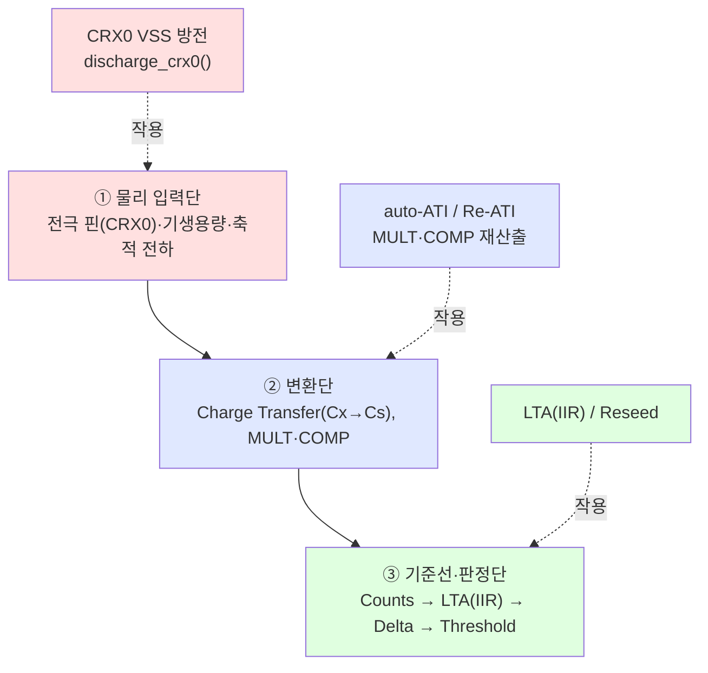

# C5 · 레이어 분리 논증 + 이전 결론 정합 (Q5)

> **TL;DR**: Q5 답은 **"다른 레이어가 맞다"** — auto-ATI/Re-ATI/Reseed는 모두 **변환·기준선 보정(측정값 영역)** 레이어이고, CRX0 VSS 방전은 **전극 핀의 물리 전하 상태(아날로그 입력 영역)** 레이어다. 데이터시트상 ESD는 "수 ns~ms의 순간 counts 변화"를 일으키는 물리 교란으로 명시(02 §노이즈)되며, ATI(전하 분배 배율·내부 보상 커패시터 조정)·LTA(IIR 드리프트 추적)·Reseed(LTA 즉시 재시드) 어느 것도 **전극에 실제로 축적된 전하를 빼내지 못한다**. 따라서 **방전이 정말 물리 전하 누적을 막는 기능이라면 auto-ATI로 대체 불가**다. 단 이 전제("방전이 ESD 물리 누적을 실제로 제거 중")는 **실측 미확정**이며, B1(진짜 오염원=Reseed)·B2(0x30 LSB 충돌)와 정합한 결론은 **조건부가능 = "공존은 0x30 read-modify-write/경로분리로 기술적으로 가능하나, 방전의 ESD 효용 자체가 실측 전까지 미확정이므로 방전을 게이트 뒤로 두고 유지·검토"**다. 하이브리드 Phase 3("ESD 물리누적 실측 후 방전 폐기 검토")와 완전 일치한다.

> [!NOTE]
> 근거: 입력 [00_입력](00_입력.md) Q5·제약 / 데이터시트 [02 §5.4~5.5·노이즈](../../데이터시트/02_proxfusion동작.md)·[06 A.5/A.12](../../데이터시트/06_레지스터레퍼런스.md) / 펌웨어 [구현·시퀀스 분석 §6·§8](../펌웨어%20구현·시퀀스%20분석.md) / 검증 [4_타당성검증 B1·B2](../생각정리/4_타당성검증.md) / [하이브리드 권고 §3~5](../은수님%20안%20평결·하이브리드%20권고.md) / 코드 `tdc_drv_iqs323.c`(reseed 918·discharge_crx0 938·sensor_setup 440·apply_settings 1023). 데이터시트·코드 라인 인용, 추정은 "확인 필요" 명시.

---

## 1. Q5 핵심 — 두 레이어의 정의

데이터시트 신호 체인을 따라가면 IQS323은 **물리(아날로그) → 변환 → 기준선/판정**의 직렬 계층이다. ESD 방전과 auto-ATI는 이 체인의 **서로 다른 단(stage)** 에 작용한다.

| 레이어 | 메커니즘 | 데이터시트 근거 | 작용 대상 |
|---|---|---|---|
| **① 물리 입력단** | 전극 핀에 실제로 축적된 전하/전위 — VSS 단락으로만 제거 가능 | 02 §노이즈(L421): "ESD 등이 수 ns~ms 순간 counts 변화" / §5.4(L153~): Charge Transfer는 Cx 실전하를 Cs로 옮기는 물리 과정 | CRX0 핀 전위 |
| **② 변환단(ATI)** | MULT=전하 분배 배율, COMP=내부 보상 커패시터로 기생용량 일부 offset → counts를 Target 범위로 정규화 | 02 §5.12(L553~557): "MULT=내부 전하 분배 비율", "COMP=내부 커패시터 뱅크 연결/해제로 offset subtraction" | counts의 스케일·offset |
| **③ 기준선단(LTA/Reseed)** | LTA=IIR로 노터치 counts를 느리게 추적(드리프트 보정), Reseed=현재 counts로 LTA 즉시 재시드 | 02 §5.5(L314~327): `LTA_new = LTA_old + (Counts−LTA_old)×Beta/256` / §5.5.1 Reseed | 판정 기준선 |

핵심 분리 논거: **②·③은 모두 "측정된 숫자(counts)"에 가해지는 디지털·아날로그 보정이지, 핀에 이미 쌓인 전하를 빼내는 동작이 아니다.** MULT·COMP는 변환 *비율*을 바꿀 뿐 입력 전위를 0으로 만들지 않고, LTA/Reseed는 그 비율을 거쳐 나온 counts를 *기준선으로 학습*할 뿐이다. 전극에 DC 전하가 축적돼 있으면 ②·③은 그 오염된 입력을 충실히 정규화·추적할 뿐 — **오염 자체를 못 없앤다.** 오직 ①(핀을 VSS로 단락)만이 물리 전하를 빼낸다.

> [!IMPORTANT]
> 따라서 Q5 답은 **"레이어가 다르고, 방전이 진짜 물리 전하를 제거하는 기능이라면 auto-ATI로 대체 불가"** 다. 하이브리드 권고 §2-9 평결("auto-ATI는 LTA 드리프트는 해결하나 ESD 물리누적은 별개 — 실측 구분")과 **동일 결론**이다.

---

## 2. "방전 ≠ auto-ATI 대체불가"의 두 가지 갈래

논증을 정직하게 끝까지 밀면, 이 명제는 **방전이 실제로 물리 전하를 제거하고 있는가**라는 미확정 전제에 의존한다. 두 갈래로 나뉜다.

### 갈래 A — 드리프트가 LTA 영역 현상이면: auto-ATI가 대체 가능

이슈("드리프트→일정 횟수 후 먹통")의 정체가 **느린 환경성 LTA 드리프트 + FIXED MULT/COMP의 정규화 부재**라면, 이는 ③(LTA)·②(ATI) 레이어 문제다. auto-ATI Full 복귀가 그대로 해결한다(하이브리드 §2-1·§3 "ATI Full 복귀 → 이슈 6·8·9"). 이 경우 방전은 **불필요한 중복**이고 폐기 후보다.

### 갈래 B — ESD가 핀 전하 누적이면: auto-ATI로 대체 불가, 방전 고유

ESD 이벤트가 CRX0 전극에 **DC성 전하를 누적**시켜 입력 전위를 서서히 끌어올린다면, 이는 ① 레이어 현상이다. auto-ATI/Re-ATI/Reseed 어느 것도 핀 전하를 빼내지 못하므로 — 보정을 반복해도 입력 오염원이 남아 **재발**한다. 이 경우 방전은 auto-ATI로 **대체 불가능한 고유 기능**이다.

> [!WARNING]
> **현재 갈래 A/B 판별 불가 (실측 필요)**: 입력 §2·하이브리드 §5가 명시하듯 ESD 정체는 미지수다. 더 결정적으로 — 현 코드의 방전이 *실제로* 물리 전하를 빼내는지조차 **0x30 LSB 비트매핑 미검증(B2)** 때문에 불확정이다(§3-2). 즉 "방전은 고유 기능" 명제는 **갈래 B가 참이고 + 0x30 토글이 실제 VSS 단락을 일으킬 때만** 성립한다. 둘 다 실측 게이트(하이브리드 §5 "드리프트 정체" + B 검증 우선순위 3 "0x30 Linearise") 뒤에 있다.

---

## 3. B1·B2와의 정합 검증

### 3-1. B1(진짜 오염원 = Reseed) 정합 — 레이어 논증이 B1을 강화한다

B1 결론: 현 FIXED 경로에서 진입 baseline 오염의 단일 채널은 auto-ATI가 아니라 **Reseed**(`apply_settings` 1134 + 절전 `reseed` 932)다. 본 레이어 분리는 이와 **모순 없이 정합하며 오히려 보강**한다.

- B1은 ③ 레이어(LTA 시딩 시점) 내부 문제다 — "언제 노터치 counts로 LTA를 잡느냐". auto-ATI를 켜든 끄든 Reseed가 터치 중 실행되면 오염된다.
- 본 C5는 ① vs ②③ 레이어 분리다 — 방전은 ③(Reseed/LTA)과 **다른 층**이므로, **B1의 Reseed 게이팅 설계와 방전 유지가 서로 간섭하지 않는다**. 즉 "노터치 seed 게이트(B1·하이브리드 Phase 1)"를 도입해도 방전은 독립적으로 계속 작동 가능 — 둘은 보완재다.
- 정합 함의: zero-base 방어의 핵심은 "Reseed 시점 노터치 게이팅"(③)이고, 방전(①)은 그와 **별개 축**으로 유지/검토하면 된다. 충돌 없음.

### 3-2. B2(0x30 LSB 정면 충돌) 정합 — 레이어는 다르나 *레지스터 주소*를 공유한다

여기가 본 검토의 가장 날카로운 긴장점이다. **레이어는 다르지만(①vs③) 방전의 구현 수단이 ② 변환단 설정 레지스터(0x30 Sensor Setup)를 물리적으로 공유**한다.

- B2 사실: `discharge_crx0()`(`tdc_drv_iqs323.c:942·947`)가 200ms마다 0x30 LSB에 `0x02`(INACTIVE_RXS_CRX0_VSS)→`0x01`(enable+ctx0)을 쓴다. 데이터시트 [06 A.5] 0x30 LSB는 bit0 Enable·bit1 Linearise·bit3 Invert·bit6 Release UI Enable.
- **레이어 분리와 충돌의 양립**: 방전의 *의도*(①핀 전하 제거)는 auto-ATI(②③)와 다른 레이어가 맞다. 그러나 방전을 *구현하는 비트 쓰기*가 0x30 LSB 전체를 덮어쓰면 — Release UI/Linearise/Invert(②③ 정합용 비트)를 클리어한다(B2). 즉 **레이어는 분리돼 있어도 "한 바이트 레지스터를 공유하는 구현 결합(implementation coupling)"이 충돌을 만든다.**
- auto-ATI Full 복귀 시 영향: auto-ATI 자체는 0x36(ATI Setup) 별개 레지스터다(펌웨어 §7, B2). 따라서 **0x30 토글이 auto-ATI *수렴 파라미터*를 직접 건드리진 않는다**(Q4 영역 — C1/C2 검증 대상). 그러나 Re-ATI가 0x30 enable 비트에 의존하는 채널을 200ms마다 disable→enable 토글하면 측정 사이클 교란 위험은 남는다(Q1·Q3 — 본 페르소나 범위 밖, C1/C3 검증).
- **비트매핑 자체가 미검증(B2 잔여)**: 펌웨어 §8 IMPORTANT — 코드는 0x30 LSB를 "핀별 INACTIVE_RXS"로 해석하나 데이터시트 A.5는 bit1 Linearise·bit3 Invert로 정의한다. 데이터시트대로면 `0x02` write는 **Linearise를 켜는 것**이지 CRX0 VSS 단락이 아닐 수 있다. **이것이 사실이면 현재 "방전"은 물리 전하를 안 빼고 있을 수도 있다** → §2 갈래 B의 대전제가 흔들린다. 실측 우선순위 최상위(B 우선순위 3).

> [!IMPORTANT]
> 정합 결론: **레이어 분리(C5)와 0x30 충돌(B2)은 모순이 아니다.** "기능 레이어가 다르다"는 *대체 불가성*을 말하고, "0x30을 공유한다"는 *공존 시 구현 결합*을 말한다. 둘 다 참이며, 해법은 — 방전을 0x30 LSB **read-modify-write로 다른 비트 보존**하거나, **방전 경로를 0x30 외(예: Pattern Definition 0x34 Inactive Rxs — Q6-⑥)로 이전**하는 것이다(B2 §설계함의 2, 하이브리드 미래 작업).

---

## 4. 하이브리드 권고와의 정합

| 하이브리드 항목 | 본 C5 정합 |
|---|---|
| §2-9 "auto-ATI는 LTA 드리프트 해결, ESD 물리누적은 별개(실측 구분)" | **완전 일치** — C5가 그 레이어 분리를 데이터시트 신호체인으로 정형화 |
| §3 "ATI Full 복귀"가 드리프트(이슈 6·8·9) 담당 | 정합 — 갈래 A(LTA·ATI 레이어)를 auto-ATI가 흡수 |
| Phase 3 "방전·CalCap 폐기 검토 — ESD 물리누적 실측 후" | **정합 핵심** — C5는 "실측 전엔 폐기 불가, 게이트 뒤 유지"로 동일 결론 |
| §5 실측 게이트 "드리프트 정체(ATI 해결) vs ESD 물리누적(방전 필요) 구분" | 정합 — C5 §2 갈래 A/B 판별이 곧 이 실측 |

대체·축소가 아니라 **보강**이다: C5는 하이브리드의 "방전≠드리프트" 직관을 **데이터시트 ①②③ 레이어로 구조화**해, 왜 auto-ATI로 대체 못 하는지(②③은 입력 전하를 못 뺀다)를 메커니즘으로 못박는다.

---

## 5. 결론 — coexist_verdict 및 권고

### 5-1. Q5 직답

- **레이어는 다르다 (확정, 데이터시트 근거)**: ESD 물리 전하 누적(①)과 auto-ATI/LTA 드리프트 보정(②③)은 신호 체인의 다른 단에 작용한다. ②③(MULT·COMP·LTA·Reseed)은 *입력 핀 전하를 제거하지 못한다* — VSS 단락(①)만이 한다.
- **고유성은 조건부 (실측 의존)**: "방전이 auto-ATI로 대체 불가한 고유 기능"이라는 명제는 **(갈래 B: ESD가 핀 전하 누적) AND (0x30 토글이 실제 VSS 단락을 일으킴, B2 비트매핑 참)** 일 때만 성립. 둘 다 미확정.

### 5-2. 공존 평결 = **조건부가능**

- **가능 근거**: 레이어가 다르므로 기능적으로는 공존 의미가 있고(방전=①, auto-ATI=②③), B1 Reseed 게이트와도 독립 축이라 간섭 없음.
- **조건(반드시 충족)**: ① 0x30 LSB **read-modify-write 또는 방전 경로 0x34 이전**으로 B2 충돌(Linearise/Invert/Release UI/enable 비트 보존) 해소 — 미해소 시 auto-ATI 정합 비트가 200ms마다 파괴됨. ② Re-ATI 진행 중 200ms enable 토글의 수렴 교란(Q1·Q3)은 C1/C3 검증 대기. ③ ATI Full I²C 무응답(현 ATI Disabled 채택 이유, 하이브리드 §5)을 RDY 통신관리로 선행 해결.
- **불가로 기울 조건**: 만약 실측에서 (a) ESD가 LTA 드리프트일 뿐(갈래 A) 또는 (b) 0x30 토글이 실제 VSS 단락을 안 함(B2 비트매핑 거짓)으로 밝혀지면 — 방전은 **고유 기능이 아니므로 폐기**가 옳고, "공존"은 무의미해진다(auto-ATI 단독).

### 5-3. 권장 대안

**하이브리드 Phase 순서 유지 + 방전을 게이트 뒤 보수적 유지**:
1. 방전을 *지금 폐기하지 말 것* — ESD 정체(갈래 A/B)·0x30 비트매핑이 미확정이라 보수적 유지가 안전(입력 §1 보수 원칙).
2. auto-ATI Full 도입 시 방전은 **0x34(Inactive Rxs, Q6-⑥) 또는 0x30 RMW로 경로 분리**해 B2 충돌 제거(C4 대안 설계자 영역과 연계).
3. 실측 2건을 게이트로 — **(가)** 드리프트가 ATI로 해소되는가 vs ESD 잔존하는가(갈래 A/B 판별), **(나)** 0x30 토글이 실제 핀 VSS 단락을 일으키는가(B2). 둘 다 "ESD 잔존 + 단락 유효"면 방전 영구 유지, 아니면 폐기.

> [!NOTE]
> 본 페르소나(C5)는 Q5·정합 전담. Q1·Q3(Re-ATI 수렴 교란)·Q4(0x30 비트 상호작용 상세)는 데이터시트 메커니즘(C1)·코드 통합(C2)·adversarial(C3)이, 대안 6종 설계는 C4가 다룬다. 본 결론은 그 결과와 합쳐져 최종 평결을 이룬다.
