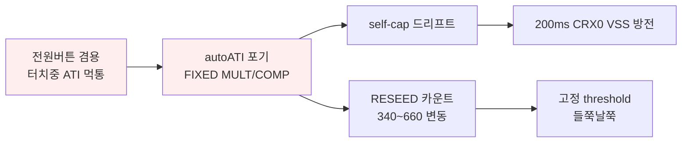
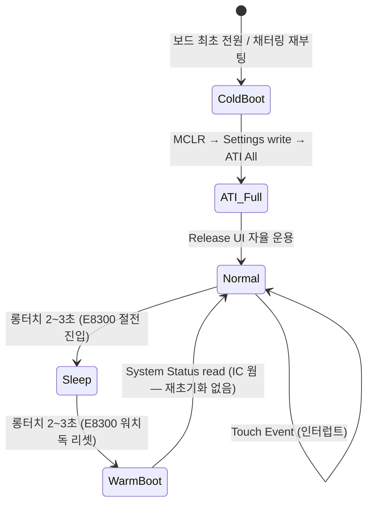

# 설계안 P1 · 데이터시트 기능 활용파

> **TL;DR**: 칩이 이미 푼 문제를 SW로 다시 풀지 않는다. **전원스위치 = Release UI**(터치중 ATI·부팅중 초기화 문제를 Activation LTA + 변화율 판정으로 원천 제거), **드리프트 = ATI Full 복귀 + Reference UI(CRX1)**(SW 주기방전·FIXED 폐지), **통신 = Event Mode + RDY 인터럽트**(폴링 폐지)로 zero-base 재구성. order code 001 = Release UI 가용을 핵심 자산으로 삼는다. self-cap·FIXED·200ms 방전·CalCap 더미를 전부 버리고 칩 내장 UI로 대체하는 게 현재 구현과의 본질적 차이다.

> [!NOTE]
> 본 설계안은 [01_문제정의·제약·평가축](01_문제정의·제약·평가축.md)을 공통 입력으로, **데이터시트 활용** 페르소나로 zero-base 구상했다. 현재 구현(self-cap·FIXED·200ms 방전·CalCap)을 정답으로 보지 않는다. 근거는 데이터시트 §·레지스터·회로로 명시하고, 데이터시트에 없는 능력은 **"확인 필요"**로 표기한다.

---

## 1. 설계 철학

핵심 통찰: **현재 구현의 9개 이슈는 거의 전부 "칩이 제공하는 UI를 쓰지 않고 SW로 우회"한 데서 파생된 2차 문제다.**

이 연쇄의 시작점(`A`)은 "터치 중에 LTA/ATI 기준을 다시 잡으면 그 정전용량이 baseline이 되어 터치를 못 본다"이다. 그런데 **이 문제는 Azoteq가 데이터시트에서 정확히 동일한 시나리오(long-term touch)를 위해 Release UI를 만들어 이미 풀어놓았다** ([04 §7.4]).

### 설계 원칙 4가지

| 원칙 | 내용 | 폐지하는 현재 우회책 |
|---|---|---|
| **원칙_1 (UI 우선)** | 장기 터치·부팅중 터치는 **Release UI**(Activation LTA·변화율)로 판정. 절대 카운트·고정 threshold에 의존하지 않음 | FIXED threshold 100, 부팅 터치 무시 플래그(`s_boot_touch_ignore`) |
| **원칙_2 (ATI 복귀)** | 드리프트 보정은 칩의 **ATI Full**에 위임. 단 "터치 중 ATI"만 막음(Follower Event Mask / 이벤트 게이팅) | FIXED MULT/COMP, write_ati_compensation |
| **원칙_3 (Reference UI)** | 환경 드리프트(온도·습도)는 **CRX1 Reference 채널**이 primary LTA를 차감 보정 | 200ms CRX0 VSS 방전, CalCap 더미 |
| **원칙_4 (이벤트 모드)** | 칩이 이벤트 시에만 RDY low로 알림 → **인터럽트 기반**. 평상시 I²C 무통신 | 200ms 폴링, RDY 윈도우 강제 open |

> 철학 한 줄: **"전원 스위치는 long-term touch 응용이고, 그건 Release UI의 설계 목적 그 자체다."**

---

## 2. 핵심 메커니즘

### 2.1 측정 방식 — Self-Cap 유지 + Linearise

| 항목 | 값 | 근거 |
|---|---|---|
| PXS Mode | **Self-Capacitance 0x10** | 회로 CRX0 단일 self 전극(R31·C51·J3) 고정 — mutual은 TxA 구동+전극 필요(HW 변경). [06 A.7] |
| Linearise Counts | **Enable** (Sensor Setup bit1) | Release UI 사용 시 데이터시트 **권장**. 단 counts invert되므로 Invert bit 정합 필요 [02 §5.4.1] |
| Conversion Freq | Period 5 = **1.00 MHz** (self 최대 권장) | [06 A.6 Table A.1] |
| Max Counts | 2047 (01) 또는 정상 max 바로 위 | stuck 방지 [02 §5.4.2] |

> [!NOTE]
> self-cap 유지는 "현재 구현을 정답으로 삼아서"가 아니라 **회로 제약**(CRX0 단일 self 전극, TxA 플로팅) 때문이다. mutual 전환은 HW 변경 필요 → 본 페르소나 범위 밖(다른 페르소나가 다룰 영역).

### 2.2 ATI 정책 — Full 복귀, 단 "터치 중 ATI" 차단

현재 구현이 autoATI를 포기한 이유는 단 하나: "터치 중 ATI가 그 정전용량을 기준으로 잡음". 이건 **ATI를 끌 이유가 아니라, 터치 중에만 ATI를 막을 이유**다.

- **ATI Mode = Full** (`ATI Setup` 0x36 bits[2:0]=100) — divider·multiplier·compensation 자동. 카운트 변동(340~660)·threshold 들쭉날쭉(이슈 8·9) 원천 해소. [02 §5.9]
- **ATI Band = Large (1/8)** — re-ATI 경계 여유. [06 A.12]
- **콜드부트 시 1회 ATI** → 안정. 이후 자동 Re-ATI는 **LTA가 ATI Band 벗어날 때만** 발생 [02 §5.10].
- **터치 중 Re-ATI 차단**: 두 겹 방어
  - (a) Release UI가 touch 상태를 유지하는 한 LTA는 frozen → ATI Band 안에 머묾 → 자동 re-ATI 트리거 안 됨 [04 §7.4, 02 §5.5].
  - (b) Reference UI의 **Follower Event Mask**로 "follower가 touch 상태일 때 reference 채널 ATI 금지"를 칩 레벨에서 강제 [04 §7.3.1].
- **수동 Re-ATI 금지 정책**: SW는 부팅 시점·해제 확인 후에만 Re-ATI(0xC0 bit2) 허용. 터치 중 SW Re-ATI 호출 경로를 코드에서 제거.

> [!IMPORTANT]
> 이게 현재 구현 대비 가장 큰 발상 전환이다. **"ATI를 끄지 말고, 터치 중 ATI만 끈다."** 칩은 LTA freeze로 이미 절반을 해주고, Follower Event Mask로 나머지를 해준다.

### 2.3 LTA 관리 — 이중 LTA (표준 LTA + Activation LTA)

Release UI의 핵심은 **두 개의 LTA**다 [04 §7.4]:

| LTA | 동작 | 역할 |
|---|---|---|
| **표준 LTA** (0x14) | touch/prox 중 **frozen** | touch **진입** 판정 baseline |
| **Activation LTA** (0x20) | touch/prox 중에도 **계속 update** | touch **해제** 판정 baseline (장기 터치 추적) |

- touch 진입: `(LTA − Counts) > Touch Threshold` — 표준 경로 [02 §5.7].
- touch 중: 표준 LTA frozen이라 "손가락 닿은 채 영원히 touch"가 정상. Activation LTA는 손가락의 천천한 정전용량 변화를 따라감.
- **touch 해제**: counts가 Activation LTA 대비 Delta Snapshot의 `Release Delta Percentage`만큼 회복하면 채널 reseed + 상태 이탈 [04 §7.4 공식]:

$$\text{If } (\text{Counts} - \text{Activation LTA}) > \left(\text{Delta Snapshot} \times \frac{\text{Release Delta Percentage}}{128}\right)$$

→ **절대 카운트가 아니라 "터치 시작 시 변화량(Delta Snapshot)의 비율"로 해제 판정**. 개체·환경 편차에 자동 정규화. 이슈 8·9(카운트 변동·threshold 들쭉날쭉)의 정공법.

#### 부팅 중 터치 문제의 해소 메커니즘

현재 구현의 가장 아픈 지점: **E8300만 리셋되고 터치 IC는 웜 → SW 재시작 시 손가락이 닿아 있으면 그 상태를 baseline으로 오인**.

- Release UI 운용 시 터치 IC는 웜 유지 → **표준 LTA·Activation LTA·touch 상태 모두 IC 내부에 보존**. E8300이 리셋돼도 IC는 "이미 touch 중"을 알고 있음.
- E8300 재시작 후 `System Status`(0x10) read → CH0 Touch=1 확인 → **이미 진행 중인 터치임을 즉시 인지**. 새로 baseline 잡지 않음.
- 손가락 해제는 IC가 Activation LTA·변화율로 자율 판정 → SW의 `s_boot_touch_ignore` 같은 우회 플래그 불필요.

> [!WARNING]
> **확인 필요**: E8300 워치독 리셋 동안 IC가 MCLR을 받지 않고 웜 유지된다는 전제는 현재 구현 분석(§11 펌웨어)과 일치하나, 콜드부트(보드 최초 전원·충전 채터링 재부팅) 시에는 Activation LTA·Delta Snapshot이 초기화된다. 이 경우는 §2.5 콜드부트 시퀀스로 별도 처리.

### 2.4 판정 — 변화율 기반 + 이벤트 게이팅

| 판정 | 방식 | 레지스터 |
|---|---|---|
| **터치 진입** | `(LTA − Counts) > Touch Threshold`, debounce | Touch Settings 0x62, Prox Settings 0x61(debounce) |
| **터치 해제** | Release UI 변화율 공식 (§2.3) | Release UI Settings 0xD4 |
| **롱터치(전원 트리거)** | E8300이 Touch 이벤트 수신 후 **타이머 2~3초 측정** (현 FSM 계승) | SW 측 — `proc_long_touch` 계열 |
| **debounce** | Prox/Touch Debounce Enter/Exit로 채터링·노이즈 흡수 | Prox Settings 0x61 bits[15:8] |

- 롱터치(2~3초) 자체는 SW 타이머가 맞다 — 데이터시트 Hold 제스처(slider 필요)는 단일 버튼엔 과함. **단, 터치 "유지/해제"의 신뢰성을 Release UI가 보장**하므로 SW 타이머가 안정적으로 동작.
- **이벤트 게이팅**: 터치 진입/이탈은 Touch Event로만 통지받음(§2.6) → SW는 상태 머신만 돌림.

### 2.5 모드 전환 — 콜드/웜 분기 + 자율 운용

| 전환 | IC 처리 | E8300 처리 |
|---|---|---|
| **콜드부트** (최초·채터링) | MCLR reset → Settings → ATI Full 1회 | Reset Event ACK → 설정 write → ATI 완료 대기 |
| **노말→절전** | **변경 없음** (전력모드는 SW가 Power Mode 필드로) | 터치 해제는 Release UI가 자율 판정 → 해제 확인 후 절전 |
| **절전→노말 (웜부트)** | **건드리지 않음** — 레지스터·LTA·상태 보존 | System Status read만. **재초기화/RESEED 금지** |

> [!IMPORTANT]
> **웜부트 시 IC를 건드리지 않는 게 핵심**이다. 현재 구현은 웜부트 후 `Initialize()`에서 다시 설정·RESEED를 타 baseline을 흔든다. Release UI 운용에선 IC가 터치 상태·이중 LTA를 다 들고 있으므로 **E8300은 읽기만** 한다.

- **전력 모드**: `System Control` Power Mode = **Automatic No ULP** (Release UI·채널 timeout과 ULP 동시 사용 금지 [04 §7.5 주의, 02 §5.8]). 절전 시 Low Power로 자동 강하, 터치 이벤트 시 NP 복귀 [02 §5.3].
- **채널 Timeout**: CH0 Timeout **Disable** (장기 터치가 timeout reseed로 끊기면 안 됨) [02 §5.8, 06 A.30].

### 2.6 통신 — Event Mode + RDY 인터럽트

현재 폴링(200ms)은 이벤트 IC를 폴링으로 쓰는 낭비다. 칩 설계 의도대로 전환:

| 항목 | 설계 | 근거 |
|---|---|---|
| Interface Selection | **Event Mode** (System Control 0xC0 bit7=1) | [05 §8.11.2, 06 A.30] |
| 통지 | RDY low = Touch/ATI/Reset 이벤트 시에만 → **E8300 인터럽트** | RDY는 회로상 INTERRUPT_n에 연결 [회로 §6] |
| Events Enable | Touch Event + ATI Event + (ATI Error) ON | [06 A.32] |
| 설정 변경 시 | Force Communication으로 RDY window 강제 open (0.1~45ms) | [05 §8.13] |
| Program Flow | POR→Ack Reset→Write Settings→ATI All→Runtime(RDY 대기) | [05 §8.15 Figure 8.3] |

- 평상시 I²C 무통신 → 전력·버스 부하↓. 터치 시에만 1 transaction.
- **확인 필요**: RDY(INTERRUPT_n)가 E8300 GPIO 인터럽트로 실제 배선·구성 가능한지(현재 poll 방식). 회로상 연결은 확인됨([회로 §6]), E8300 측 인터럽트 핸들러 신설 필요.

---

## 3. 주요 레지스터·설정

운용 모드 콜드부트 설정 시퀀스 (Event Mode Program Flow [05 §8.15] 기준):

| 단계 | 레지스터 | 주소 | 값(예) | 의미 |
|---|---|---|---|---|
| 1 | System Control | 0xC0 | LSB bit0=1 | ACK Reset |
| 2 | System Status | 0x10 | (poll) | reset_event==0 확인 |
| 3 | Prox Control (CH0) | 0x32 | PXS=0x10, Max Counts | Self-Cap |
| 4 | Sensor Setup (CH0) | 0x30 | bit0=1(En)·bit6=1(Release UI)·bit1=1(Linearise)·bit3 Invert 정합 | **Release UI Enable + Linearise** |
| 5 | Conv Freq (CH0) | 0x31 | Period=5 (1MHz), Frac=127 | self 권장 |
| 6 | ATI Setup (CH0) | 0x36 | bits[2:0]=100(Full), bit3=1(Large Band), Res Factor | **ATI Full** |
| 7 | ATI Base (CH0) | 0x37 | 0x0064 등 | 감도 기준 |
| 8 | Channel Setup (CH0) | 0x60 | Channel Mode=01(Follower), Reference Sensor ID=1, Follower Weight | **CRX1 Reference 추종** |
| 9 | Sensor Setup (CH1) | 0x40 | En + CRX1 활성 | **Reference 채널** |
| 10 | Channel Setup (CH1) | 0x70 | Channel Mode=10(Reference), Follower Event Mask=0x03 | **터치 중 reference ATI 금지** |
| 11 | Touch Settings (CH0) | 0x62 | Threshold·Hysteresis | 진입 임계 |
| 12 | Prox Settings (CH0) | 0x61 | Debounce Enter/Exit | 채터링 흡수 |
| 13 | Release UI Settings | 0xD4 | Release Delta %, Delta Snapshot Sample Delay | **해제 판정** |
| 14 | Events Enable | 0xD3 | Touch·ATI Event ON + Activation Settling Threshold | 이벤트 + Release UI 정착 |
| 15 | Activation LTA Filter | 0xB3 | NP/LP beta | Activation LTA 응답성 |
| 16 | System Control | 0xC0 | bit7=1(Event), Power Mode=101(Auto No ULP), CH0 Timeout Disable(MSB bit8) | 운용 모드 |
| 17 | System Control | 0xC0 | Re-ATI(bit2) | ATI All 1회 |

> [!NOTE]
> CRX1 Reference 채널(8~10단계)은 회로상 CRX1(J4, C52 100nF·R32 0Ω)이 배선 완료된 자원을 활용 [회로 §7.2]. **확인 필요**: C52=100nF(CH0의 C51=100pF 대비 1000배)가 reference self-cap 측정에 적합한지 — DC 차단 특성이라 reference 전극으로서 동작 검증 필요. 부적합 시 Reference UI는 보류하고 ATI Full + Release UI만으로도 핵심 이슈는 해결됨(2-tier fallback).

### 핵심 차이 레지스터 (현재 → 설계안)

| 레지스터 | 현재 구현 | 본 설계안 |
|---|---|---|
| Sensor Setup 0x30 | Release UI bit6=0 | **bit6=1 (Release UI ON)** + Linearise |
| ATI Setup 0x36 | bits[2:0]=000 (Disabled) | **100 (Full)** |
| ATI Mult/Comp 0x38/0x39 | FIXED 수동 write | **ATI 자동** (write 제거) |
| CH1 (0x40/0x70) | CalCap 더미 | **Reference 채널** |
| System Control 0xC0 | Streaming, 수동 RESEED | **Event Mode, Re-ATI(Full)** |
| Release UI Settings 0xD4 | 미사용(0x00) | **해제 판정 활성** |
| 200ms CRX0 방전 | 매 폴링 | **제거** (ATI/Reference가 드리프트 처리) |

---

## 4. 요구 충족 방식

| 요구사항 | 충족 방식 |
|---|---|
| 터치 = 전원 스위치 | Touch Event → E8300 인터럽트 → 롱터치 타이머 |
| 절전→노말 2~3초 (E8300만 리셋) | Release UI가 터치 유지 신뢰 보장 → SW 타이머 2~3초 안정 측정 |
| 노말→절전 2~3초 | 동일. 해제는 Release UI 자율 판정 → 안전한 절전 진입 |
| 터치 IC 상시 전원 | 전력 모드 Automatic No ULP, 절전 시 Low Power(터치 유지) |
| 최초 전원만 콜드부트 | §2.5 콜드부트 시퀀스. 웜부트는 IC 무변경 |
| 충전 채터링 재부팅 | 보수적으로 콜드부트로 수용 → ATI Full 1회로 빠른 안전 복구 (§5 리스크) |

---

## 5. 이슈 9건 대응표

| # | 이슈 | 본 설계안 대응 | 근거 |
|---|---|---|---|
| 1~3 | 터치 중 ATI가 그 정전용량 기준 → 재터치 인식 안 됨 | **Release UI**: touch 중 표준 LTA frozen + Activation LTA로 해제만 추적. **터치 중 ATI 자체가 불필요** | [04 §7.4, 02 §5.5] |
| 4 | 노말→절전 설정 시점 터치 우려 | 해제를 Release UI가 자율 판정 → SW가 "해제 폴링"할 필요 없음 | [04 §7.4] |
| 5 | autoATI 포기 → FIXED | **ATI Full 복귀.** 터치 중 ATI만 Follower Event Mask로 차단 | [02 §5.9, 04 §7.3.1] |
| 6 | self-cap 드리프트 → 먹통 | **ATI Full 자동 보정 + Reference UI(CRX1)** 환경 드리프트 차감 | [02 §5.9, 04 §7.3] |
| 7 | 200ms VSS 방전 우회 | **제거.** ATI/Reference가 드리프트 처리 | — |
| 8 | RESEED 카운트 340~660 변동 | ATI Full이 매번 ATI Target 기준 정규화 → 절대 카운트 무관 | [02 §5.9 ATI Target 공식] |
| 9 | 고정 threshold 들쭉날쭉 | **해제는 Delta Snapshot 비율**(변화량 정규화), 진입은 ATI Target 기준 LTA delta | [04 §7.4, 02 §5.7] |

> 한 줄: **이슈 1→2→...→9 연쇄의 출발점(터치 중 ATI)을 Release UI가 끊으면 나머지 8건이 도미노로 해소된다.**

---

## 6. 가정·확인 필요

| 항목 | 상태 | 비고 |
|---|---|---|
| order code 001 = Release UI 가용 | **확정** | [01 §10.1, 가능성맵]. Movement UI는 A01 한정이라 미사용 |
| 웜부트 시 IC 웜 유지(MCLR 미수행) | **확정** | [펌웨어 §11] 코드 분석 일치 |
| 웜부트 시 Activation LTA·touch 상태 보존 | **확인 필요** | IC 웜이면 레지스터 보존되나 실측 검증 권고 |
| CRX1을 Reference 채널로 동작 | **확인 필요** | C52=100nF의 self-cap reference 적합성. 부적합 시 Reference UI 보류(2-tier fallback) |
| RDY → E8300 GPIO 인터럽트 구성 | **확인 필요** | 회로 연결 확인됨([회로 §6]), E8300 측 핸들러 신설 필요 |
| Release UI Settings 튜닝값(Release %·Sample Delay) | **확인 필요** | 실측 튜닝 — AZD125·실험 |
| Linearise + Invert 정합 | **확인 필요** | Linearise set 시 counts invert → Invert bit 재조정 [02 §5.4.1] |
| 채터링 재부팅 빈도·콜드부트 복구 시간 | **확인 필요** | ATI All ≈ 짧은 시간이나 [02 §5.9] 정량 실측 |
| Self-cap에서 Release UI 동작 | **확인 필요** | 데이터시트 예시는 일반 long-term touch — self/mutual 무관해 보이나 실측 권고 |

---

## 7. 리스크

| 리스크 | 영향 | 완화 |
|---|---|---|
| **Release UI 튜닝 난이도** | Release %·Activation Settling·Sample Delay·Activation LTA beta 등 신규 파라미터 다수 → 초기 튜닝 부담 | AZD125 가이드 + 단계적 실측. 핵심 2~3개부터 |
| **콜드부트(채터링) 시 Activation LTA 손실** | 채터링 재부팅 시 진행 중 터치의 Delta Snapshot 소실 → 그 1회 해제 판정 부정확 가능 | 콜드부트 직후 터치 상태면 ATI 후 즉시 재진입 처리. 채터링은 드문 이벤트 |
| **CRX1 Reference 부적합** | C52=100nF가 reference로 부적합하면 Reference UI 무효 | 2-tier fallback: Reference UI 빼고 ATI Full + Release UI만으로도 이슈 1~5·8·9 해결 |
| **Event Mode 전환 시 통신 복잡도** | Force Comm·RDY window 타이밍 신규 구현 | Program Flow [05 §8.15] 그대로 구현. 데이터시트가 절차 명시 |
| **데이터시트 권장과 실칩 차이** | §8(0x30 INACTIVE_RXS 해석 차)처럼 실칩 동작이 데이터시트와 다를 여지 | Release UI는 명시된 표준 기능 — 0x30 INACTIVE_RXS 우회책 자체를 폐지하므로 그 쟁점 소멸 |
| **순수 SW 범위 초과 가능성** | RDY 인터럽트·E8300 핸들러는 SW지만 통합 변경 | self-cap·전극은 HW 무변경 유지. 인터럽트는 SW 영역 |

---

## 8. 현재 구현과의 핵심 차이 (1~2줄)

현재는 "터치 중 ATI 먹통"을 피하려 **ATI를 끄고(FIXED) 드리프트를 SW(200ms 방전·CalCap)로 떠안은** 우회 구조다. 본 설계안은 칩이 long-term touch를 위해 만든 **Release UI로 터치 중 판정을 칩에 위임**하고, **ATI Full + Reference UI로 드리프트를 칩이 자동 보정**하게 해 SW 우회책 4종(FIXED·200ms 방전·CalCap 더미·부팅 터치 무시 플래그)을 전부 제거한다.
