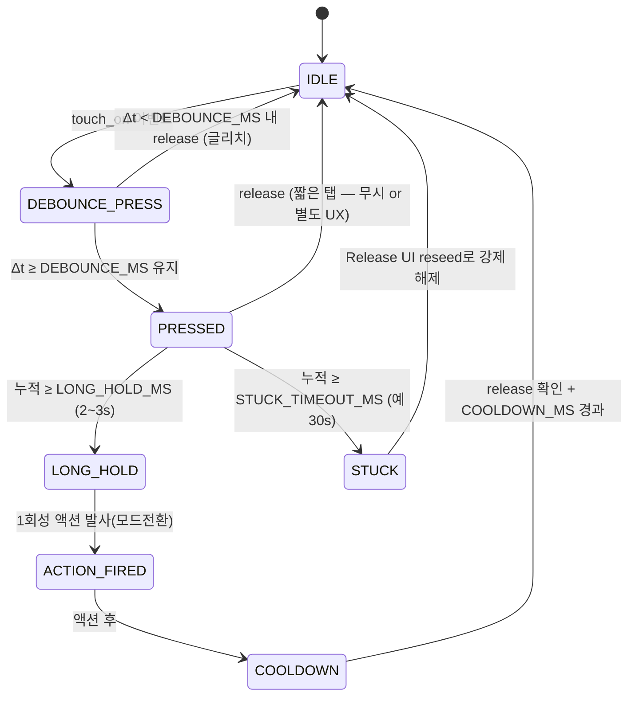
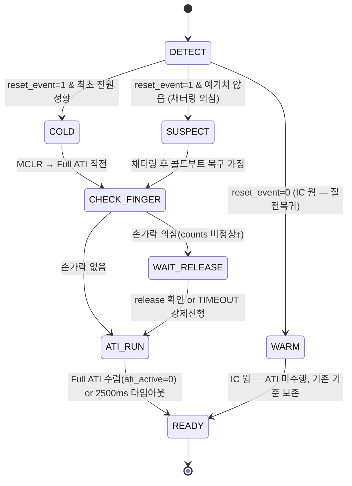

# 설계안 P3 · 상태머신·UX 파 — 전원 스위치 FSM 중심 재설계

> **TL;DR**: 전원 스위치는 본질적으로 **이산 이벤트 기계**(웜/콜드부트·롱터치·모드전환)이지 연속 정전용량 추적기가 아니다. zero-base로, IC는 **Release UI(order code 001)** + **이벤트 모드** + **고정 baseline**으로 "터치 중 초기화" 문제를 LTA freeze가 아니라 *Activation LTA의 변화율 판정*으로 원천 제거하고, 호스트(E8300)는 **Touch FSM**(IDLE→DEBOUNCE→PRESSED→LONG_HOLD→COOLDOWN)과 **Boot FSM**(COLD/WARM/SUSPECT)을 둔다. 신호처리보다 **상태·전이·타임아웃·디바운스** 설계를 우선해 9개 이슈를 상태 경계 문제로 환원한다. 현재의 200ms 강제방전·FIXED·CalCap 더미는 전부 폐기 대상.

> [!IMPORTANT]
> 본 문서는 [01_문제정의·제약·평가축](01_문제정의·제약·평가축.md)의 제약 안에서 zero-base로 발상했다. **order code 001 = Release UI**(Movement UI 불가)를 절대 전제로 하며, 데이터시트에 없는 능력은 "확인 필요"로 표기한다. 근거는 데이터시트 §·레지스터·회로 분석을 명시.

---

## 1. 설계 철학 — "전원 스위치는 FSM이다"

### 1.1 출발점 재정의

현재 구현은 "정전용량을 정확히 측정해서 임계와 비교"하는 **연속 신호처리 사고**다. 그래서 드리프트·카운트 변동·threshold 들쭉날쭉이라는 *아날로그 병*을 SW가 떠안았다(200ms 방전·FIXED·CalCap 더미). 

상태머신·UX 관점에서 보면 전원 스위치가 실제로 요구하는 출력은 **이산 이벤트 5종**뿐이다:

1. `눌림 시작`(press edge)
2. `눌림 유지 2~3초`(long-hold satisfied)
3. `해제`(release edge)
4. `장기 부착 자동 해제`(stuck-finger recovery)
5. `부팅 시점 상태`(cold/warm/suspect)

연속 카운트의 절대값·드리프트·개체편차는 이 5개 이벤트를 안정적으로 뽑아낼 수만 있으면 **무의미**하다. 따라서 설계의 중심을 "측정 정확도"에서 **"이벤트 경계의 견고함"**(디바운스·히스테리시스·타임아웃)으로 옮긴다.

### 1.2 세 가지 설계 원칙

| 원칙 | 내용 | 해결하는 근본 문제 |
|---|---|---|
| **원칙_1 — baseline을 부팅에서 분리** | LTA/판정 기준을 "부팅 순간의 정전용량"이 아니라, *변화율 기반 + 환경 추종 baseline*으로 설정 | 이슈 1~4 (터치 중 초기화 먹통) |
| **원칙_2 — 모든 전이에 디바운스·히스테리시스·타임아웃** | press/release/long-hold/stuck에 명시적 시간 게이트와 비대칭 임계 | 이슈 9 (들쭉날쭉), chattering |
| **원칙_3 — 이벤트 푸시, 폴링 폐기** | RDY 인터럽트 + 이벤트 모드로 "상태 변화"만 받음. 호스트는 FSM tick만 | 전력·반응성·코드 단순화 |

### 1.3 왜 Release UI가 핵심인가

이슈 1~4의 근원은 **"부팅 시점에 손가락이 닿아 있으면 그 정전용량이 기준이 된다"**는 것이다. autoATI든 FIXED+RESEED든, 기준선을 잡는 순간 손가락이 있으면 그 상태가 "정상"으로 굳어버린다.

Release UI는 정확히 이 문제를 위해 설계된 기능이다([데이터시트 04 §7.4]):

- 표준 LTA는 touch/prox 중 **frozen**이지만, **Activation LTA는 touch/prox 중에도 계속 update**된다.
- 판정이 "고정 threshold vs counts 절대 비교"가 아니라 **counts 변화율(Counts−Activation LTA) 기반**이다.
- 즉 손가락이 *계속 붙어 있는 동안* Activation LTA가 손가락 정전용량 쪽으로 천천히 수렴하고, **손가락을 떼는 순간의 변화율**로 release를 감지한다.

이것이 "전원 스위치 = 롱터치 후 해제"라는 UX와 정확히 맞물린다. **order code 001이 Release UI라는 제약이, 오히려 이 설계에서는 정답 도구**다.

---

## 2. 핵심 메커니즘

### 2.1 측정 방식 — Self-Cap CRX0 유지 + Linearise

| 항목 | 선택 | 근거 |
|---|---|---|
| PXS 모드 | **Self-Capacitance (0x10)** | CRX0(B2) 단일 전극 회로 그대로. mutual은 TxA 구동+전극 필요(HW), zero-base지만 회로 변경 최소가 합리 |
| 측정 채널 | **CRX0(CH0)** 단일 활성 | J3 전극. CRX1/CRX2는 후술 |
| **Linearise Counts** | **ON** (Sensor Setup bit1) | 데이터시트 §5.4.1: **Release UI 사용 시 특히 권장**. counts 선형화로 변화율 판정 안정 |
| Invert | Linearise로 counts inverted → **Invert bit 보정** | §5.4.1: Linearise set 시 counts inverted되므로 Invert로 채널 로직 정합 |
| conversion freq | **1 MHz (Period=5)** 또는 그 이하 | §A.6 Table A.1: self-cap 최대 권장 1 MHz. 노이즈 여유 위해 낮춰도 무방 |
| Max Counts | 정상 max 바로 위 값(예 2047) | §5.4.2: stuck 방지, ATI/HW 한계 초과 시 conversion 정지 회피 |

> [!NOTE]
> self-cap을 유지하는 것은 "현재 구현을 정답으로 삼아서"가 아니라, **회로(J3/CRX0)가 self-cap 단일 전극이고 전원 스위치라는 용도에 self-cap 1채널이 충분**하기 때문이다. mutual-cap·guard 등은 HW 변경을 요구하므로 §6 리스크로 분리.

### 2.2 ATI 정책 — Full ATI 1회 + 조건부 Re-ATI (방전 폐기)

현재의 "FIXED MULT/COMP + 200ms 강제 VSS 방전"을 **전면 폐기**한다. 그 구조는 autoATI를 못 써서 생긴 우회책이고, 그 대가가 카운트 변동(이슈 8)·먹통(이슈 6)이다.

상태머신 관점의 ATI 정책:

| 시점 | 정책 | 근거 |
|---|---|---|
| **콜드부트(최초 전원 1회)** | `ATI Mode=Full`로 **자동 ATI 1회 수렴** → divider/mult/comp 자동 결정 | §5.9: Full 권장, 개체·환경 자동 보정. FIXED의 카운트 변동(이슈 8) 제거 |
| **콜드부트 시 손가락 부착** | ATI 직전 **Boot FSM이 "터치 의심" 판정** 시 ATI 보류 → 해제 후 ATI, 또는 타임아웃 시 강제 진행 후 release-edge로 재seed | 이슈 1~3 근본. §2.6 Boot FSM |
| **웜부트(절전↔노말)** | **ATI 재실행 안 함**. IC는 전원 유지·웜 상태이므로 기존 ATI 결과 보존 | 비대칭 전원 구조 활용. 웜에서 ATI 안 하면 "터치 중 초기화" 자체가 사라짐 |
| **런타임 드리프트** | **Automatic Re-ATI**(LTA가 ATI Band 벗어날 때 자동) + Release UI의 Activation LTA가 touch 중 추종 | §5.10. 200ms 강제 방전 불필요 — IC 내부 ATI가 충/방전 보정 담당 |
| **ATI Band** | **Large(1/8)** 우선(0x36 bit3=1) | §A.12·§5.10. 전원 스위치는 둔감·견고가 미덕. 잦은 re-ATI 억제 |

핵심 전환: **드리프트 대응을 SW 강제방전 → IC의 autoATI 내부 보정으로 되돌린다**. "터치 중 ATI 먹통"은 autoATI를 끄는 대신, **(a) 웜부트에서 ATI를 아예 안 하고 (b) 콜드부트에서만 Boot FSM이 터치 의심을 가드**하여 회피한다. 이것이 zero-base 재구성의 핵심 — *문제를 ATI on/off가 아니라 "언제 기준을 잡느냐"의 타이밍 문제로 환원*.

### 2.3 LTA 관리 — Release UI Activation LTA 중심

| 요소 | 설정 | 근거 |
|---|---|---|
| **Release UI Enable** | Sensor Setup(0x30) **bit6 = 1** | §A.5 bit6 "Release/Movement UI Enable". 001 칩 → Release UI로 동작 |
| **Activation LTA Filter Beta** | 중속 추종(예 NP beta ~64, 0xB3) | §A.29. 너무 빠르면 롱터치 중 수렴해 long-hold 전에 release 오판정 / 너무 느리면 stuck 회복 지연. **튜닝 포인트(확인 필요)** |
| **Release Delta Percentage** | 보수적(예 50/128 ≈ 39%) | §A.34·§7.4: (Counts−ActivationLTA) > (DeltaSnapshot × %/128)이면 reseed·이탈. 큰 값=둔감 release |
| **Delta Snapshot Sample Delay** | 안정 샘플 수(예 4~8) | §7.4: Activation Settling Threshold 이내가 N연속 샘플이면 Delta Snapshot 기록 |
| **Activation Settling Threshold** | counts 안정 판정 임계(0xD3 상위) | §7.4·§A.32 |
| 표준 LTA Reseed | **웜부트 시 release-edge에서만** 수동 reseed(0xC0 bit3) | §5.5.1. 부팅 즉시 reseed(현재 방식) 폐기 — 터치 중 reseed가 이슈 1~4 근원 |

> [!IMPORTANT]
> 설계의 LTA 관점 핵심: **부팅이 LTA를 건드리지 않는다.** 콜드부트는 Full ATI가 자연 수렴, 웜부트는 IC 웜 상태 보존, 런타임은 Activation LTA가 touch 중에도 추종. reseed는 "손가락 뗀 게 확인된 순간"에만. 이로써 "초기화 시점에 손가락" 상황이 **어느 경로에서도 기준을 오염시키지 않는다**.

### 2.4 판정 — 2단 임계 + 디바운스 + 히스테리시스

전원 스위치 UX를 위한 **이중 게이트**:

```
counts/Activation LTA delta ──┬── Prox Threshold (느슨)  → "근접 의심" (옵션)
                              └── Touch Threshold (엄격) → "눌림 확정"
```

| 파라미터 | 값(초안) | 근거·의도 |
|---|---|---|
| Touch Threshold | 중간값(예 20~40, **delta 기반**) | §5.7: (LTA−Counts)>Threshold. 절대 카운트 아닌 delta라 개체편차 둔감 |
| Touch Hysteresis | Threshold의 ~60% | §5.7: 이탈은 (Threshold−Hysteresis). **비대칭 진입/이탈로 채터링 억제**(이슈 9) |
| **Prox(옵션)** | Touch보다 느슨 + Prox Debounce | §5.7·§A.16. baseline freeze 방지 보조. 현재 비활성인데 **재검토**(이슈 대비) |
| **Touch Debounce Enter** | 2~4 conversion | §A.16/A.17 debounce: noise·ESD 글리치로 인한 false press 차단 |
| **Touch Debounce Exit** | 2~4 conversion | 손 미세 움직임에 의한 release 깜빡임 차단 |
| **Fast Filter Band** | 설정(0xB4) | §5.6: 큰 변화 시 fast filter로 빠른 응답, 작은 변화는 normal로 안정 |

판정 자체는 IC가 하고, 호스트는 **이벤트(touch set/clear)만** 받는다. 호스트 FSM이 그 위에 시간 차원(롱터치·쿨다운)을 얹는다.

### 2.5 Touch FSM (호스트 측 — 시간 차원)

IC가 주는 `touch on/off` 이벤트 위에 호스트가 얹는 전원 스위치 상태기계:



| 상태 | 의미 | 핵심 타임아웃·게이트 |
|---|---|---|
| `IDLE` | 무터치 대기 | — |
| `DEBOUNCE_PRESS` | press edge 검증 | `DEBOUNCE_MS`(예 30~50ms) |
| `PRESSED` | 눌림 유지·롱터치 카운트 | `LONG_HOLD_MS`(2400~3000ms) |
| `LONG_HOLD` | 롱터치 충족 | 1회성(`s_is_long_touch` 식 재진입 차단) |
| `ACTION_FIRED` | 모드전환 트리거 발사 | — |
| `COOLDOWN` | **재진입 방지**(전환 직후 손가락 잔류 가드) | `COOLDOWN_MS` + release 확인 |
| `STUCK` | 장기 부착(스티커·물방울) | `STUCK_TIMEOUT_MS` → reseed |

> [!NOTE]
> 현재 코드의 `proc_long_touch`(2400ms 1회)·`s_boot_touch_ignore`를 이 FSM이 **명시적 상태로 흡수·일반화**한다. 특히 **`COOLDOWN`**이 "모드 전환 직후 손가락이 아직 붙어 있어 즉시 재전환되는" 문제를 상태로 차단한다(현재는 암묵적).

### 2.6 Boot FSM (호스트 측 — 콜드/웜/의심)

비대칭 전원 구조(IC 상시 웜, E8300만 리셋)와 충전 채터링을 **명시적 부팅 분류 상태기계**로:



| 분기 | 트리거 판별 | 처리 |
|---|---|---|
| **COLD** | `reset_event=1`(§A.2 System Status) + 최초 전원 | MCLR → finger guard → **Full ATI 1회** → READY |
| **WARM** | `reset_event=0` (IC 웜) | **ATI·reseed 미수행**, 기준 보존, 즉시 READY |
| **SUSPECT(채터링)** | `reset_event=1`인데 절전 복귀 맥락 | 보수적으로 COLD와 동일 복구(요구사항 권고: 재부팅 가정) |
| **CHECK_FINGER** | ATI 직전 counts가 비정상적으로 높음(손가락 의심) | WAIT_RELEASE로 가드 |

> [!IMPORTANT]
> **충전 채터링(~1µs)** 대응: IC가 reset됐는지 SW로 직접 알 수 없으므로(확인 필요), **`reset_event` 비트 + 부팅 정황으로 COLD/WARM/SUSPECT 분류**하고, SUSPECT는 보수적으로 콜드 복구한다. 콜드 복구가 빠르고 안전하면(Full ATI 자동) 채터링 재부팅을 **수용**하는 게 회피보다 견고(부록 시드질문 정합). 회로 측 R28→페라이트는 별도 HW 완화(§6).

### 2.7 통신 — 이벤트 모드 + RDY 인터럽트 (폴링 폐기)

| 항목 | 현재 | 재설계 | 근거 |
|---|---|---|---|
| 인터페이스 | I²C 스트리밍·200ms **폴링** | **I²C Events**(0xC0 bit7=1) | §A.30. RDY가 event 시만 low |
| 호스트 트리거 | 200ms 타이머 폴링 | **RDY 인터럽트**(INTERRUPT_n, C7) | 회로: RDY active-low. 이벤트 발생 시만 깨움 |
| Events Enable | touch·ATI | **Touch·Power·ATI Event**(0xD3 하위) | §A.32. Power Event로 전원모드 변화도 수신 |
| Watchdog | I²C 통신으로 kick | 윈도우 밖 자동 kick, 통신 시 byte마다 kick | §7.6: 255ms. 이벤트 모드와 정합 |
| 전력 모드 | 수동 절전 진입 | **Automatic No ULP**(0xC0 Power Mode=101) | §5.3·5.8. **채널 timeout(STUCK) 쓰려면 ULP 금지**(§5.8 WARNING) |

> [!WARNING]
> **전력 모드 결정적 제약**: §5.8 — "채널 prox/touch timeout 사용 시 ULP 금지, Automatic No ULP 권장." STUCK 자동해제(Event Timeout)를 쓰려면 **ULP를 포기**해야 한다. 현재 절전 9µA(ULP) vs No-ULP(LP 50µA 수준)의 트레이드오프 → §6 리스크. 단, 절전은 E8300이 watchdog reset 루프로 도므로 **IC는 LP로도 충분**할 수 있음(확인 필요).

---

## 3. 주요 레지스터·설정 (초안)

| 레지스터(주소) | 설정값(초안) | 의미 | 근거 |
|---|---|---|---|
| Sensor Setup CH0 (0x30) | bit0=1(enable), **bit6=1(Release UI)**, bit3=Invert(linearise 보정), bit1=1(Linearise) | self-cap + Release UI + 선형화 | §A.5, §5.4.1 |
| Prox Control (0x32) | PXS Mode=0x10(Self), Max Counts=2047 | self-cap, stuck 방지 | §A.7 |
| Conversion Freq (0x31) | Period=5(1MHz), Frac=127 | self-cap 권장 상한 | §A.6 |
| ATI Setup (0x36) | ATI Mode=**Full**, ATI Band=Large(1/8) | 콜드부트 자동 수렴·둔감 re-ATI | §A.12, §5.9 |
| Touch Settings (0x62) | Threshold·Hysteresis(비대칭) + Debounce | 2단 게이트·채터링 억제 | §A.17, §5.7 |
| Prox Settings (0x61) | Threshold(느슨) + Prox Debounce | baseline freeze 방지(옵션) | §A.16 |
| Activation LTA Beta (0xB3) | NP beta 중속 | Release UI 추종 속도 | §A.29 |
| Fast Filter Band (0xB4) | 설정 | 빠른응답/안정 균형 | §5.6 |
| Events Enable (0xD3) | Touch·Power·ATI Event ON | 이벤트 모드 수신 | §A.32 |
| Release UI Settings (0xD4) | Release Delta % ≈ 50/128, Sample Delay 4~8 | 변화율 release 판정 | §A.34, §7.4 |
| System Control (0xC0) | bit7=1(Events), Power Mode=Automatic No ULP, CH Timeout(STUCK용) | 이벤트·전력·STUCK | §A.30, §5.8 |
| Event Timeouts (0x?) | Touch Event Timeout(STUCK 시간) | 장기부착 자동 reseed | §5.8, §A.31 |

> 모든 값은 **초안**이며 실측 튜닝 필요. zero-base 원칙상 현재 코드의 0x5C82/0x63EF(FIXED) 같은 실측 의존 상수는 **전부 제거**(Full ATI가 대체).

---

## 4. 요구 충족 방식

| 요구사항 | 충족 메커니즘 |
|---|---|
| 터치 = 전원 스위치 | Touch FSM의 press/long-hold/release 이벤트 |
| 절전→노말 2~3초 롱터치 | `PRESSED`→`LONG_HOLD`(LONG_HOLD_MS) → ACTION_FIRED → E8300 워치독 리셋 |
| 노말→절전 2~3초 롱터치 | 동일 FSM, ACTION이 절전 진입. **COOLDOWN이 전환 직후 잔류손가락 가드** |
| 터치 IC 상시 전원 유지 | Boot FSM의 **WARM 분기**가 ATI·reseed 미수행, 기준 보존 (비대칭 구조 활용) |
| 최초 전원만 콜드부트 | Boot FSM **COLD**(reset_event + MCLR + Full ATI), 이외는 WARM |
| 충전 채터링 재부팅 불확실 | Boot FSM **SUSPECT** 분기 → 보수적 콜드 복구(재부팅 수용), 회로 R28 완화는 HW(§6) |

---

## 5. 이슈 9건 대응표

| # | 이슈 | 본 설계의 대응 | 핵심 |
|---|---|---|---|
| 1~3 | 터치 중 ATI가 그 정전용량을 기준으로 잡아 재터치 인식 안 됨 | **웜부트 ATI 미수행** + 콜드부트 **CHECK_FINGER 가드** + **Release UI**(Activation LTA가 touch 중 추종, 변화율 판정) | 기준 잡는 타이밍을 부팅에서 분리 |
| 4 | 절전 진입 시 설정 시점 터치 우려 | Touch FSM **COOLDOWN** + reseed를 release-edge에서만 | 전이 직후 잔류손가락을 상태로 가드 |
| 5 | autoATI 포기, FIXED 채택 | **autoATI(Full) 재도입** — 단 터치중 ATI는 타이밍(웜 미수행·finger guard)으로 회피 | 문제를 on/off가 아닌 타이밍으로 |
| 6 | self-cap 드리프트로 일정 터치 후 먹통 | **Full ATI의 내부 충/방전 보정 복원** + Automatic Re-ATI + Activation LTA 추종 | IC 내부 보정으로 환원 |
| 7 | CRX0 주기적 VSS 방전(우회책) | **200ms 강제 방전 전면 폐기** | ATI가 보정 담당, 방전 불필요 |
| 8 | FIXED라 부팅마다 RESEED 카운트 340~660 변동 | **FIXED 폐기 → Full ATI가 개체·환경 자동 보정** | 카운트 변동 원천 제거 |
| 9 | 고정 threshold로 터치 들쭉날쭉 | **delta 기반 판정 + 히스테리시스(비대칭) + 디바운스** + Release UI 변화율 | 절대 카운트 무관, 채터링 억제 |

---

## 6. 가정·확인 필요

| 항목 | 상태 | 비고 |
|---|---|---|
| Release UI가 self-cap 단일 채널·전원스위치 용도로 잘 동작 | **확인 필요** | 데이터시트는 long-term touch/prox 감지용으로 명시(§7.4). 전원스위치 적합성은 실측 |
| Activation LTA Beta·Release Delta % 튜닝값 | **확인 필요** | 롱터치(2~3s) 동안 Activation LTA가 수렴해버리면 long-hold 전 release 오판정 위험 — beta를 충분히 느리게 |
| 콜드부트 자동 ATI 수렴 시간 vs 부팅 UX | **확인 필요** | §5.9 "짧은 시간" 명시하나 실측 필요. 현재 INIT_TIMEOUT 2500ms 참고 |
| 충전 채터링 시 IC 실제 reset 여부 | **확인 필요(요구사항 명시)** | reset_event 비트로 사후 판별. SUSPECT 보수 처리 |
| ULP 포기(No-ULP) 시 절전 전류 | **확인 필요** | §5.8 STUCK timeout ↔ ULP 상호배타. LP 50µA 허용 가능한지 |
| RDY 인터럽트 배선·E8300 측 풀업 | **확인 필요** | 회로 분석 §6: I²C/RDY 풀업 마스터 측 추정 |
| reset_event로 COLD/WARM 구분 정확도 | **확인 필요** | 웜부트 시 reset_event=0 보장되는지 실측 |
| Linearise+Invert 조합 정합 | **확인 필요** | §5.4.1 권고 따르나 실칩 검증 |

---

## 7. 리스크·실패모드

| 리스크 | 영향 | 완화 |
|---|---|---|
| **Release UI 미적합** | 핵심 전제 붕괴 시 설계 근간 흔들림 | fallback: 표준 LTA + delta 판정 + finger-guard FSM만으로도 이슈 1~4 일부 해결(Release UI는 강화책) |
| **롱터치 중 Activation LTA 수렴** | 2~3s 유지 전 release 오판정 | beta를 LONG_HOLD_MS보다 느리게. Sample Delay·Settling으로 보강. **최우선 튜닝** |
| **No-ULP 전류 증가** | 절전 소비↑ | STUCK을 채널 timeout 대신 **호스트 FSM 타이머**로 구현하면 ULP 유지 가능(대안) |
| **콜드부트 ATI 중 손가락** | 가드 타임아웃 시 강제 진행 → 기준 오염 | WAIT_RELEASE 후에도 release-edge reseed로 자가 복구 |
| **이벤트 모드 RDY 의존** | RDY 배선·풀업 문제 시 무응답 | 폴링 fallback 경로 유지(이중화), watchdog 255ms 안전망 |
| **FSM 복잡도 증가** | 상태·전이·예외 유지보수 부담 | Touch/Boot 2개 FSM 분리·`tdc_` 명명·상태표 문서화. 단일 책임 |
| **개체편차 잔존** | delta 기반이라 둔감하나 0은 아님 | Full ATI가 1차 보정, 히스테리시스가 2차 |

---

## 8. 현재 구현과의 핵심 차이 (1~2줄)

현재는 **autoATI를 포기하고 FIXED+200ms 강제방전+CalCap 더미**로 아날로그 드리프트를 SW가 떠안았다 — 본 설계는 그 우회책을 전부 폐기하고, **Full ATI(자동보정 복원) + Release UI(터치 중 추종·변화율 판정) + 이벤트모드 + Touch/Boot 2-FSM**으로 "기준 잡는 타이밍을 부팅에서 분리"하여 이슈 1~9를 *상태 경계 문제*로 환원한다.
