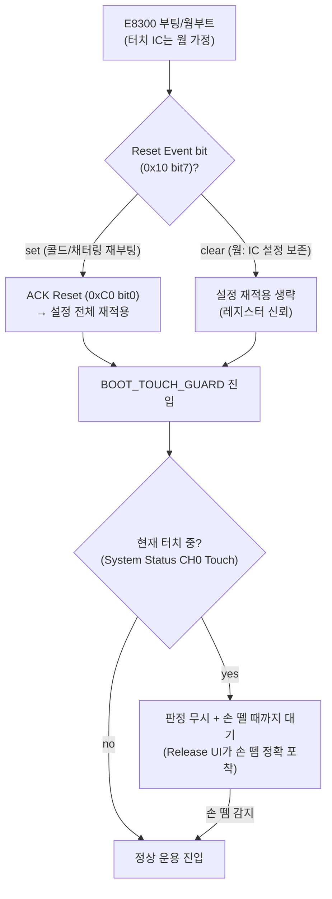

# 설계안 P4 · 강건성파 — "최악을 가정하고, 실패해도 복구한다"

> **TL;DR**: 충전 채터링 재부팅·ESD 누적·**터치 중 초기화/부팅**을 상수(常數)로 가정한 zero-base 재설계. 핵심은 ① **Release UI**(order code 001 지원·데이터시트 §7.4)로 판정 기준을 "부팅 시점 LTA"에서 분리 — Activation LTA가 터치 중에도 갱신되고 **상대 변화율**로 이탈 판정하므로 "터치 누른 채 부팅"이 구조적으로 무력화된다. ② **Dual Direction 임계**로 드리프트 극성에 무관, ③ **Re-ATI는 노터치일 때만**(조건부) 허용해 드리프트 보정을 되살리되 터치 중 ATI 먹통을 차단, ④ **Watchdog 255ms + I²C Transaction Timeout + Reset Event ACK 재동기화**로 통신·웜부트 실패를 자동 복구, ⑤ **Channel/Event Timeout reseed**를 안전망(데드맨)으로. 정밀 추적이 아니라 **둔감·이중방어·자동복구**가 설계 가치. order code 001 = Release UI 확정, Movement UI 불가.

---

## 1. 설계 철학

전원 스위치는 본질적으로 **on/off 롱터치**다. 0.1pF 단위 정밀 정전용량 추적은 요구사항이 아니며, 오히려 정밀함이 취약함을 부른다. 강건성파의 zero-base 출발점은 세 개의 최악 가정이다.

| 최악 가정 | 의미 | 설계가 부담해야 할 것 |
|---|---|---|
| **터치 중 초기화/부팅이 정상 케이스다** | 모드 전환 트리거가 "지속 터치"라, 부팅·설정 시점에 손가락이 닿아 있는 게 디폴트 | 판정 기준이 **부팅 시점 정전용량에 의존하면 안 된다** |
| **재부팅은 막을 수 없다** | 충전 채터링 ~1µs (R28 0Ω 무필터). 보수적으로 콜드부트 가정 | 재부팅을 **회피**가 아니라 **빠르고 안전하게 수용** |
| **ESD 전하는 누적된다** | R31 100Ω(권장 470Ω 미달)·전원 무필터. SW만으로 완전 해결 불가 | **자동 복구 데드맨**을 깔고, 먹통을 일시적 상태로 격하 |

→ 따라서 설계 목표는 "한 번도 안 틀리는 정밀 센서"가 아니라 **"틀려도 스스로 빠져나오는 둔감한 스위치"**다. 모든 메커니즘은 (가) 부팅 의존성 제거, (나) 극성 무관, (다) 시한부 자동 복구 — 이 세 축으로 정렬한다.

> [!IMPORTANT]
> **현재 구현(self-cap·FIXED·200ms 방전·CalCap)을 출발점으로 삼지 않는다.** 현재 방식은 autoATI를 포기하면서 "부팅 시점 raw count(340~660 변동)에 고정 threshold를 얹는" 구조라, 세 최악 가정에 정면으로 취약하다. P4는 데이터시트가 **명시적으로 보장**하는 안전장치(Release UI·Dual Direction·Watchdog·Timeout reseed)를 1차 방어선으로 쌓는다.

---

## 2. 핵심 메커니즘

### 2.1 측정 방식 — Self-Cap 유지 + Dual Direction + Linearise

- **PXS = Self-Capacitance (0x10)** 유지. 회로(CRX0 단일·J3)와 데이터시트 권장(self ≤1MHz)에 정합. mutual/inductive는 HW 변경 필요 → 강건성파는 **검증된 회로를 바꾸지 않는다**(HW 변경은 ESD·전원 보강에만 한정 권고, §3·§7).
- **Dual Direction 임계 활성** (`Sensor Setup` 0x30 bit2=1, [06 A.5]). 표준 단방향은 `(LTA − Counts) > Threshold` 한 방향만 본다. 그런데 웜부트·콜드부트·ESD 누적 후 baseline이 어느 방향으로 틀어질지 보장이 없다. Dual Direction은 `Counts > LTA+Th OR Counts < LTA−Th`로 **양극성 모두 터치로 인식**([02 §5.7]) → 부팅 직후 LTA 시드가 약간 어긋나도 터치 감지가 살아 있다. 전원 스위치는 "어느 쪽으로든 큰 변화 = 손가락"이면 충분하다.
- **Linearise Counts 활성** (bit1=1). 데이터시트가 **Release UI 사용 시 특히 권장**([02 §5.4.1])하며, counts invert가 동반되므로 `Invert` bit(bit3)로 채널 로직 정합. Release UI(§2.4)의 전제 조건이다.

### 2.2 ATI 정책 — "조건부 Full ATI": 노터치일 때만 보정, 터치 중엔 동결

현재 구현이 autoATI를 **포기**한 유일한 이유는 "터치 중 ATI가 그 정전용량을 기준으로 잡아 먹통"이다. 강건성파는 ATI를 버리지 않고 **언제 도느냐를 통제**한다.

- **운용 ATI Mode = Full** (`ATI Setup` 0x36 bits[2:0]=100, [06 A.12]). FIXED MULT/COMP의 개체·환경 편차(이슈 #8)를 근본 제거. ATI Target = ATI Base × (ResFactor/16).
- **Re-ATI 게이팅 (핵심)**: 자동 Re-ATI는 LTA가 ATI Band를 벗어날 때 칩이 자동 트리거하는데([02 §5.10]), 이게 터치 중에 걸리면 먹통의 원인이다. 그래서:
  - **ATI Band = Large (1/8, bit3=1)** 로 넓혀, 손가락에 의한 정상 변화로는 Re-ATI가 트리거되지 않게 한다(터치 delta가 band 안에 들어오도록 ATI Base/ResFactor 튜닝 — **확인 필요**, 실측 튜닝 항목).
  - 그래도 터치 중 LTA는 **frozen**([02 §5.5])이므로 자동 Re-ATI 트리거 입력 자체가 동결된다. 즉 **터치 상태에서는 LTA가 안 움직여 Re-ATI가 구조적으로 안 걸린다** — autoATI 포기의 근본 전제가 사실은 "초기화 시점의 1회 ATI"였고, 그건 §2.5 부팅 게이팅으로 분리한다.
  - **수동 Re-ATI(0xC0 bit2)는 SW가 "노터치 확인 후"에만** 발행한다(데드맨 복구 경로, §2.6). ATI Error 시 자동 Re-ATI는 안 걸리므로([02 §5.11]) SW 수동 트리거가 필수인데, 이를 노터치 게이트 뒤에 둔다.

> [!NOTE]
> **방전(discharge) 폐기**: 현재 200ms CRX0→VSS 방전은 FIXED의 self-cap 드리프트를 SW가 떠안은 우회책이다. Full ATI + LTA IIR 필터가 드리프트 보정을 칩 내부에서 수행하므로 **주기 방전 로직을 제거**한다(이슈 #6·#7 근본 해소, 복잡도↓). 더불어 CRX1 CalCap 더미(방전 전제)도 불필요 → CRX1을 **Reference UI 채널**로 승격(§2.3).

### 2.3 LTA 관리 — Release UI(주방어) + Reference UI(보조) 이중화

**(가) Release UI — 부팅 의존성을 끊는 1차 메커니즘** ([04 §7.4], order code 001 지원 확정)

- `Sensor Setup`(0x30) **bit6 Release/Movement UI Enable = 1** → 001에서는 **Release UI**로 동작([01 §6.6, 가능성맵]).
- 표준 LTA는 터치 중 frozen이지만 **Activation LTA(0x20)는 터치 중에도 계속 갱신**된다([04 §7.4]). 이탈 판정은 고정 threshold가 아니라 **counts 변화율**:
  $$\text{이탈 조건: } (\text{Counts} - \text{Activation LTA}) > \left(\text{Delta Snapshot} \times \frac{\text{Release Delta Percentage}}{128}\right)$$
- **왜 강건성의 심장인가**: "터치 누른 채 부팅"하면 부팅 직후 LTA가 손가락 얹힌 값으로 시드된다(현재 구현의 치명상). 그러나 Release UI는 **부팅 시점 절대값이 아니라 손 뗄 때의 상대 변화**로 이탈을 판정하므로, **시드가 오염돼도 손가락을 떼는 순간 Activation LTA 대비 변화가 잡혀 정상 복귀**한다. 부팅 시점 LTA 의존성이 구조적으로 제거된다(이슈 #1~4 근본 해소).
- 설정: `Release UI Settings`(0xD4) — `Release Delta Percentage`(이탈 민감도, /128)·`Delta Snapshot Sample Delay`(스냅샷 연속 샘플 수). `Events Enable and Activation Settling Threshold`(0xD3) 상위 바이트 `Activation Settling Threshold` 설정 ([06 A.32/A.34]). `Activation LTA Filter Betas`(0xB3)로 IIR 필터.

**(나) Reference UI — 환경 드리프트 보조 보정** ([04 §7.3], CRX1/J4 회로 배선 완료)

- 현재 CalCap 더미로 낭비되는 **CRX1(J4 배선 완료)** 을 **Reference 채널(CH1)** 로 승격. CH0(CH0=Follower)의 primary LTA를 CH1 reference가 온도·습도 드리프트분만큼 보정([04 §7.3]).
- 설정: CH0 `Channel Setup`(0x60) Channel Mode=Follower·Reference Sensor ID=0x01·Follower Weight(0x63); CH1 `Channel Setup`(0x70) Channel Mode=Reference·Follower Event Mask=0x03(CH0 prox·touch 시 reference ATI 금지, [04 §7.3.2]).
- 사용자가 CH1 counts에 영향 줄 수 없어야 한다는 전제([04 §7.3]) → CRX1 전극을 사용자 비접촉 위치로(C52 100nF 영향·접지 차폐 검토는 **확인 필요**). 리스크 시 Reference UI는 **선택적**으로 두고 Release UI만으로도 1차 방어 성립.

> [!NOTE]
> Release UI(주)와 Reference UI(보조)는 직교한다. Release UI는 "터치 중·부팅 시점" 시간축 방어, Reference UI는 "환경 드리프트" 공간축 보정. 강건성파는 **둘을 겹쳐** 단일 실패점을 없앤다. CRX1 Reference 리스크가 크면 Release UI 단독으로 핵심 요구는 충족된다(graceful degradation).

### 2.4 판정 — 둔감한 이중 게이트 + Release UI 이탈

- **진입(터치 ON)**: `Touch Settings`(0x62) threshold/hysteresis. 강건성파는 threshold를 **현재(100/80)보다 둔감하게** 잡아 ESD·노이즈 오검출을 줄인다(전원 스위치는 명확한 큰 변화만 = 손가락). Dual Direction이므로 양극성 큰 변화 모두 진입. **Touch Hysteresis 충분히 크게** → 채터링 경계 흔들림 억제.
- **이탈(터치 OFF)**: 표준 hysteresis **AND** Release UI 변화율 이탈([04 §7.4])의 **이중 판정**. 부팅 오염 케이스에선 Release UI가, 정상 케이스에선 hysteresis가 각각 동작 → 어느 한쪽이 무력해도 다른 쪽이 손 뗌을 잡는다.
- **롱터치 FSM(2~3초)**: 판정은 기능 레이어에서 유지하되, 강건성 강화 — TOUCH 지속 타이머에 **상한 가드**를 둬 비정상 무한 TOUCH(stuck) 시 데드맨(§2.6)이 발동하도록 연계.
- **prox 활성화 검토**: 현재 `PROX_ENABLE=0`(측정 불안정 우려). 강건성파는 prox를 **noisy하지 않게** 켜는 것을 검토 — prox debounce(Prox Settings 0x61 bits[11:8] Enter)를 충분히 줘 LTA freeze 방지 보조([02 §5.7]). 단 안정성 미확인 시 비활성 유지(보수적). **확인 필요**.

### 2.5 모드 전환 — 부팅 게이팅과 "터치 무시 창"의 정식화

비대칭 구조(E8300만 리셋, 터치 IC 상시 웜)에서 모드 전환은 항상 "터치 중 E8300 재시작"이다. 강건성파는 이를 예외가 아니라 **정상 시퀀스**로 설계한다.

- **Reset Event 분기로 콜드/웜 자동 식별** ([05 §8.12, 06 A.2]): `Reset Event` bit가 set이면 채터링·콜드 재부팅 → ACK 후 **설정 전체 재적용**. clear면 웜부트(IC 레지스터 보존) → 재적용 생략. **이 분기가 충전 채터링 재부팅을 콜드부트와 동일하게 안전 복구**시키는 핵심(보수적 재부팅 수용 전략, 요구사항 주의사항 #6).
- **BOOT_TOUCH_GUARD**: 부팅 직후 터치 중이면 손 뗄 때까지 판정 무시. 현재 구현의 `s_boot_touch_ignore`를 정식 상태로 승격하되, **이탈 감지를 Release UI에 위임**해 "부팅 시점 LTA 오염으로 손 뗌을 못 잡는" 현재의 취약점을 제거.
- **절전→노말(웜부트)**: E8300만 워치독 리셋. 터치 IC는 MCLR 미수행·설정 보존 → Reset Event clear 경로. 빠른 재동기화.
- **노말→절전**: 둔감화(현재 255/255 통과) 후 reseed 대신, **Release UI 활성 상태로 절전 진입**해 "절전 진입 시점 터치 잔존(이슈 #4)"도 손 뗌 변화율로 정상 이탈하게 한다.

### 2.6 자동 복구 데드맨 (강건성파의 시그니처)

실패를 0으로 만들 수 없으므로, **모든 먹통을 시한부로 만든다**. 4겹 안전망:

| 안전망 | 메커니즘 | 데이터시트 근거 | 복구 대상 |
|---|---|---|---|
| **1. Channel/Event Timeout reseed** | prox/touch 상태가 `Event Timeouts`(0xD2) 초과 지속 시 자동 reseed·상태 이탈 | [02 §5.8, 06 A.31] | ESD 누적 stuck-touch, LTA 오염 무한 터치 |
| **2. Watchdog 255ms** | I²C kick 없으면 칩 자동 soft reset | [04 §7.6] | I²C 행·펌웨어 데드락 |
| **3. I²C Transaction Timeout** | comm window 미서비스 시 window 닫고 정상 처리 지속 (LTA 최신 유지) | [05 §8.8, 06 0xD1] | 마스터 미응답 중 IC 정지 방지 |
| **4. SW 노터치 게이트 수동 Re-ATI/Reseed** | ATI Error·stuck 의심 시 **노터치 확인 후** Re-ATI(0xC0 bit2)/Reseed(bit3) 발행 | [02 §5.10/5.11] | ATI Error(자동 Re-ATI 안 걸림), baseline 오염 |

> [!WARNING]
> **안전망 1·2(Timeout/Watchdog)는 ULP 모드와 상호 배타**다([02 §5.8, 04 §7.5 각주]). 채널 timeout 사용 시 자동 전력 전환은 **'Automatic No ULP'(0xC0 bits[6:4]=101)** 로 설정해야 한다. 강건성파는 **ULP를 포기하고 Automatic No ULP를 선택** — 전력 효율보다 자동 복구 보장을 우선(페르소나 일관성). 전력 영향은 §리스크에서 평가.

### 2.7 통신 — 이벤트 모드 + RDY 인터럽트 + 검증 write

- **Event Mode** (`System Control` 0xC0 bit7=1, [05 §8.11.2]) + **RDY 인터럽트** 사용. 현재 폴링은 200ms 고정 — 이벤트 모드는 변화 시에만 RDY low라 ① 응답성↑, ② 평균 전력↓, ③ **Reset Event를 즉시 포착**(채터링 재부팅을 200ms 안에 놓치지 않음). RDY는 reset 핀 겸용(C7·C58)이라 인터럽트 입력으로 적합.
- **Force Communication**으로 설정 변경 시 RDY window 강제 open([05 §8.13], t_wait 0.1~45ms).
- **진짜 write-verify**: 현재 `write_and_verify`는 read 성공만 보고 값 비교를 안 한다(쟁점 #3). 강건성파는 **write 후 read해 값 일치까지 비교**, 불일치 시 1회 재시도 → ESD로 레지스터가 깨져도 감지·자가 교정. 부팅 설정 시퀀스의 **CRC식 무결성 게이트**.
- 필요 시 `I2C Settings`(0xE0) `Stop Bit Disable`로 0xFF 종료 강제([05 §8.9])는 보류(추가 복잡도). `Read/Write Check Disable`(bit1)는 강제 write가 필요한 복구 경로에서만 한시 사용.

---

## 3. 주요 레지스터·설정

| 영역 | 레지스터(주소) | 설정값/방향 | 근거 | 현재 대비 |
|---|---|---|---|---|
| 측정 | Prox Control(0x32) PXS Mode | 0x10 Self · Max Counts 여유 설정 | [06 A.7] | 유지 |
| 채널 로직 | Sensor Setup(0x30) | **bit6 Release UI=1**, bit3 Invert, bit2 Dual Direction=1, bit1 Linearise=1, bit0 Enable | [06 A.5] | **신규(Release/Dual/Linearise)** |
| ATI | ATI Setup(0x36) | **bits[2:0]=100 Full**, bit3 ATI Band=Large(1/8) | [06 A.12] | **FIXED→Full** |
| ATI 보정 | 0x38/0x39 | ATI가 자동 결정(수동 write 제거) | [02 §5.9] | **고정값 제거** |
| LTA(주) | Release UI Settings(0xD4) | Release Delta %, Snapshot Sample Delay | [06 A.34] | **신규** |
| LTA 필터 | Activation LTA Filter Betas(0xB3) | NP/LP beta | [06 A.29] | **신규** |
| LTA(보조) | CH0 Setup(0x60)=Follower / CH1 Setup(0x70)=Reference, Follower Event Mask=0x03, Weight(0x63) | Reference UI | [04 §7.3, 06 A.15/A.18] | **CalCap→Reference** |
| 판정 | Touch Settings(0x62) | 둔감 threshold + 큰 hysteresis | [06 A.17] | **둔감화** |
| 안전망 | Event Timeouts(0xD2) | touch/prox timeout 설정(×512ms) | [06 A.31] | **신규(stuck 복구)** |
| 전력 | System Control(0xC0) bits[6:4] | **101 Automatic No ULP** | [06 A.30] | **ULP→No ULP** |
| 통신 | System Control(0xC0) bit7 | **1 Event Mode** + RDY 인터럽트 | [05 §8.11.2] | **폴링→이벤트** |
| 이벤트 | Events Enable(0xD3) 하위 | Touch·ATI Error·ATI Event enable | [06 A.32] | 유사 |
| 부팅 동기 | System Control(0xC0) bit0 ACK / bit2 Re-ATI / bit3 Reseed | Reset Event 분기 후 조건부 발행 | [06 A.30, A.2] | **분기 정식화** |
| 무결성 | I²C Settings(0xE0) | 기본(Stop enable) + write-verify SW | [06 A.36] | **verify 강화** |

---

## 4. 요구 충족 방식

| 요구사항 | P4 충족 방식 |
|---|---|
| 터치 = 전원 스위치 | Dual Direction self-cap + 둔감 threshold로 "큰 변화 = 손가락" 단순·견고 판정 |
| 절전→노말 2~3초 (E8300만 리셋) | 웜부트 → Reset Event clear 경로 → 설정 보존·빠른 재동기화 + 롱터치 FSM(2.4s) |
| 노말→절전 2~3초 | Release UI 활성 채로 절전 진입 → 절전 시점 터치 잔존도 손 뗌 변화율로 정상 이탈(이슈 #4) |
| 터치 IC 전원 상시 유지 | Automatic No ULP — 상시 웜·자동 복구 양립(전력은 LP까지만 강하) |
| 최초 전원만 콜드부트 | Reset Event set → ACK + 전체 설정 재적용(콜드부트 정식 경로) |
| 충전 채터링 재부팅 (~1µs) | **재부팅 수용** — Reset Event 분기가 채터링 재부팅을 콜드부트와 동일 복구 + Event Mode로 즉시 포착 |

---

## 5. 이슈 9건 대응표

| # | 이슈 | P4 대응 | 근거 |
|---|---|---|---|
| 1~3 | 터치 중 ATI가 그 정전용량 기준 → 재터치 인식 불가 | **Release UI**: 판정이 부팅 LTA가 아닌 Activation LTA 상대 변화율 → 부팅 LTA 오염 무력화. ATI는 터치 중 LTA frozen이라 구조적으로 안 걸림 + 수동 Re-ATI는 노터치 게이트 | [04 §7.4, 02 §5.5] |
| 4 | 노말→절전 설정 시점 터치 잔존 | Release UI 활성 절전 진입 → 손 뗌 변화율로 이탈. BOOT_TOUCH_GUARD 정식화 | [04 §7.4] |
| 5 | (autoATI 포기, FIXED 채택) | **FIXED 폐기 → Full ATI 복귀** + Re-ATI 노터치 게이팅으로 포기 이유 자체 제거 | [02 §5.9] |
| 6 | self-cap 드리프트 → 일정 터치 후 먹통 | Full ATI 내부 보정 + LTA IIR 필터 → 드리프트 칩 내부 흡수. 200ms 방전 우회책 폐기 | [02 §5.6/5.9] |
| 7 | CRX0 주기 VSS 방전(우회책) | **폐기**(ATI가 대체). CRX1 CalCap 더미도 폐기 → Reference UI로 승격 | [02 §5.9] |
| 8 | FIXED라 매 부팅 raw count 340~660 변동 | Full ATI가 매 부팅 전극 정전용량에 맞춰 자동 정규화 → 카운트 기준 안정 | [02 §5.9] |
| 9 | 고정 threshold + 카운트 편차로 들쭉날쭉 | Release UI 상대 변화율 판정(절대 카운트 무관) + Reference UI 드리프트 보정 + Dual Direction 극성 무관 | [04 §7.4/7.3] |

추가로 **이슈 외 잠재 먹통**(ESD stuck·I²C 행·레지스터 오염)은 §2.6 데드맨 4겹이 시한부 자동 복구로 흡수 — 강건성파의 고유 기여.

---

## 6. 가정·확인 필요

| 항목 | 상태 | 비고 |
|---|---|---|
| order code 001 = Release UI 지원 | **확정** | [01 §10.1, 04 §7.4, 가능성맵]. Movement UI(A01)는 불가 |
| Release UI 단일 채널 전원버튼 적용성 | **확인 필요** | 데이터시트는 long-term touch/prox 해제용으로 명시. 전원버튼 롱터치 시나리오에 Release Delta %·Sample Delay 튜닝 실측 필요 |
| Full ATI 터치 중 미트리거 보장 | **확인 필요(부분)** | LTA frozen([02 §5.5])이라 입력 동결 → 논리상 안 걸림. ATI Band Large로 마진 확보. 실칩 검증 필요 |
| CRX1 Reference UI 적용 (C52 100nF·접지 차폐) | **확인 필요** | 사용자 비접촉·동일 환경 노출 조건([04 §7.3]). 리스크 시 Release UI 단독 운용으로 강등 가능 |
| Dual Direction self-cap 동작 | **확인 필요(낮음)** | 데이터시트 명시 지원([02 §5.7]). self-cap 양극성 실측 권고 |
| Event Mode + RDY 인터럽트 전환 | **확인 필요** | 현재 폴링. RDY 핀 인터럽트 배선·마스터 측 풀업 실재 확인([회로 §6, I²C 풀업 마스터 측 추정]) |
| Automatic No ULP 전력 영향 | **확인 필요** | ULP 미사용분 전력 증가 실측. 절전 평균 소비 재평가 |
| write-verify 재시도 정책 | 가정 | 불일치 1회 재시도 후 실패 시 로그·데드맨 위임(설계 결정) |
| Channel Timeout 값(×512ms) | **확인 필요** | stuck 복구와 정상 롱터치(2~3초) 구분되도록 충분히 크게(예 ≥수 초). 실측 튜닝 |

---

## 7. 리스크

| 리스크 | 영향 | 완화 |
|---|---|---|
| **전력 증가** (ULP 포기·Event Mode·이중 LTA) | 절전 평균 소비↑ — 요구사항 "상시 전원"과 충돌은 아니나 효율 저하 | Automatic No ULP는 LP까지 강하 허용. Halt Report Rate·Report Rate 튜닝으로 보완. 실측 후 ULP 재도입 조건 재검토 |
| **Release UI 미검증 영역** | 전원버튼 용도는 데이터시트 주 use-case가 아님 — 튜닝 실패 시 이탈 둔감/과민 | Release UI + 표준 hysteresis **이중 판정**으로 단일 실패점 제거. 최악 시 hysteresis 단독 fallback |
| **복잡도 증가** (Release+Reference+Event+Dead-man) | SW 상태·예외·튜닝 부담↑ (강건성파의 본질적 트레이드오프) | FSM 우선 구현([코딩/구현 패턴]). 각 안전망은 칩 자동 기능 위임으로 SW 코드 최소화. 단계적 활성(Release→Reference→Dead-man) |
| **Reference UI 회로 부적합** | CRX1 C52 100nF·전극 위치가 reference 조건 미충족 | Reference UI를 **선택 기능**으로 분리. Release UI 단독으로 핵심 요구 충족(graceful degradation) |
| **ESD 근본 미해결**(SW 한계) | R31 100Ω·전원 무필터는 SW로 완전 해결 불가 | 데드맨이 먹통을 시한부화(증상 완화). **HW 보강 병행 권고**(R31→470Ω·R28 페라이트·guard electrode, [회로 §12]) |
| **Dual Direction 오검출** | 양극성 감지라 노이즈도 양쪽으로 잡힐 여지 | 둔감 threshold + 큰 hysteresis + debounce로 상쇄. 전원버튼은 큰 신호라 마진 충분 |

---

## 8. 현재 구현과의 핵심 차이 (1~2줄)

현재는 **autoATI를 포기**하고 "부팅 시점 raw count(340~660 변동)에 고정 threshold를 얹은 뒤 200ms 주기 방전·CalCap 더미로 드리프트를 SW가 떠안는" 구조라 세 최악 케이스(터치 중 부팅·채터링 재부팅·ESD 누적)에 정면 취약하다. P4는 이를 뒤집어 **Full ATI로 카운트를 자동 정규화하고, 판정을 Release UI 상대 변화율로 부팅에서 분리하며, Channel Timeout·Watchdog·Reset Event 분기·write-verify의 4겹 데드맨으로 모든 먹통을 시한부 자동 복구**로 격하한다 — 정밀이 아니라 둔감·이중방어·자동복구가 설계 가치다.
