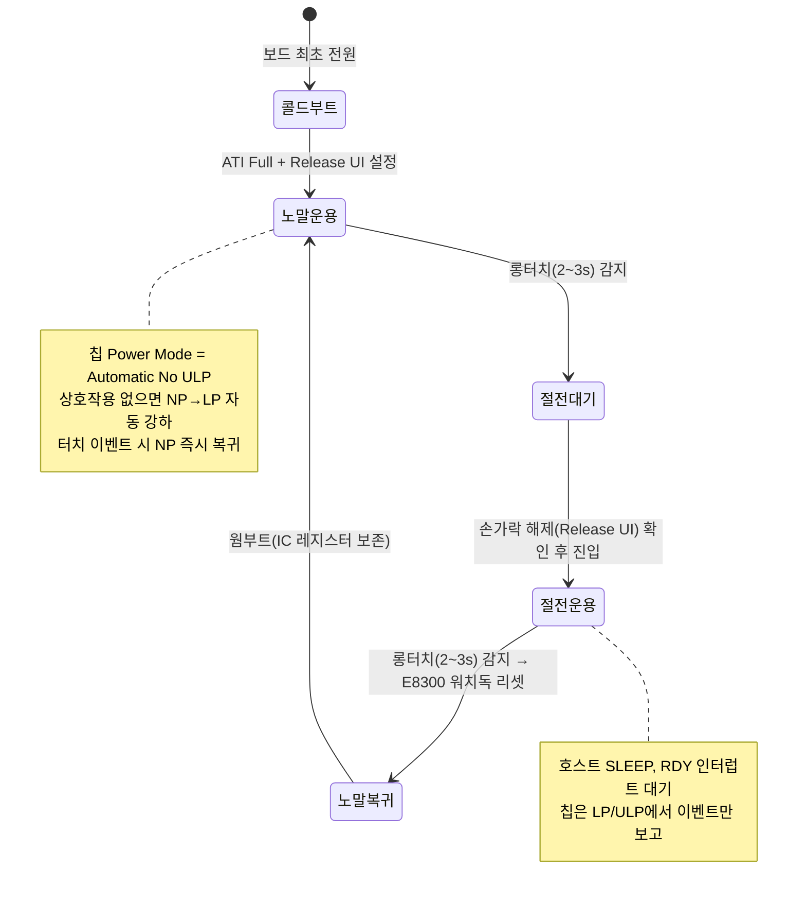

# 설계안 P5 · 전력·이벤트파 — 이벤트 모드 · ULP · Release UI

> **TL;DR**: 전원 스위치는 "롱터치 on/off"다. 칩이 이미 가진 **이벤트 엔진**(RDY는 이벤트 시에만 low)·**Automatic 전력 스테핑**(NP↔LP↔ULP)·**Release UI**(Activation LTA로 터치 중에도 baseline 계속 갱신)를 그대로 쓴다. 호스트 200ms 폴링·수동 CRX0 방전·FIXED MULT/COMP를 모두 버리고, **Full ATI 재도입 + 터치 중 ATI 차단(Channel Timeout Disable + 수동 Re-ATI를 해제 확정 후에만)**으로 드리프트를 칩 자체 보정에 되돌린다. "터치 중 초기화 먹통"의 근원(부팅 시 baseline이 손가락 닿은 채 고정됨)을 **Release UI의 rate-of-change 판정**으로 분리한다. order code 001 = **Release UI** 사용 가능, Movement UI는 불가.

> [!IMPORTANT]
> 본 문서는 [01 문제정의·제약·평가축](01_문제정의·제약·평가축.md)을 공통 입력으로 한 **zero-base 설계안**이다. 현재 구현(self-cap·FIXED·200ms 방전·CalCap)을 정답으로 전제하지 않는다. 근거는 데이터시트 §·레지스터(부록 A)와 회로 분석에 명시했고, 데이터시트로 보장되지 않는 부분은 "확인 필요"로 표기한다.

---

## 1. 설계 철학 — 이벤트 IC는 이벤트로 굴린다

현재 구현의 본질은 **이벤트 IC를 폴링 IC처럼 쓰는 것**이다. 200ms마다 깨워서 status를 읽고, 매번 CRX0를 VSS로 방전하고, ATI를 포기한 대가로 SW가 드리프트 보정을 떠안았다. 전력·이벤트파의 관점에서 이건 칩 능력의 정반대다.

세 가지 원칙:

1. **이벤트 모드 + RDY 인터럽트** — RDY는 enabled event가 트리거되거나 reset될 때만 low([데이터시트 05 §8.11.2]). 호스트는 RDY 하강 인터럽트에서만 깨어나 status 1회 read. "활동 없으면 매 cycle 방해받지 않는다"는 데이터시트 권고 그대로([05 §8.11.2]). 폴링 busy-loop 제거.
2. **칩의 native 저전력 스테핑** — `Power Mode`='Automatic'(또는 timeout 사용 시 ULP 제약 고려해 'Automatic No ULP')로 두면, 상호작용 없을 때 NP→LP→ULP로 자동 강하하고, 이벤트 발생 시 NP로 즉시 복귀한다([02 §5.3]). 호스트가 전력모드를 손으로 토글할 필요가 없다.
3. **드리프트는 칩이 보정한다** — Full ATI + 자동 Re-ATI는 칩의 정체성이다([02 §5.9~5.10]). autoATI를 버린 단 하나의 이유는 "터치 중 ATI가 그 정전용량을 baseline으로 잡음"인데, 이건 **ATI 타이밍을 제어**하면 풀린다. ATI를 영구히 끄는 게 아니라, **터치 중에만 차단**(Channel Timeout Disable로 터치 중 자동 reseed/timeout 억제 + Re-ATI는 호스트가 해제 확정 후에만 트리거)하면 된다. 200ms 수동 방전이라는 우회로가 통째로 사라진다.

> 핵심 통찰: "터치 중 초기화 먹통"의 근원은 **부팅·전환 시점에 LTA(baseline)가 손가락 닿은 상태로 고정**되는 것이다. self-cap+FIXED에선 이걸 막을 길이 없어 SW로 우회했다. 그러나 **Release UI**는 표준 LTA가 frozen일 때도 **Activation LTA를 계속 갱신**하고, 고정 threshold가 아니라 **Counts의 변화율(Delta Snapshot 대비 %)** 로 해제를 판정한다([04 §7.4]). 즉 baseline이 언제 잡혔는지와 무관하게 "손가락이 떨어지는 변화"를 본다 — 문제의 근원을 칩 기능으로 직접 푼다.

---

## 2. 핵심 메커니즘

### 2.1 측정 방식 — self-cap CRX0 유지, Linearise + Release UI

- **측정 타입**: Self-Capacitance, CRX0 단일(PXS Mode 0x10, [06 A.7]). 회로상 CRX0(B2)만 전극(J3)에 연결되어 있고 전원 스위치는 단일 버튼이므로 채널 확장 불필요. HW 변경 0.
- **Linearise Counts ON**([06 A.5 bit1]): 데이터시트가 **Release UI 사용 시 특히 권장**한다([02 §5.4.1]). linearise하면 counts가 inverted되므로 `Invert` bit를 정합되게 set([02 §5.4.1, 06 A.5 bit3]). → counts↔delta 관계가 선형화되어 Release UI의 변화율 판정이 안정적.
- **Release UI Enable**([06 A.5 bit6]): order code 001은 이 bit가 **Release UI**로 동작([01 §10.1, 04 §7.4]). Activation LTA(0x20)·Delta Snapshot(0x23)·Release UI Settings(0xD4) 사용.

### 2.2 ATI 정책 — Full ATI 재도입 + 터치 중 차단(조건부 Re-ATI)

현재 구현의 FIXED MULT/COMP가 이슈 6·8·9(드리프트·카운트 340~660 변동·threshold 들쭉날쭉)의 직접 원인이다. zero-base에선 **Full ATI로 되돌린다**.

| 단계 | 정책 | 근거 |
|---|---|---|
| 콜드부트(POR) | `ATI Mode`='Full'([06 A.12])로 1회 ATI. 단 **노터치 보장이 없으므로**(전원 버튼이라 부팅 시 터치 빈번) ATI 완료 후 **Release UI가 해제를 감지하면 호스트가 수동 Re-ATI**(0xC0 bit2) 1회 → 깨끗한 baseline 확보 | [02 §5.9, §5.10] |
| 정상 운용 | 자동 Re-ATI 활성(LTA가 ATI Band 벗어나면 칩이 자동) — 드리프트를 칩이 보정 | [02 §5.10] |
| **터치 중** | Channel Timeout Disable(0xC0 bit8=1)로 터치 중 자동 reseed 억제 + 터치 지속 동안 호스트는 Re-ATI를 **트리거하지 않음** → "터치 중 ATI가 그 정전용량을 baseline으로 잡는" 사고 차단 | [02 §5.8], 이슈 1~4 |
| 절전 진입/복귀 | 절전 진입 시 손가락 해제 확인(Release UI 이벤트) 후 Re-ATI 1회 → 절전 환경 baseline. 웜부트 복귀는 IC 레지스터 보존이므로 재ATI 불필요(필요 시 Release UI delta로 판단) | [04 §7.4] |

> [!NOTE]
> **autoATI를 버릴 이유가 사라진다.** 터치 중 ATI가 문제였을 뿐, ATI 자체는 칩의 드리프트 보정 핵심이다. ATI 타이밍을 "노터치 확정 시점"으로만 제한(Release UI가 그 시점을 알려줌)하면 FIXED + 200ms 방전 우회 구조 전체가 불필요해진다.

### 2.3 LTA 관리 — 이중 LTA(표준 LTA + Activation LTA)

Release UI의 핵심은 **두 개의 baseline**이다([04 §7.4]):

- **표준 LTA**(0x14): touch/prox 중 frozen. 진입(touch enter) 판정용. `(LTA − Counts) > Touch Threshold`([02 §5.7]).
- **Activation LTA**(0x20): **터치 중에도 계속 갱신**. `Activation LTA Filter Betas`(0xB3)로 IIR 필터. 해제(release) 판정용.
- **Delta Snapshot**(0x23): counts와 Activation LTA 차이가 `Activation Settling Threshold`(0xD3 상위)보다 작은 상태가 `Delta Snapshot Sample Delay`(0xD4 상위) 샘플 이상 지속되면, LTA−counts의 절대 delta가 기록됨.
- **해제 조건**([04 §7.4]):
  $$(\text{Counts} - \text{Activation LTA}) > \left(\text{Delta Snapshot} \times \frac{\text{Release Delta Percentage}}{128}\right) \Rightarrow \text{reseed + 상태 이탈}$$

→ 이 구조가 "baseline이 손가락 닿은 채 고정되어도 해제를 못 잡는" 문제를 원천 해결한다. 부팅 시 손가락이 닿아 있어도 Activation LTA가 떨어지는 손가락을 추적하므로 release를 정확히 감지.

### 2.4 판정 — 진입은 threshold, 해제는 Release UI

| 판정 | 메커니즘 | 레지스터 |
|---|---|---|
| 터치 진입 | `(LTA − Counts) > Touch Threshold`, debounce | Touch Settings(0x62) |
| 터치 해제 | Release UI delta-% (변화율) | Release UI Settings(0xD4), Activation LTA(0x20), Delta Snapshot(0x23) |
| 롱터치(2~3초) | **호스트 타이머**(터치 enter 이벤트 시각 ~ 해제 이벤트 시각). 칩 gesture(Hold)는 slider 필요라 비채택 | 호스트 SW |

> [!NOTE]
> **롱터치를 칩 gesture(Hold)로 할 수도 있으나** Hold는 slider enable이 전제다([04 §7.2.2 — "slider enabled 시 on-chip gesture recognition"]). 단일 버튼에 slider 구성은 과하고, `Minimum Hold Time`(0xA4)으로 2~3초를 칩이 직접 재는 매력은 있다(호스트 타이머 부담 제거). **확인 필요**: 단일 채널 slider(Total Channels=1, [04 §7.2])로 Hold gesture만 쓰는 구성이 실칩에서 안정적인지. 1차 설계는 호스트 타이머(견고·검증 용이), 2차 최적화로 칩 Hold 검토.

### 2.5 모드 전환 — 칩 Automatic 스테핑 + 호스트 비대칭 리셋

요구사항의 비대칭(터치 IC 상시 웜, E8300만 워치독 리셋)은 유지하되, 전력 스테핑을 칩에 위임한다.

- **노말 운용**: 호스트는 RDY 인터럽트 대기(폴링 없음). 칩은 `Automatic No ULP`로 NP↔LP 스테핑([02 §5.3]). 터치 이벤트 시 RDY low → 호스트가 status read → 롱터치 타이머 시작.
- **노말→절전**: 롱터치 확정 → 주변장치 OFF → 칩에 절전 설정(아래 §2.6 통신 시퀀스) → 호스트 SLEEP(`SYS_WAIT_FOR_INTERRUPT`), **RDY 인터럽트로만 깨어남**.
- **절전→노말**: 절전 중 터치 → RDY low → 호스트 깨어남 → 롱터치 타이머 → 2~3초 확정 시 `SYS_WATCHDOG_RESET`(E8300만)([펌웨어 §11]). 웜부트라 IC 레지스터 보존.

> [!IMPORTANT]
> **전력 모드 timeout vs ULP 제약(확인 필요)**: 데이터시트는 **채널 prox/touch timeout 사용 시 ULP 금지**([02 §5.8 WARNING])이고 자동 전환은 `Automatic No ULP` 권장이라 명시한다. 본 설계는 Channel Timeout을 터치 중에만 disable하고 평소엔 쓰므로, **`Automatic No ULP`를 기본 채택**한다. 순수 ULP의 4µA(self-cap 3ch [01 §3.4])를 절전에서 최대로 누리려면 Channel Timeout을 전면 disable해야 하는데, 그러면 stuck-touch 자동 복구를 잃는다 → §6 리스크에서 트레이드오프 명시.

### 2.6 통신 — 이벤트 모드 + Force-Comm 설정 윈도우

- **Interface Selection = I²C Events**(0xC0 bit7=1, [06 A.30]). RDY는 enabled event/reset 시에만 low([05 §8.11.2]).
- **Events Enable**(0xD3 하위): Touch Event(bit1) + Reset Event 처리 + (필요 시) Power Event(bit3)·ATI Event(bit4) enable. Release UI order code의 0xD3은 상위 바이트가 `Activation Settling Threshold`이므로([06 A.32]) 동시 설정.
- **설정 변경**: 이벤트 모드에선 RDY 윈도우가 이벤트 시에만 열리므로, 호스트가 능동적으로 설정할 땐 **Force Communication**(communication request로 RDY 윈도우 강제 open, t_wait 0.1~45ms [05 §8.13])을 쓴다. 현재 코드의 `force_window_open()`(I²C dummy 전송)이 이미 이 역할 → 재사용 가능.
- **Watchdog**: 윈도우 밖에선 칩이 자동 kick([04 §7.6])이라 호스트 부담 없음. 윈도우 안에서만 transaction 완결 주의.
- **write_and_verify 실질화**: 현재 코드는 write 후 read만 하고 값 비교를 안 한다([펌웨어 §12]). 이벤트 모드에선 설정 빈도가 낮으므로(초기화·전환 시점만) **값 일치 검증을 추가**해도 비용 미미 → 레지스터 오기록 감지.

---

## 3. 주요 레지스터·설정

| 레지스터(주소) | 설정 값/필드 | 목적 | 근거 |
|---|---|---|---|
| Sensor Setup(0x30) | Enable(bit0)=1, **Linearise(bit1)=1**, **Invert(bit3)=1**(linearise 정합), **Release/Movement UI Enable(bit6)=1** | self-cap CH0 + Release UI | [06 A.5], [02 §5.4.1] |
| Prox Control(0x32) | PXS Mode=0x10(Self), Max Counts 적정 | self-cap, stuck 방지 | [06 A.7] |
| Prox Input·Control(0x33) | CRx0(bit8)=1 | CRX0 Rx 선택 | [06 A.9] |
| Pattern Definitions(0x34) | Wav Pattern 0=0x03 (self) | self-cap 파형 | [02 Table 5.2] |
| ATI Setup(0x36) | **ATI Mode=100(Full)**, ATI Band·Resolution Factor 적정 | 드리프트 칩 보정 | [06 A.12], [02 §5.9] |
| Touch Settings(0x62) | Threshold·Hysteresis (진입 판정) | 터치 enter | [06 A.17] |
| Activation LTA Filter Betas(0xB3) | NP/LP Activation LTA beta | Activation LTA 추종 속도 | [06 A.29] |
| **Release UI Settings(0xD4)** | **Release Delta Percentage**(하위), **Delta Snapshot Sample Delay**(상위) | 해제 변화율 판정 | [06 A.34], [04 §7.4] |
| **Events Enable+Settling(0xD3)** | Touch Event(bit1)=1, Reset 처리, Activation Settling Threshold(상위) | 이벤트 + 정착 threshold | [06 A.32] |
| **System Control(0xC0)** | **Interface Selection(bit7)=1(Events)**, **Power Mode(bit6-4)=101(Automatic No ULP)**, CH0 Timeout Disable(bit8)=터치 중 1, Reseed/Re-ATI/ACK Reset 비트 운용 | 이벤트·전력·ATI 타이밍 | [06 A.30] |
| Report Rate(0xC1~0xC3) | NP/LP/(ULP) report rate(ms) | 이벤트 모드 cycle rate | [06], [05 §8.11.1] |
| I²C Transaction Timeout(0xD1) | 적정(기본 200ms, 2~230 범위) | 윈도우 미서비스 보호 | [06], [05 §8.8] |
| Event Timeouts(0xD2) | Touch Event Timeout (stuck 자동 복구) | stuck-touch 안전망 | [06 A.31] |

> [!NOTE]
> CRX1(CalCap 더미)·200ms CRX0 방전 관련 레지스터(현재 0x40·0x44·0x46 CalCap, 0x30 0x02→0x01 토글)는 **전부 제거**된다. CRX0 방전이 필요했던 이유는 FIXED라 self-cap 드리프트를 SW가 흡수해야 했기 때문인데, Full ATI 복귀로 칩이 보정하므로 더미 활성 채널(CalCap)·주기 방전 모두 불필요. → 회로의 CRX1(J4)·TxA(B6)는 미사용 자원으로 남기거나, 2차로 guard electrode 검토(본 설계 범위 밖).

---

## 4. 요구 충족 방식

| 요구사항 | 충족 방식 |
|---|---|
| 터치 = 전원 스위치 | CRX0 self-cap 터치 enter(threshold) → 호스트 롱터치 타이머 |
| 절전→노말 (2~3s 롱터치, E8300만 리셋) | 절전 중 RDY 인터럽트로 깨어남 → 터치 지속 2~3초 → `SYS_WATCHDOG_RESET`. 비대칭 유지 |
| 노말→절전 (2~3s 롱터치) | 노말 운용 중 롱터치 확정 → 절전 설정 write → 호스트 SLEEP(RDY 대기) |
| 터치 IC 전원 상시 유지 | 변경 없음(HW 비대칭 그대로). IC는 콜드부트 1회 제외 상시 웜 |
| 보드 최초 전원에만 콜드부트 | POR 시에만 ATI Full + 전체 설정. 웜부트는 레지스터 보존 → 재설정 최소(Release UI delta로 상태 판단) |
| 충전 채터링 재부팅(보수적 재부팅 가정) | Reset Event(0x10 bit7) 감지 → ACK Reset → 콜드부트 시퀀스 재실행. 이벤트 모드에선 reset이 RDY low로 즉시 통보됨([05 §8.11.2, Figure 8.3]) → **재부팅 복구가 폴링보다 빠르고 결정적** |

---

## 5. 이슈 9건 대응표

| # | 이슈 | P5 대응 | 근거 |
|---|---|---|---|
| 1~3 | 터치 중 autoATI가 그 정전용량을 baseline으로 잡아 재터치 인식 불가 | **ATI 타이밍 제어**: 터치 중 Re-ATI 미트리거 + Channel Timeout Disable. ATI는 Release UI가 해제 확정한 시점에만. 추가로 **Release UI는 baseline 고정 시점 무관**(Activation LTA 계속 갱신) | [02 §5.8~5.10], [04 §7.4] |
| 4 | 노말→절전 시 설정 시점 터치 우려 | 절전 진입 전 **Release UI 해제 이벤트 확인** 후 설정·Re-ATI. 변화율 판정이라 baseline 시점 의존 제거 | [04 §7.4] |
| 5 | autoATI 포기, FIXED 채택 | **autoATI(Full) 재도입**. 포기 이유(터치 중 ATI)가 타이밍 제어로 해소되므로 FIXED 불필요 | [02 §5.9] |
| 6 | FIXED라 self-cap 드리프트 → 먹통 | Full ATI + 자동 Re-ATI가 칩 레벨에서 드리프트 보정 → 드리프트 누적 없음 | [02 §5.9~5.10] |
| 7 | 대응으로 200ms CRX0 VSS 방전 | **방전 로직 전면 제거**(드리프트를 칩이 보정하므로 불필요). 폴링·방전 busy-loop 소멸 → 전력↓ | 본 설계 §2.2 |
| 8 | FIXED+RESEED라 카운트 340~660 변동 | Full ATI가 divider·multiplier·compensation을 자동 정렬 → counts를 ATI Target 근방으로 수렴([02 §5.9]). 개체·환경 편차를 칩이 흡수 | [02 §5.9] |
| 9 | 고정 threshold라 CUR 편차로 터치 들쭉날쭉 | (a) ATI로 counts 정규화 + (b) **해제는 고정 threshold가 아니라 변화율(Release UI)** → 절대 카운트 편차 영향 제거 | [02 §5.7, 5.9], [04 §7.4] |

---

## 6. 가정 · 확인 필요

| 항목 | 상태 | 비고 |
|---|---|---|
| order code 001 = Release UI 동작 | **확정** | [01 §10.1], Sensor Setup bit6이 001에선 Release UI([06 A.5]) |
| Release UI 파라미터(Release Delta %·Settling Threshold·Sample Delay) 실측 튜닝 | **확인 필요** | 0xD4·0xD3 상위 값은 전극·환경별 실측 필요. AZD125 권장 |
| 이벤트 모드 + RDY 인터럽트 HW 경로 | **확인 필요** | RDY(C7)→INTERRUPT_n→E8300. I²C 풀업·RDY 풀업 마스터 측 실재 확인([회로 §6]) |
| `Automatic No ULP` vs 순수 ULP 절전 전력 | **트레이드오프** | Channel Timeout 사용 시 ULP 금지([02 §5.8]). 절전 4µA(ULP) vs stuck 자동복구 양립 불가 → 정책 결정 필요 |
| 콜드부트 시 터치 상태에서 ATI Full 후 baseline 오염 | **확인 필요** | ATI Full이 터치 중 실행되면 그 정전용량 기준 → 해제 후 Re-ATI로 교정 설계. 첫 ATI를 노터치까지 지연할지(Release UI delta로 판단) 실측 필요 |
| Linearise+Invert 조합의 self-cap 동작 | **확인 필요** | [02 §5.4.1] 권장이나 실칩 counts 부호·delta 방향 실측 확인 |
| 단일 채널 Hold gesture로 롱터치 위임 가능성 | **확인 필요(2차)** | slider 전제([04 §7.2]). 1차는 호스트 타이머 |
| RDY 인터럽트 wake에서 E8300 SLEEP 소비 | **확인 필요** | E8300 측 절전 전류는 본 설계 범위 밖(터치 IC만 다룸) |

---

## 7. 리스크 · 실패 모드

| 리스크 | 영향 | 완화 |
|---|---|---|
| **이벤트 모드 누락 이벤트** | RDY 윈도우를 호스트가 제때 서비스 못 하면 윈도우 손실([05 §8.8]) | I²C Transaction Timeout 적정 + 인터럽트 우선순위. 윈도우 손실해도 다음 이벤트로 복구(reference 최신 유지) |
| **터치 중 콜드부트 baseline 오염** | 부팅 시 손가락 닿으면 ATI/LTA가 오염 | Release UI 변화율 판정 + 해제 후 Re-ATI. 그래도 첫 진입 판정은 오염 baseline 영향 → 부팅 터치 무시 로직(현 `s_boot_touch_ignore` 계승) |
| **`Automatic No ULP`라 절전 전력 한계** | 순수 ULP(4µA) 대비 LP(37µA) 수준에 머물 수 있음 | stuck 복구 vs 전력 트레이드오프 명시 후 정책 결정. 절전 한정 ULP+Channel Timeout 전면 disable 옵션 별도 검토 |
| **Release UI 튜닝 미스** | Release Delta % 부적정 시 해제 못 잡거나 조기 해제 | RTT 덤프로 Activation LTA·Delta Snapshot 가시화 + 실측 튜닝. AZD125 참조 |
| **자동 Re-ATI가 부적절 타이밍 발동** | 미세 터치를 환경 변화로 오인해 Re-ATI → baseline 이동 | ATI Band 적정 폭 + 터치 중 Channel Timeout Disable로 reseed 억제 |
| **채터링 재부팅 빈발 시 ATI 반복** | 재부팅마다 ATI Full → 응답 지연 | ATI는 짧게 실행되어 사용자 미인지([02 §5.9]). reset ACK→ATI 경로 결정적([05 Figure 8.3]) |
| **HW 미검증(I²C/RDY 풀업)** | RDY 인터럽트 동작 전제 붕괴 | 회로 §6 풀업 실재 확인이 선행 게이트 |

---

## 8. 현재 구현과의 핵심 차이 (1~2줄)

현재는 **이벤트 IC를 200ms 폴링·수동 CRX0 방전·FIXED ATI로 굴리며 SW가 드리프트 보정을 떠안았다**. P5는 **이벤트 모드+RDY 인터럽트로 호스트를 깨우고, Full ATI를 되살려 드리프트를 칩에 돌려주며, "터치 중 초기화 먹통"을 Release UI(Activation LTA 변화율 판정)로 근원 해결**한다 — 폴링·방전·CalCap 더미·FIXED가 모두 사라진다.
