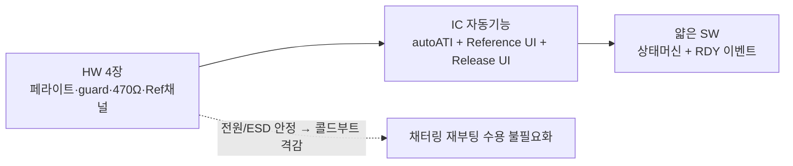

# 설계안 P6 · HW협업·근본개선파

> **TL;DR**: 빈 종이에서 출발한 통합 재설계. 9개 이슈의 **근원은 self-cap 단일채널 + FIXED 우회**이고, 이는 회로가 IC의 자동보정(ATI·Reference UI)을 못 받쳐줘서 SW가 떠안은 부채라고 본다. HW 카드 4장(① R28→**페라이트**로 채터링/ESD 차단 → 콜드부트 빈도 격감, ② **CRX1/J4를 guard electrode**로 능동 구동 → CH0 간섭·ESD 경로 차폐, ③ CRX0 직렬 100→470Ω, ④ **CRX2를 Reference 채널**로 신설)을 써서 **autoATI를 정정당당하게 복원**하고, 환경 드리프트는 **Reference UI(CH 추적 차감)** 가, 터치 중 모드전환 먹통은 **Release UI(Activation LTA·변화율 reseed)** 가 IC 하드웨어로 푼다. SW는 얇은 상태머신 + RDY 이벤트 통신만 담당. order code 001 = **Release UI 사용 가능**(Movement UI 불가)이라 본 설계의 핵심 두 축이 데이터시트로 보장된다. **현재 구현과의 핵심 차이**: SW가 떠안은 자동보정(200ms 방전·FIXED·CalCap 더미)을 전부 폐기하고, 회로를 고쳐 IC의 autoATI+Reference UI+Release UI에 되돌려준다.

> [!NOTE]
> 본 설계안은 공통 입력 [`01_문제정의·제약·평가축.md`](01_문제정의·제약·평가축.md)의 제약 안에서 작성됐다. 회로 사실은 [`../회로 구성·분석.md`](../회로%20구성·분석.md), 현재 SW는 [`../펌웨어 구현·시퀀스 분석.md`](../펌웨어%20구현·시퀀스%20분석.md), 데이터시트 §은 [`../../데이터시트/`](../../데이터시트/) 근거. **데이터시트에 없는 능력은 "확인 필요"로 표기**한다.

---

## 1. 설계 철학

**전제: 9개 이슈는 SW 버그가 아니라 HW가 IC를 못 받쳐줘서 생긴 부채다.**

현재 구현의 모든 우회(FIXED MULT/COMP, 200ms CRX0 VSS 방전, CRX1 CalCap 더미, prox 비활성)는 한 가지 결정 — "**autoATI를 못 쓴다**" — 에서 파생됐다. autoATI를 못 쓰는 이유는 두 가지였다:

1. **터치 중 부팅·모드전환** 시 ATI가 터치 정전용량을 기준으로 잡아 먹통 (이슈 1~4)
2. ATI를 끄니 **self-cap 드리프트**가 생겨 200ms 방전으로 또 우회 (이슈 6~7), 그 대가로 FIXED 카운트 변동·threshold 들쭉날쭉 (이슈 8~9)

HW협업·근본개선파의 진단: **이 두 문제 모두 IC가 데이터시트로 정식 해법을 제공한다. 단, 회로가 그 해법의 전제(깨끗한 전원·간섭 없는 전극·Reference 채널)를 안 갖춰서 SW가 떠안았을 뿐이다.**

- 터치 중 LTA 오염 → **Release UI**(Activation LTA는 터치 중에도 계속 갱신, 변화율로 reseed)가 IC 하드웨어로 해결 [04 §7.4]
- 환경 드리프트 → **Reference UI**(사용자가 못 건드리는 reference 채널이 LTA를 능동 보정)가 해결 [04 §7.3], **단 reference 채널이 회로에 필요**
- 채터링 재부팅·ESD 누적 → **전원 페라이트 + guard electrode + 직렬저항**으로 차단 — SW가 못 막는 물리 문제

**따라서 설계 순서를 뒤집는다: 먼저 회로를 IC가 자동 동작할 수 있는 상태로 고치고(HW 4장), 그 위에서 IC의 자동 기능(autoATI + Reference UI + Release UI)을 켜고, SW는 최소한의 상태머신만 얹는다.** "SW로 IC를 흉내내지 말고, HW를 고쳐 IC에게 일을 돌려준다"가 본 철학의 한 줄이다.

---

## 2. 핵심 메커니즘

### 2.1 측정 방식 — self-cap 유지 + Reference 채널 신설

- **CH0 (CRX0/J3)**: 주 센싱 채널. **self-capacitance 유지**(PXS 0x10, [06 A.7]). 전극·커넥터가 이미 self-cap 전제로 깔려 있어 mutual 전환은 전극 재설계가 필요 → self 유지가 합리적. `Linearise Counts` set 권장(Release UI 사용 시 데이터시트가 명시 권장, [02 §5.4.1]) + 그에 맞춰 `Invert` 정합.
- **CH2 (CRX2/C1) → Reference 채널 신설** [HW 카드 ④]: 현재 470Ω 종단 후 NC. 여기에 **사용자가 만질 수 없는 reference 전극**(예: 인접 PCB 영역, 동일 환경 노출 but 손가락 도달 불가)을 연결해 CH2를 reference 채널로 만든다. CH0를 follower로 묶어 **온도·습도·경시 드리프트를 IC가 능동 차감** [04 §7.3]. 이것이 현재 "200ms 방전"이 흉내내려던 일을 IC 하드웨어로 정식 수행하는 핵심.
- **CH1 (CRX1/J4) → guard electrode 구동** [HW 카드 ②]: CalCap 더미 폐기. 후술 §2.6.

> [!NOTE]
> mutual-cap(TxA 구동)은 검토했으나 채택 보류. 장점(self-cap 드리프트 본질 회피, counts 증가형이라 ESD 강건)이 크지만 **전극·배선 재설계가 필요**(TxA 종단 NC, J3 전극이 self 전제)해 본 설계의 "기존 자원 활용" 원칙과 충돌. mutual은 P6의 **2순위 카드**로 부록에 남긴다.

### 2.2 ATI 정책 — autoATI(Full) 복원, 단 "터치 중 ATI 금지"를 IC 메커니즘으로 보장

근본개선의 핵심. FIXED를 버리고 **ATI Mode = Full** [02 §5.9, 06 A.12] 복원. 카운트 변동(이슈 8)·threshold 들쭉날쭉(이슈 9)이 자동 소멸한다(ATI가 매 환경에서 counts를 ATI Base로 정규화하므로).

"터치 중 ATI 먹통"(이슈 1~4)은 다음 **2중 안전장치**로 막는다 — 둘 다 SW 타이밍이 아니라 IC/HW 메커니즘:

1. **Reference UI의 `Follower Event Mask`** [04 §7.3.1, 06 A.16]: reference 채널(CH2)은 follower(CH0)가 prox/touch 상태일 때 **ATI를 자동 disable**한다(데이터시트 명문). 즉 "손가락 닿은 동안 기준 채널이 오염 안 되게" IC가 보장. → 터치 중 모드전환 시점에 손이 닿아 있어도 reference 기준은 안 흔들린다.
2. **부팅 직후 autoATI 1회 + 그 전에 Release UI가 터치를 흡수**: 콜드부트(전원 최초 연결)에만 autoATI를 돌리는데, 이때 손가락이 닿아 있으면 §2.4 Release UI/부팅 무시 로직으로 처리. 웜부트(모드전환)에는 IC 레지스터가 보존되므로 **autoATI를 다시 안 돌린다** → 터치 중 ATI 자체가 발생 안 함.

→ 결국 "ATI를 켜되 터치 중엔 안 돌게"라는 공통 입력 부록의 시드 질문을, **Follower Event Mask + 웜부트 ATI 생략**으로 정확히 구현한다.

### 2.3 LTA 관리 — Reference UI가 표준 LTA를, Release UI가 Activation LTA를

3중 LTA 체계로 "부팅 시점 LTA 오염" 근원을 끊는다:

- **표준 LTA**: 환경 추적(천천히), 터치 중 frozen [02 §5.5]. Reference UI가 CH2 추적분을 차감해 드리프트 제거 → **200ms CRX0 방전 완전 폐기**.
- **Activation LTA** (Release UI): 터치 중에도 **계속 갱신** [04 §7.4]. 장기 터치(전원 버튼 누른 채)에서 "이게 진짜 release인가"를 변화율로 판정하는 기준.
- **Reseed**: 콜드부트 1회만 명시 reseed. 이후는 IC 자동(Reference UI + Re-ATI band) [02 §5.10]에 위임.

### 2.4 판정 — Release UI(변화율 기반) 1차 + Touch threshold 2차

전원 스위치는 본질이 "장기 터치 → 해제" 패턴이라 **Release UI가 정확히 이 용도** [04 §7.4]:

- 터치 진입: 표준 `(LTA − Counts) > Touch Threshold` [02 §5.7]. autoATI 정규화 덕에 threshold가 개체·환경 무관하게 안정(이슈 9 해소).
- **터치 해제(이탈)**: fixed threshold 비교가 아니라 **counts 변화율** 기준 [04 §7.4]:
  $$\text{If } (\text{Counts} - \text{Activation LTA}) > \left(\text{Delta Snapshot} \times \frac{\text{Release Delta Percentage}}{128}\right) \Rightarrow \text{reseed + 상태 이탈}$$
- 효과: "손가락 댄 채 모드전환·부팅"이 일어나도 Activation LTA가 그 상태를 학습하고, **손을 떼는 변화율**로 해제를 잡으므로 "터치 중 초기화 후 재인식 불가"(이슈 1~4) 근원 해소.
- order code 001 = **Release UI 사용 가능** [07 §10.1] → `Sensor Setup` bit6 `Release/Movement UI Enable` set [06 A.5]. 001에선 이 비트가 **Release UI로 동작**(Movement UI는 A01 전용, 본 칩 불가) — 공통 입력 §5 WARNING 그대로.

### 2.5 모드 전환 — "지속 터치" 판정을 IC Event Timeout + SW 롱터치 카운터 이중화

- **절전 → 노말**: 절전 중 IC는 LP/ULP에서 self-cap 측정 지속. 2~3초 지속 터치 검출 시 E8300 워치독 리셋(웜부트). SW가 RDY 이벤트로 touch 진입을 받고 롱터치 타이머 가동.
- **노말 → 절전**: 2~3초 롱터치 검출 → 절전 진입. **진입 시 IC 재설정 불필요**(현재의 255/255 둔감→reseed 2단계 폐기) — Release UI가 터치 중 상태를 자체 관리하므로 "설정 시점 터치 우려"(이슈 4)가 구조적으로 사라진다.
- **전력 모드**: `Power Mode = Automatic No ULP` [02 §5.3] 권장. 이유: Event Timeout(채널 timeout)·Release UI를 안정 운용하려면 ULP 금지가 데이터시트 명문 [02 §5.8 WARNING]. 절전 평균전류는 페라이트·guard로 노이즈 재측정이 줄어 상쇄.
  - *확인 필요*: ULP 9µA 대비 LP 50µA(2ch 기준) 전력 차가 인공와우 절전 예산에 허용되는지 — 실측 필요. ULP가 필수면 Release UI/Event Timeout 대신 §2.4 SW 롱터치만으로 절전 판정하는 fallback 분기 보유.

### 2.6 통신 — RDY 이벤트 모드(인터럽트) 전환

현재 폴링(200ms) + RDY 윈도우 핸드셰이크를 **이벤트 모드**로 전환 [05 §8.11]:

- `Events Enable`(0xD3 하위)에서 Touch·ATI·Power Event enable [06 A.32]. RDY는 event 발생 시에만 low → E8300이 INTERRUPT_n(C7)으로 깨어 read.
- 효과: 200ms 정주기 깨움 제거 → 절전 평균전류↓(§2.5 ULP 금지의 전력 상쇄), 통신 횟수↓. Watchdog(255ms)은 윈도 밖 IC 자동 kick [04 §7.6]이라 무방.
- `write_and_verify`의 값 미검증(현재 쟁점 §14-3)을 실제 read-back 비교로 강화 — 설정 오기록 감지.

---

## 3. 주요 레지스터·설정

| 목적 | 레지스터(주소) | 설정 값/의미 | 근거 |
|---|---|---|---|
| CH0 self-cap + Release UI + Linearise | Sensor Setup CH0 (0x30) | bit0 Enable=1, bit1 Linearise=1, bit3 Invert(정합), **bit6 Release/Movement UI Enable=1** | [06 A.5], [02 §5.4.1] |
| CH0 PXS Self | Prox Control / PXS | PXS Mode = 0x10 (Self) | [06 A.7] |
| ATI Full 복원 | ATI Setup CH0 (0x36) | ATI Mode bits[2:0]=Full, ATI Base·Resolution Factor 설정, ATI Band | [02 §5.9~5.10, 06 A.12] |
| CH2 Reference 채널 | Channel Setup CH2 (0x72) | Channel Mode=Reference(0b10), Follower Event Mask=0x03(CH0 prox+touch) | [04 §7.3, 06 A.16] |
| CH0 Follower 연결 | Channel Setup CH0 (0x52) | Channel Mode=Follower(0b01), Reference Sensor ID=2(CH2) | [04 §7.3.2, 06 A.16] |
| CH0 Follower Weight | Follower Weight CH0 (0x63) | 4096=직접추적 시작값(튜닝) | [04 §7.3.1, 06 A.18] |
| CH1 guard 구동 | Sensor Setup CH1 (0x40) 등 | CH1 enable + guard 구동 구성 *(데이터시트 명시 guard 모드 없음 — 확인 필요, §6)* | — |
| Touch threshold | Touch Settings (0x62) | threshold/hysteresis (autoATI 정규화 후 안정값, 튜닝) | [02 §5.7] |
| Activation Settling Threshold | Events Enable+Activation (0xD3 상위) | Activation Settling Threshold 설정 | [04 §7.4, 06 A.32] |
| Release UI 변화율 | Release UI Settings (0xD4) | Delta Snapshot Sample Delay(상위), Release Delta Percentage(하위) | [04 §7.4, 06 A.34] |
| Activation LTA filter | Activation LTA Filter Betas (0xB3) | NP/LP Activation LTA Beta | [06 A.29] |
| 이벤트 모드 | Events Enable (0xD3 하위) | Touch·ATI·Power Event enable | [06 A.32] |
| 전력 모드 | System Control / Power Mode | Automatic No ULP, Power Mode Timeout(0xC5) | [02 §5.3, 06 A.] |
| Event Timeout | Event Timeouts (0xD2) | Touch/Prox timeout (지속터치 보조 판정) | [02 §5.8, 06 A.31] |
| Conversion Freq | Conv Freq Setup CH0 (0x31) | self-cap ≤1MHz 권장 범위 [06 A.6] | [06 A.6] |

> [!IMPORTANT]
> **CRX1 guard 구동은 데이터시트에 "guard electrode" 전용 모드가 명시돼 있지 않다(확인 필요).** 일반적 구현은 (a) 인접 채널을 driven-shield로 동상 구동, 또는 (b) reference 채널로 묶어 간섭 흡수. 본 설계는 CRX2를 Reference로 쓰므로 **CRX1은 (a) 능동 guard 또는 미사용 floating 중 측정 결과로 선택**한다. guard 구동 가능성은 Azoteq AZD125(Capacitive Sensing Design Guide) 확인이 필요하다.

---

## 4. 요구 충족 방식

| 요구사항 | 본 설계의 충족 방식 |
|---|---|
| 터치 = 전원 스위치 | CH0 self-cap touch 이벤트 → SW 롱터치 FSM |
| 절전→노말 2~3초 (E8300만 리셋) | 절전 LP에서 RDY 이벤트로 touch 수신 → 롱터치 카운터 → 워치독 리셋(웜부트). IC 레지스터 보존 → **재설정·재ATI 불필요** |
| 노말→절전 2~3초 | 롱터치 검출 → 절전 진입. Release UI가 터치 상태 자체 관리 → 진입 시 둔감 2단계 우회 불필요 |
| 터치 IC 전원 상시 유지 | 변경 없음. E8300만 리셋되는 비대칭 유지 |
| 보드 최초 전원 시만 콜드부트 | 콜드부트 1회만 autoATI + reseed. 웜부트는 IC 보존 |
| 충전 채터링 ~1µs | **HW 카드 ① 페라이트**가 µs 채터링을 물리 차단 → 재부팅 빈도 격감. 만약 재부팅돼도 콜드부트 경로가 autoATI로 자가복구(둔감) → "재부팅 수용" 안전 |

---

## 5. 이슈 9건 대응표

| # | 이슈 | P6 대응 | HW/SW |
|---|---|---|---|
| 1~3 | 터치 중 autoATI가 터치 정전용량 기준 → 재터치 인식 불가 | **Follower Event Mask로 터치 중 reference ATI 차단** + 웜부트 시 ATI 미실행(레지스터 보존) | IC 기능 + SW |
| 4 | 노말→절전 설정 시점 터치 우려 | Release UI가 터치 상태 자체 관리 → 진입 시 IC 재설정 최소화, 둔감 2단계 폐기 | IC 기능 |
| 5 | autoATI 포기 → FIXED 채택 | **autoATI(Full) 복원** — 포기 원인을 Follower Event Mask로 제거 | IC 기능 |
| 6 | FIXED라 self-cap 드리프트 → 일정 후 먹통 | **Reference UI가 드리프트 능동 차감** + autoATI 내부 보정 부활 | IC 기능 + **HW ④** |
| 7 | 대응으로 200ms CRX0 VSS 방전 | **방전 완전 폐기** — Reference UI가 그 역할을 정식 수행 | 삭제 |
| 8 | FIXED라 부팅마다 RESEED 카운트 340~660 변동 | autoATI가 매 환경에서 counts를 ATI Base로 정규화 → 변동 소멸 | IC 기능 |
| 9 | 고정 threshold + CUR 편차 → 됐다 안 됐다 | autoATI 정규화로 counts 안정 + Release UI 변화율 판정(절대값 무관) | IC 기능 |
| — | (추가) 채터링 재부팅 불확실 | **HW ① 페라이트로 차단** → 재부팅 빈도 격감, 잔여는 콜드부트 자가복구 | **HW ①** |
| — | (추가) ESD 누적 먹통(절전 2~3회 후) | **HW ② guard + HW ③ 470Ω**로 ESD 경로 차폐·전류제한 | **HW ②③** |

---

## 6. 가정 · 확인 필요

| 항목 | 상태 | 검증 방법 |
|---|---|---|
| CRX1 "guard electrode" 능동 구동 가능 여부 | **확인 필요** — 데이터시트에 guard 전용 모드 명시 없음 | Azoteq AZD125 + 실측. 불가 시 CRX1 floating 또는 2차 reference |
| CRX2를 Reference로 쓸 사용자 불가촉 전극 확보 | **가정** — PCB에 reference 전극 영역 추가 필요(HW 변경) | 레이아웃 검토. 인공와우 외형상 reference 전극 배치 공간 확인 |
| Release UI가 self-cap 단일 전원버튼 용도에서 의도대로 동작 | **가정** — 데이터시트는 long-term touch 일반 명시 [04 §7.4], 전원버튼 특화 사례 없음 | 실칩 튜닝(Release Delta %, Settling Threshold, Sample Delay) |
| Automatic No ULP의 절전 전류가 예산 허용 | **확인 필요** — ULP 9µA 대비 LP 50µA(2ch) | 실측. 초과 시 §2.5 ULP+SW롱터치 fallback |
| 페라이트 비드 값·임피던스 | **확인 필요** — µs 채터링 차단 + 전원 강하 허용 동시 만족 | 채터링 파형 실측 후 비드 선정 |
| guard 동상 구동이 CH0 감도에 미치는 영향 | **확인 필요** | guard on/off 감도 실측 |
| Reference 채널(CH2 신설)이 2ch 전류·timing에 미치는 영향 | **가정** — 데이터시트 2ch 전류표 존재 | 실측 |
| order code 001 Release UI 동작 | **데이터시트 보장** [07 §10.1] | — (검증 완료) |

---

## 7. 리스크

| 리스크 | 영향 | 완화 |
|---|---|---|
| **HW 변경 4건이 전제** — 페라이트·guard 배선·470Ω·reference 전극. 보드 리비전 필요 | 가장 큰 리스크. SW만으로 즉시 적용 불가 | 우선순위화: ① 페라이트(채터링)·③ 470Ω(ESD)은 부품 교체로 저비용 선행 가능. ②④는 차기 리비전 |
| Reference 전극 배치 공간이 인공와우 외형상 부족할 수 있음 | Reference UI 핵심 카드 무력화 | fallback: Reference UI 없이 autoATI + Release UI만으로도 이슈 5·8·9·1~4 상당수 해결(드리프트만 일부 잔존) |
| Release UI 튜닝 파라미터(Release Delta %·Settling·Sample Delay)가 전원버튼 용도에 미검증 | 해제 인식 오작동(너무 빨리/늦게 reseed) | 단계적 튜닝 + Touch threshold 2차 판정 병행(이중 안전) |
| guard 구동 가능 여부 불명확(데이터시트 미명시) | guard 카드 무력화 | CRX1 floating로 degrade, ESD는 470Ω+페라이트로 대부분 커버 |
| Automatic No ULP 전류 초과 | 절전 예산 위반 | ULP+SW롱터치 fallback 분기 |
| 이벤트 모드 전환 시 RDY 인터럽트 배선/풀업 검증 필요(I²C 풀업 회로 측 부재) | 통신 불안정 | 마스터 측 풀업 실재 확인(공통 입력 §3) 선행 |
| autoATI 복원 후에도 콜드부트 시 손가락 닿아 있으면 ATI 오염 잔존 | 콜드부트 1회 한정 먹통 | 콜드부트는 "보드 최초 전원"이라 손 안 닿은 상태 가정 가능 + Release UI 부팅무시 |

---

## 8. 현재 구현과의 핵심 차이 (1~2줄)

현재는 **autoATI를 포기**하고 그 빈자리를 SW(FIXED MULT/COMP·200ms CRX0 방전·CRX1 CalCap 더미·폴링)로 메운다. 본 설계는 **회로를 고쳐(페라이트·guard·470Ω·reference 전극) IC가 autoATI+Reference UI+Release UI를 정식 수행하게 되돌리고**, SW는 얇은 상태머신과 RDY 이벤트 통신만 남긴다.

---

## 부록 — 2순위 카드 (보류)

- **Mutual-cap 전환 (TxA 구동)**: self-cap 드리프트를 본질적으로 회피하고 counts 증가형이라 ESD에 강건. 단 전극·배선 재설계 필요(TxA NC, J3 self 전제) → 차기 보드 풀리디자인 시 1순위 후보로 승격 검토.
- **OUTA event indicator** [04 §7.1]: 터치 이벤트를 OUTA(B4, 현재 NC)로 HW 출력 → E8300이 I²C 없이도 이벤트 감지(디버깅·redundancy). 저비용 추가 카드.
- **CRX0 RC 필터 재튜닝**: R31 100→470Ω 시 C51과의 fc 변화(15.9MHz→3.4MHz) 감도 영향 동시 평가 [회로 §7.1].
