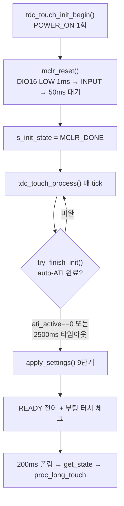

# IQS323 터치 펌웨어 구현·시퀀스 분석 (Sound1)

> **TL;DR**: IQS323 터치 SW를 코드 ground truth로 정리. 2계층(`tdc_touch`↔`tdc_drv_iqs323`)·초기화(MCLR→auto-ATI 폴링→apply_settings 9단계)·CH1 CalCap 더미·ATI FIXED(보드변종)·200ms CRX0 방전·노말 2.4s/절전 2.2s 롱터치·폴링 I²C+RDY 핸드셰이크를 분석하고 요구사항·데이터시트와 대조, SW 쟁점을 제기한다. (개선안 도출은 후속)

> [!NOTE]
> 회로 짝: [`회로 구성·분석.md`](회로%20구성·분석.md). 코드 위치 `src/2__cm3/Cortex-M3-src/systemControl/`. 레지스터 비트 의미는 데이터시트 [`../데이터시트/06_레지스터레퍼런스.md`](../데이터시트/06_레지스터레퍼런스.md) 교차. 사용 시나리오·이슈 원본은 [`../개발 요구 사항 및 예상 문제 정리.md`](../개발%20요구%20사항%20및%20예상%20문제%20정리.md).

> [!IMPORTANT]
> 본 문서의 코드 사실(함수·라인·레지스터 write 값·상수)은 Claude가 코드를 직접 Read해 확정했다. **추정·미확인은 "(추정)"·"(확인 필요)"로 명시**한다. 단정은 코드/데이터시트로 검증된 것만.

---

## 1. 개요 — 2계층 구조

| 레이어 | 파일 | 역할 |
|---|---|---|
| **기능**(IC 독립) | `tdc_touch.{c,h}` | 초기화 상태머신·200ms 폴링·롱터치 FSM·UX 로직 |
| **드라이버** | `tdc_drv_iqs323.{c,h}` | I²C·RDY 윈도우·레지스터 설정 시퀀스 |
| **빌드 설정** | `tdc_touch_config.h` | 보드변종·CRX1 모드·방전 등 플래그(한 곳 관리) |
| **통합** | `main.c`(`func_normal`/`func_sleep`)·`initialize.c`(`Initialize`) | 호출·전원모드 연계 |

IC 교체 시 기능 레이어는 무수정, 드라이버만 교체하는 분리 설계.

## 2. 파일·함수 맵 (핵심)

**`tdc_touch.c`**: `tdc_touch_init_begin()`(289)·`tdc_touch_process()`(301)·`tdc_touch_get_state()`(379)·`proc_long_touch()`(78)·`try_finish_init()`(216).
**`tdc_drv_iqs323.c`**: `sensor_setup()`(440)·`touch_settings_impl/touch_settings`(536/547)·`prox_settings()`(559)·`write_ati_compensation()`(683)·`tdc_drv_iqs323_apply_settings()`(1023)·`discharge_crx0()`(938)·`reseed()`(918)·`apply_sleep_settings()`(954)·`read_status()`(1153)·`read_touch_margin()`(1172)·RDY/I²C 래퍼(`force_window_open` 143·`write_register` 178·`read_register` 227·`write_and_verify` 265).

## 3. 빌드 설정 (`tdc_touch_config.h`)

| # | 플래그 | 기본값 | 의미 |
|---|---|---|---|
| 1 | `TDC_BOARD_VARIANT` | `PACKAGE`(2) | ATI 보상값 선택 (MINI/DEVELOP/PACKAGE) |
| 2 | `TDC_DRV_IQS323_ATI_DUMP_ENABLE` | 0 | RE-ATI 후 MULT/COMP RTT 덤프(디버그) |
| 3 | `TDC_TOUCH_ATI_CALIB_MODE` | 0 | auto-ATI 후 MULT/COMP LED 이진 출력(디버그) |
| 4 | `TDC_TOUCH_SLEEP_MEASURE_MODE` | 0 | 절전 환경 re-ATI 측정(개발) |
| 5 | `TDC_TOUCH_CRX1_VSS_ENABLE` | 0 | CRX1→IC 내부 VSS (C52 단락 전제) |
| 6 | `TDC_TOUCH_CRX1_REF_ENABLE` | 0 | CH1 Reference 모드 (LTA 드리프트 보정) |
| 6-1 | **`TDC_TOUCH_CRX1_DUMMY_ENABLE`** | **1** | **CH1 내부 CalCap 더미** (production, 5·6과 상호배타) |
| 7 | `TDC_TOUCH_CRX0_DISCHARGE_ENABLE` | 1 | 매 폴링 CRX0 VSS 방전 (6-1 전제) |
| 8 | `TDC_TOUCH_CRX0_DISCHARGE_LOG` | 0 | 방전 write 로그 억제 |
| 9 | `TDC_TOUCH_MARGIN_LOG_ENABLE` | 1 | 터치 마진 RTT 로그 |
| 9-1 | `TDC_TOUCH_MARGIN_LOG_INTERVAL` | 5 | 마진 읽기 주기(폴링 N회마다) |
| 10 | `TDC_TOUCH_PROX_THRESHOLD_ENABLE` | 0 | Prox Settings 적용 (측정 불안정 우려로 비활성) |
| — | `TDC_TOUCH_RTT_TUNING`(drv.h) | 0 | RTT 런타임 파라미터 튜닝(개발) |

- CRX1 3모드(VSS·REF·DUMMY) 동시 활성은 `#error`로 차단(상호배타).

## 4. 초기화 시퀀스

- **`init_begin`**(289): `mclr_reset()`(MCLR HOLD 1ms·BOOT_WAIT 50ms) 후 `s_init_state=MCLR_DONE`, `s_mclr_done_tick` 기록. 즉시 반환(비차단).
- **`try_finish_init`**(216): `is_auto_ati_done()`(System Status 0x10 ati_active 비트) 폴링. 미완이고 `INIT_TIMEOUT_MS(2500)` 초과 시 경고 후 **강제 진행**(터치 누른 채 부팅 대비). 그 다음 `apply_settings()` 호출.
- **READY 전이 직후**(`process` 318~325): 터치 중이면 `s_boot_touch_ignore=true`(해제까지 무시), 5초 초과 시 디버그 LED.

## 5. `apply_settings()` 레지스터 시퀀스 (운용 모드, line 1089~1146)

`ATI_DUMP_ENABLE=0` 운용 경로 9단계:

| # | 호출 | 레지스터(주소) | write 값 | 목적 |
|---|---|---|---|---|
| 1 | `ack_reset_event()` | System Control(0xC0) | LSB 0x01 | Reset Event ACK |
| 2 | `confirm_reset_event()` | System Status(0x10) | (poll) | reset_event==0 확인 |
| 3 | `sensor_setup()` | 0x50/0x44/0x40/0x46/0x70/0x30 | §6 참조 | CH0/CH1/CH2 채널 구성 |
| 4 | `touch_settings()` | Touch Settings(0x62) | LSB 100·MSB 80 | threshold/hysteresis |
| 5 | `prox_settings(120)` | Prox Settings(0x61) | — | **`PROX_ENABLE=0`이라 no-op**(미기록) |
| 6 | `events_enable()` | Events Enable(0xD3) | touch·ATI ON, 그 외 OFF | 이벤트 설정 |
| 7 | `write_ati_compensation()` | 0x36/0x38/0x39 | §7 참조 | ATI FIXED 보상 |
| 8 | RESEED | System Control(0xC0) | LSB 0x08 | LTA 초기화(bit3) |
| 9 | CH Timeout Disable | System Control(0xC0) | MSB 0x07 | CH0~2 timeout 비활성 |

> [!NOTE]
> 5단계 `prox_settings(120)`은 호출되나 `TDC_TOUCH_PROX_THRESHOLD_ENABLE=0`이라 내부 `(void)threshold; return true`로 **Prox Settings 레지스터에 실제 기록하지 않는다**(reset 0 유지). 즉 노터치 LTA freeze 방지용 prox 기능은 현재 **비활성**.

## 6. 채널 설정 (`sensor_setup()`, line 440~534)

| 채널 | write | 비고 |
|---|---|---|
| **CH2**(0x50) | LSB 0x00(Floating)·MSB 0x00 | 항상 disable |
| **CH1 — production = DUMMY** | ① 0x44 LSB 0x2A·MSB 0x03 (CalCap 1.0pF + Inactive Rxs VSS, Wav0) ② 0x40 LSB 0x01(enable)·MSB CalCap Rx/Tx(bit14/13) ③ 0x46 LSB 0x08·MSB 0x04 (ATI Mode=Disabled) ④ 0x70 LSB 0x00 (Independent) | 내부 CalCap을 변환 부하로, measurement cycle 유지 |
| **CH0**(0x30) | LSB 0x01(enable)·MSB 0x01(ctx0) | 활성 측정 채널 |

- CH1 4모드(빌드 분기): `REF`(0x70=0x02 Reference) / `VSS`(0x40 LSB 0x0A) / **`DUMMY`(production)** / default(Floating).
- CH1 ATI Disabled(③): CalCap 부하의 auto-ATI 수렴 실패 → 전역 ATI_ERROR(0x10 bit6) SET → 터치 판정 차단을 막기 위함(상세: [`../이슈해결/2026-06_CRX1-ESD-더미채널.md`](../이슈해결/2026-06_CRX1-ESD-더미채널.md)).

## 7. ATI FIXED 보상 (`write_ati_compensation()`, line 683~720)

auto-ATI 미사용. 사전 측정값을 직접 write(`ATI_SETUP`→`ATI_MULT`→`ATI_COMP`).

| 보드변종 | ATI_MULT (0x38) | ATI_COMP (0x39) | 기준 |
|---|---|---|---|
| MINI | 0x5A82 | 0x5800 | 초기 측정 |
| DEVELOP | 0x6282 | 0x53FF | 초기 측정 |
| **PACKAGE**(기본) | **0x5C82** | **0x63EF** | 정상 노터치 실측(2026-06-08) |
| 절전(공통) | 0x5C82 | 0x63EF | 주변 OFF+저속 클럭 실측 |

- `ATI_SETUP`(0x36) = LSB 0x08·MSB 0x04 → **ATI Mode bits[2:0]=000(Disabled)**. (전 변종 공통)

> [!WARNING]
> **코드 내부 불일치(관찰)**: PACKAGE 실제 `#define`은 `ATI_MULT_MSB 0x5C`·`ATI_COMP_LSB 0xEF`(line 667~670, MULT 0x5C82·COMP 0x63EF)인데, 바로 위 주석 표(line 638~640)는 `0x5E`·`0xE4`로 적혀 있다. **실제 동작값은 #define 기준(0x5C82/0x63EF)**이며 주석 표가 낡았다. 정정 권고(코드 측, 본 분석 범위 밖).

## 8. 200ms 폴링 + CRX0 VSS 방전

- 폴링 주기 `TDC_TOUCH_POLL_INTERVAL = 200`(ms). `process()`가 `ci_timer_get_tick()` 기반 200ms 경과마다 `get_state()` 호출.
- **`discharge_crx0()`**(938): `get_state()` 말미(상태 결정 후) 호출.
  - ① `write_register_discharge(0x30, 0x02, 0x00)` — CH0 disable + CRX0 VSS
  - ② `write_register_discharge(0x30, 0x01, 0x01)` — CH0 복원(enable+ctx0)
  - verify 없음(best-effort), `DISCHARGE_LOG=0`이라 로그 억제.
- 전제: `CRX0_DISCHARGE_ENABLE=1`은 `CRX1_DUMMY_ENABLE=1` 필수(CH0 disable 순간 유일 활성 채널이 없으면 measurement cycle 정지·RDY 먹통).

> [!IMPORTANT]
> **데이터시트 대조 쟁점(확인 필요)**: 코드는 `0x30`(Sensor Setup) LSB에 `INACTIVE_RXS` 값(0x0A=둘 다 VSS, 0x02=CRX0만 VSS)을 쓰고, 코드 주석(`tdc_drv_iqs323.h` 84~89)은 이를 "bits[1:0]=CRX0 상태, bits[3:2]=CRX1 상태(2-bit/pin)"로 해석한다. 한편 데이터시트 [06 A.5] Sensor Setup LSB 비트 정의는 **bit3 Invert·bit2 Dual Direction·bit1 Linearise·bit0 Enable Channel**으로, "핀별 inactive 상태" 필드가 명시돼 있지 않다(Inactive Rxs는 [06 A.10] Pattern Definitions bits[3:0]). 데이터시트 비트 정의대로면 `0x02`=Linearise·`0x0A`=Invert+Linearise(enable=0)로 해석된다. **이 해석 차이가 실칩에서 어떻게 동작하는지는 실측 확인이 필요하다.** (현재 코드가 동작 중이므로 disable 채널에서 무영향이거나 칩이 데이터시트 외 매핑을 따를 가능성 — 단정 불가)

## 9. 터치 판정·마진

- **`read_status()`**(1153): System Status(0x10) 읽어 `ch0_touch` 비트 → `pressed`, `ati_error` 비트 추출.
- **`get_state()`**(379): `pressed`면 `TOUCH`, 아니면 `NOT_TOUCH`. **`ati_error`는 `(void)`로 무시**(운용 모드 ATI Disabled, 전역 비트라 CH1 더미 잔재 합산되나 CH0 터치는 채널별 정확).
- **마진**(`read_touch_margin` 1172, `MARGIN_LOG_INTERVAL=5`마다): `current_coeff = (LTA − Counts) × 256 / LTA`. threshold 계수(100)와 같은 단위로 역환산해 RTT 로그. 방전 전 신선한 LTA/Counts로 읽어야 정확.
- threshold/hysteresis: 노말 100/80, 절전(reseed 시) 100/80. Prox 120(노말)·100(절전) — `PROX_ENABLE=0`이라 미적용.

## 10. 롱터치 FSM (`proc_long_touch()`, line 78~132)

- `TDC_TOUCH_LONG_TOUCH_MS = 2400`(ms). TOUCH 상태가 2400ms 지속되면 **true 1회**(`s_is_long_touch`로 중복 차단, 재터치 필요).
- 상태 전이: RESET/NOT_TOUCH/CAL_ERROR에서 TOUCH 진입 시 `s_tick_first_touch` 기록 → TOUCH 지속 중 2400ms 경과 시 true.

> [!NOTE]
> **코드 주석↔상수 불일치(관찰)**: `tdc_touch.h` 헤더 주석 "2.8초 롱터치", `tdc_touch.c:76` "롱터치 판정 (3초)", `tdc_touch.c:334` "100ms 폴링"은 실제 상수(`LONG_TOUCH_MS 2400`=2.4초·`POLL_INTERVAL 200`)와 다르다. **실제 동작은 상수 기준**.

## 11. 전원 모드 연계

### 노말 (`func_normal`)
- `main.c:448`: `powerButtonPushed = tdc_touch_process()` 매 iteration. 2.4s 롱터치 시 true → `systemControl()`이 POWER_OFF LED → `systemState.systemOff=true` → `break` → `func_sleep()`.

### 절전 진입 (`func_sleep`, line 797~)
1. **터치 해제 대기**: `read_status` `pressed`인 동안 100ms delay 반복.
2. 주변장치 OFF: FPGA reset → CFX ULP cmd → NRF/QCC(shutdown)/FPGA/PMIC OFF → LED OFF → CFX ULP 진입 대기.
3. **`apply_sleep_settings()`**(872, 클럭 변경 전): touch_settings **255/255**(둔감) + ATI 절전값(0x5C82/0x63EF) + CH Timeout Disable(0xC0 MSB 0x07) + ULP 플래그.
4. `ci_power_sleep()`(SYSCLK 30.72M→2.56M) → I²C prescale(122kHz 유지).
5. **`reseed()`**(880): touch_settings **100/80** + prox 100(미적용) + RESEED(0xC0 0x08).
6. 타이머 200ms(`ULP_TIMER` PRESCALE_128·TIMEOUT 62 ≈ 201.6ms).
7. **ULP loop**: `SYS_WAIT_FOR_INTERRUPT`(200ms idle) → watchdog refresh → `get_state` → TOUCH면 `touch_cnt++`, **`>= ULP_LONG_TOUCH_COUNT(11)`**(2.2s) → `SYS_WATCHDOG_RESET()`. 손 뗌/read 실패 시 cnt=0.

> [!IMPORTANT]
> **절전 threshold 2단계(직접 확인)**: `apply_sleep_settings`는 threshold/hysteresis를 **255/255(둔감)**로 먼저 쓰고, `ci_power_sleep` 후 `reseed`가 **100/80**으로 복원하며 LTA를 reseed한다. 클럭 전환·LTA 안정 구간을 둔감 상태로 통과시키려는 의도로 보인다. (의도 추정 — 확인 필요)

- **웜부트**: 절전 복귀는 `SYS_WATCHDOG_RESET`(E8300 CM3만 리셋, 터치 IC 전원은 유지).
  > [!WARNING]
  > **정정(2026-06-11, 검증 B4)**: 종전 "MCLR 미수행 → IC 레지스터 상태 보존"으로 서술했으나 **거짓**이다. 워치독 리셋 후 `main()`→`Initialize()`→`tdc_touch_init_begin()`(`initialize.c:449`)→`mclr_reset()`(`drv.c:908→288`)이 **reset-cause 분기 없이 무조건 실행**되어 IC가 매 웜부트 **POR**된다(레지스터·LTA가 start-up default로 초기화 후 `apply_settings`로 재설정). 즉 전원은 유지되나 IC 내부 상태는 콜드부트와 사실상 동일하게 초기화된다. 진짜 "IC 보존"을 원하면 reset-cause(콜드 POR vs 워치독 웜) 분기로 웜부트 MCLR을 스킵하는 SW 변경이 선행돼야 한다(현 코드 reset-cause 검출 부재). 상세: [`생각정리/4_타당성검증.md` B4](생각정리/4_타당성검증.md).
- 타이밍 비교: 노말 **2.4s**(2400ms), 절전 **2.2s**(200ms×11). 폴링 주기 차이 고려한 값(추정).

## 12. 통신 방식 — 폴링 I²C + RDY 핸드셰이크

- IQS323은 이벤트 IC(RDY 인터럽트 지원)이나, 펌웨어는 **폴링 기반**(RDY 인터럽트 미사용). 노말·절전 모두 200ms 주기.
- RDY 윈도우 프로토콜(`write_register` 178): `force_window_open()`(I²C dummy 0xFF 전송, RDY low 대기 max 45ms) → `i2c_write` → `wait_rdy_window_closed()`(max 20ms, soft timeout).
- `read_register`(227): 2-phase(주소 write → window → data read).
- **`write_and_verify`**(265): `write_register` 후 `read_register`로 읽되 **값 일치는 검증하지 않음**(read 성공만 확인). → 설정값 오기록을 감지하지 못함(쟁점 §14).

## 13. 요구사항·데이터시트 대조

### 현재 구현 5종 ↔ 코드 ↔ 데이터시트

| 요구사항 구현 | 코드 근거 | 데이터시트 |
|---|---|---|
| ① self-cap CRX0 | `sensor_setup` 0x30 enable+ctx0, PXS 0x10 | [06 A.7] PXS Self 0x10 |
| ② autoATI 미사용·FIXED MULT/COMP | `write_ati_compensation` 0x36 Mode Disabled + 0x38/0x39 고정 | [06 A.12] ATI Mode 000=Disabled |
| ③ 200ms CRX0→VSS 방전 | `discharge_crx0` 0x30 0x02→0x01, POLL 200 | [06 A.10] Inactive Rxs VSS (단 §8 쟁점) |
| ④ CRX1 CalCap | `sensor_setup` DUMMY: 0x40 CalCap Rx/Tx + 0x46 ATI Disabled | [02 §5.12.3] CalCap, [06 A.5] CalCap Rx/Tx |
| ⑤ 스트리밍 모드 | (폴링으로 read, Interface 설정은 events_enable 0xD3) | [06 A.30] Interface Selection |

### 이슈 9건 ↔ 코드 대응

| 이슈 | 코드 대응 |
|---|---|
| 터치 중 ATI 먹통(전원버튼 겸용) | autoATI 미사용 + 부팅 터치 무시(`s_boot_touch_ignore`) + INIT_TIMEOUT 강제진행 |
| 초기화 시 터치 먹통 | 노말→절전 터치 해제 대기(`func_sleep` 터치 release까지) |
| 드리프트→일정 횟수 후 먹통 | 200ms CRX0 VSS 방전(`CRX0_DISCHARGE`) |
| RESEED 시 카운트 340~660 변동 | FIXED MULT/COMP라 raw count 시점 의존(§14) |
| 고정 threshold 들쭉날쭉 | threshold 100 고정(`touch_settings`), 적응 없음(§14) |

## 14. SW 관점 관찰·쟁점 (분석)

> 아래는 **쟁점 제기**다. 개선안 확정·검증은 후속 스터디([README] 로드맵).

1. **autoATI 포기 → FIXED + 주기방전 우회 구조**: 전원버튼 겸용(터치 중 ATI가 그 정전용량을 기준 잡음)이 근원 → autoATI 포기 → self-cap 드리프트 → 200ms CRX0 VSS 방전으로 보완. SW가 HW 자동보정 역할을 떠안은 구조.
2. **고정 threshold(100)의 카운트 변동 취약성**: MULT/COMP 고정이라 매 부팅 시점 정전용량에 따라 raw count(340~660)가 달라지는데(요구사항 이슈 #8), threshold는 고정 → CUR 마진이 들쭉날쭉(이슈 #9). 적응형 정규화 부재.
3. **`write_and_verify` 값 미검증**: write 후 read는 하나 값 일치를 비교하지 않음 → 레지스터 오기록 미감지 가능. "verify"라는 이름과 실제 동작 괴리.
4. **절전 threshold 2단계(255→100/80)**: 의도(둔감 통과 후 reseed)는 추정. 명시 문서화·검증 필요.
5. **데이터시트 vs 코드 레지스터 해석 차이(§8)**: 0x30 LSB의 INACTIVE_RXS 인코딩이 데이터시트 A.5 비트 정의와 불일치 — 실칩 동작 확인 필요(가장 중요한 검증 항목).
6. **코드 내부 불일치**: ATI 주석표(0x5E/0xE4) vs define(0x5C/0xEF), 롱터치 주석(2.8/3초) vs 상수(2.4초), 폴링 주석(100ms) vs 상수(200ms). 코드 정정 권고.
7. **prox 기능 비활성**: LTA freeze 방지용 prox(120)가 `PROX_ENABLE=0`으로 꺼짐(측정 불안정 우려). baseline drift 방어 수단 하나가 미사용.
8. **보드변종 ATI 실측 의존**: PACKAGE 값이 특정 시점(2026-06-08) 실측 — 개체·환경 편차 시 재측정 필요(FIXED의 본질적 한계).
9. **ati_error 전역 무시**: CH1 더미 auto-ATI 잔재가 전역 ATI_ERROR(0x10 bit6)에 합산되나 CH0 터치는 채널별이라 무시. 단 진짜 CH0 ATI 이상도 함께 가려짐(운용상 ATI Disabled라 무관하나 진단 가시성↓).

---

## 부록 — 핵심 상수·레지스터 요약

| 항목 | 값 | 출처 |
|---|---|---|
| I²C 주소 / RDY 핀 | 0x44 / DIO16 | drv.h 25·26 |
| MCLR HOLD / BOOT WAIT | 1ms / 50ms | drv.h 38·39 |
| RDY open/close 타임아웃 | 45ms / 20ms | drv.h 31·32 |
| POLL / LONG / INIT_TIMEOUT | 200 / 2400 / 2500 ms | touch.h 25~27 |
| 절전 WAKE / LONG / COUNT | 200 / 2200 ms / 11 | main.c 784·785·788 |
| threshold / hysteresis | 100 / 80 | drv.h 132·133 |
| prox / sleep prox | 120 / 100 (미적용) | drv.h 145·146 |
| PACKAGE ATI MULT/COMP | 0x5C82 / 0x63EF | drv.c 667~670 |
| CalCap pattern | 0x2A / 0x03 | drv.h 107·108 |
