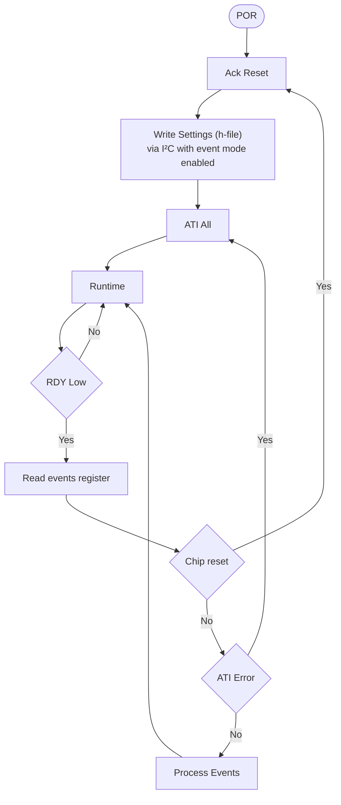

# IQS323 데이터시트 — 05 I²C Interface (§8)

> **TL;DR**: I²C 통신. Fast-mode-plus(≤1MHz)·8-bit 주소/16-bit word(little endian), 주소(debug=LSB invert), RDY Comm Window, Transaction Timeout(2~230ms·기본 200), Terminate(STOP/0xFF), Invalid 0xEE, Streaming vs Event Mode, Force Comm, Program Flow 원문 정리. 원문 p.30~34.

> [!NOTE]
> Memory map 주소표·레지스터 비트는 [`06_레지스터레퍼런스.md`](06_레지스터레퍼런스.md). Reset 동작은 [`03_하드웨어설정.md`](03_하드웨어설정.md) §6.6.

---

## 8.1 I²C Module Specification

standard 2-wire I²C + Ready(RDY) line 지원. **byte level clock stretching 허용**. 지원 사양:

- **Fast-mode-plus standard I²C up to 1 MHz**
- Streaming data + event mode

IQS323은 8-bit addressing 구현, **각 address에 2 byte**.

> [!NOTE]
> **Fast-mode-plus(FM+)와 Clock Stretching**
>
> I²C 속도 등급은 Standard(100 kHz) → Fast(400 kHz) → **Fast-mode-plus(1 MHz)** 순으로 높아진다.
> 속도가 높아질수록 버스 배선의 기생 정전용량과 pull-up 저항이 형성하는 RC 시정수가 병목이 된다.
> 신호 상승 시간(rise time) 허용 최댓값이 Standard 1000 ns / Fast 300 ns에서 FM+는 **120 ns**로 단축되어,
> pull-up 저항을 낮추고 충전 전류를 키워야 한다.
> 그 결과 LOW 싱크 전류 요구량이 Standard·Fast의 **3 mA** 대비 FM+는 **최대 20 mA**까지 상승한다.
> IQS323이 FM+를 지원 사양으로 명시한 것은 이 20 mA 싱크 드라이버와 120 ns 내 수렴하는 I/O 셀을 갖췄음을 보증한다는 의미다.
>
> **Clock Stretching**은 open-drain 특성을 이용해 슬레이브가 SCL을 LOW로 붙잡아 마스터의 다음 클럭을 지연시키는 메커니즘이다.
> 마스터는 SCL을 HIGH로 릴리즈한 후 라인 실제 레벨을 read-back해 HIGH가 될 때까지 대기해야 한다.
> IQS323은 내부 레지스터 기록·ADC 변환 준비 중 clock stretching을 사용하므로, 마스터가 wired-AND 감지를 생략하면 데이터 충돌이 발생한다.

## 8.2 I²C Address

7-bit I²C address는 order code로 결정(사용 가능 주소는 §10). 모든 order code에서 IQS323은 추가 **debug I²C address**도 ack. debug address는 디버깅 전용으로 정상 동작 시 사용 금지. **debug address = primary address의 LSB invert**. 예: IQS323-001의 primary address는 0x44, debug address는 0x45.

> [!NOTE]
> **Debug Address 활용과 주의사항**
>
> `debug address = primary의 LSB invert` 규칙은 별도 GPIO 추가 없이 단일 배선으로 두 번째 주소를 확보하는 방법이다.
> 예: primary 0x44(0b100_0100) → debug 0x45(0b100_0101).
> Debug 주소는 JTAG/SWD 없이 내부 상태를 덤프하거나 ATI 파라미터를 확인하는 데 유용하다.
>
> **운영 환경에서 debug address 사용 금지** — 데이터시트 원문 명시 사항이며, 예측 불가한 동작을 유발할 수 있다.
> 동일 버스에 IQS323이 2개 이상 있을 경우 debug 주소가 충돌하는지 설계 단계에서 반드시 점검해야 한다.

## 8.3 I³C Compatibility

data retrieval 위해 clock stretching을 허용하므로 **I³C bus와 비호환**.

> [!NOTE]
> **FM+ vs 표준 I²C — SCL 파형 비교**
>
> ```
> ── Standard / Fast-mode (≤400 kHz) ──────────
>
>  SCL  ──────┐         ┌──────┐         ┌──
>             │         │      │         │
>             └─────────┘      └─────────┘
>  주기        ←── 2.5 µs ──→
>  HIGH 최소   1000 ns
>  LOW 최소     900 ns
>  rise time  ≤300 ns     싱크 전류  3 mA
>
> ── Fast-mode-plus (≤1 MHz) ───────────────────
>
>  SCL  ────┐      ┌────┐      ┌────┐      ┌──
>           │      │    │      │    │      │
>           └──────┘    └──────┘    └──────┘
>  주기       ←── 1.0 µs ──→
>  HIGH 최소   600 ns
>  LOW 최소   1300 ns   ← LOW가 더 길다
>  rise time ≤120 ns    싱크 전류 20 mA
>  fall time  20~120 ns (70%→30%)
>
>  ┌──────────────────────────────────────┐
>  │ 항목         Std/Fast      FM+       │
>  ├──────────────────────────────────────┤
>  │ 최대 속도    400 kHz      1 MHz      │
>  │ rise time   ≤300 ns     ≤120 ns     │
>  │ 싱크 전류     3 mA        20 mA     │
>  │ pull-up Rp  ≥1 kΩ       ≤450 Ω     │
>  └──────────────────────────────────────┘
>
>  MCU: FM+ 모드 명시 활성화 필요
>  IQS323: 20 mA 싱크 드라이버 내장 → FM+ 보증
> ```
>
> FM+는 클럭 주기가 짧아지는 만큼 rise time 허용폭도 좁아진다.
> pull-up 저항값을 낮춰 RC 시정수를 줄여야 하며,
> MCU 측에서도 FM+ 모드를 명시적으로 활성화해야 한다.

> [!NOTE]
> **I³C 비호환 이유**
>
> I³C(Improved Inter-Integrated Circuit)는 I²C 핀 호환성을 유지하면서 최대 12.5 MHz SDR을 달성하기 위한 MIPI 표준이다.
> I³C의 핵심 전제는 **클럭은 오직 컨트롤러(마스터)만 구동**한다는 것이다.
> 타깃이 SCL을 LOW로 붙잡는 clock stretching을 허용하면, 컨트롤러는 다음 비트 샘플링 시점을 예측할 수 없어 고속 파이프라인 타이밍이 무너진다.
> IQS323은 data retrieval 중 clock stretching을 필수적으로 사용하므로,
> I³C 버스에 연결하면 타깃이 SCL을 잡는 순간 컨트롤러가 타임아웃 또는 버스 리셋을 발생시킨다.

## 8.4 Communication During ATI

`System Status`의 `Reset Event` bit가 set이 아니면, **ATI 동안 I²C 통신 disabled**.

> [!NOTE]
> ATI(Automatic Tuning Implementation) 실행 중에는 I²C 통신이 차단된다.
> 따라서 드라이버는 POR 후 `Reset Event` bit를 확인해 ATI 완료를 검증한 뒤 레지스터 설정을 진행해야 한다.
> §8.15 Program Flow Diagram의 `Ack Reset` → `Write Settings` 순서가 이를 반영한다.

## 8.5 Memory Map Addressing and Data

memory map은 8-bit addressing 구현. data는 16-bit word로 formatting → **각 address에 2 byte 저장**. 예: address `0x10`은 2 byte 제공, 다음 2 byte read는 `0x11`에서. **16-bit data는 little endian(LSB first)**.

> [!NOTE]
> **Little Endian 바이트 순서**
>
> I²C 비트 단위 전송은 MSB first가 표준이지만, 멀티바이트 레지스터의 바이트 순서는 디바이스가 결정한다.
> IQS323은 16-bit word를 **little endian(LSB 먼저)** 으로 전송한다.
> 예: address `0x10`에서 값 `0x0201`을 읽으면 버스에 등장하는 순서는 첫 바이트 `0x01`, 두 번째 바이트 `0x02`다.
>
> ARM Cortex-M3은 기본 little endian이므로 I²C 수신 버퍼를 `uint16_t`로 캐스팅하면 바이트 스왑 없이 올바른 값을 얻는다.
> 바이트 순서를 착각하면 threshold·카운트 등 모든 16-bit 값이 바이트 스왑된 엉뚱한 값으로 해석되므로 주의한다.

## 8.6 Ready (RDY) Indicator

IQS323은 **open-drain active low RDY signal**로 updated data 가용을 master에 알림. master가 이를 interrupt input으로 사용하고 **RDY가 low일 때만 I²C 통신 시작**하는 것이 최적. RDY line은 reset pin도 겸함(§6.6.3).

> [!NOTE]
> **RDY Open-Drain과 인터럽트 기반 통신**
>
> Open-drain은 LOW만 능동 구동하고 HIGH는 pull-up 저항에 의존한다. Active-low 인디케이터에 적합한 이유:
> - **복수 디바이스 공유 가능**: 어느 하나가 LOW를 구동하면 라인 전체가 LOW로 수렴(wired-AND)
> - **충돌 방지**: push-pull 방식과 달리 두 디바이스가 동시에 반대 레벨을 구동해도 단락 전류가 흐르지 않음
> - **reset 겸용(§6.6.3)**: MCU GPIO를 출력으로 전환해 LOW를 구동하는 것만으로 하드웨어 리셋 가능
>
> 권장 패턴은 MCU GPIO를 **falling-edge 트리거 외부 인터럽트**로 설정해 RDY LOW → ISR → I²C START 흐름을 구현하는 것이다.
> 폴링 방식(루프에서 GPIO 계속 샘플링) 대비 CPU 사용률과 전력 소모를 크게 줄인다.

## 8.7 Communications Window

device가 master에 보낼 data가 있으면 RDY line을 low로 당김 → communications window open, master가 address하기를 기대. comm window 닫히면 IQS323이 RDY line release. window 닫힘 시점은 §8.9.

> [!NOTE]
> **Comm Window와 데이터 손실**
>
> Comm window는 IQS323이 RDY를 LOW로 당겨 여는 한시적 통신 기회다.
> window가 닫히면 그 사이클의 이벤트 데이터는 **영구 손실**된다.
>
> 드라이버는 I²C 버스가 다른 디바이스에 점유된 상태에서 RDY가 떨어지는 경우를 대비해 miss 카운터 등으로 window 손실을 추적하는 것이 좋다.
> ISR 우선순위를 충분히 높게 설정해 RDY falling edge 감지 후 최대한 빠르게 I²C 트랜잭션을 시작해야 한다.

## 8.8 I²C Transaction Timeout

comm window가 `I²C Transaction Timeout` register 지정 시간(ms) 내 서비스되지 않으면 window 닫힘(RDY high), 정상 처리 계속 → master 미응답해도 reference value 최신 유지. 단 닫힌 window는 손실.

- default `I²C Transaction Timeout` = **200 ms**. **2 ms ~ 230 ms** 범위.
- comm window 시작(RDY low)부터 측정.
- master와 IQS323 간 통신 시작 후(I²C line의 START condition) I²C transaction timeout은 disabled되고 닫힌 window의 watchdog timer가 제어(§7.6).

> [!NOTE]
> **RDY 타이밍 시퀀스 — MCU 응답 흐름**
>
> ```
> 시간 →
>
> IQS323  ──────┐                          ┌────
>  RDY          │◄────── comm window ─────►│
>               └──────────────────────────┘
>               ↑                          ↑
>          window 열림                window 닫힘
>
>  MCU     ░░░░ ↓ falling edge 감지
>          ←t_isr→
>               ISR 진입
>               ↓
>               │←─── t_start ──→│
>                                START 발행
>                                │ 트랜잭션 진행
>                                │ (§7.6 watchdog 제어)
>                                STOP → window 닫힘
>
> ── Timeout 미처리 시 ─────────────────────────
>
>  IQS323  ──────┐                    ┌─────
>   RDY          └────────────────────┘
>                ← 기본 200 ms 경과 →
>                (설정 범위: 2~230 ms)
>                timeout → 자동 닫힘
>                이벤트 데이터 손실
>
>  START 수신 순간 → timeout 비활성화
>  → §7.6 watchdog으로 제어권 전환
> ```
>
> RDY falling edge 감지 후 START 조건을 최대한 빠르게 내보내야 window 손실을 막는다.
> ISR 우선순위를 충분히 높게 설정할 것.

> [!NOTE]
> **Transaction Timeout — 자기 치유 메커니즘**
>
> IQS323은 마스터가 ISR 블로킹·슬립 모드·버그 등으로 무응답 상태에 빠져도 내부 상태 머신이 멈추지 않도록
> Transaction Timeout 후 window를 스스로 닫는다.
>
> timeout 범위(2~230 ms)는 애플리케이션의 응답 예산에 맞게 조정 가능하나,
> 너무 짧게 설정하면 MCU 처리 지연으로 window를 제때 서비스하지 못해 터치 이벤트가 누락된다.
>
> **START condition 수신 이후**에는 이 타이머가 비활성화되고 §7.6의 closed-window watchdog으로 제어권이 넘어간다.
> 이 전환이 중요한 이유는, START 이후에는 마스터가 트랜잭션 중간에 버스를 점유하므로
> 별도 watchdog이 버스 hang을 감시해야 하기 때문이다.

## 8.9 Terminate Communication

standard I²C STOP이 현재 comm window 닫음.

`I2C Settings`의 `Stop Bit Disable` bit set 시 device는 standard I²C STOP에 미응답. 이 bit는 즉시 적용 → bit가 set된 window는 **end communications command(`0xFF`, Figure 8.1)** 로 닫아야 함.

> [!NOTE]
> **Comm Window 타임라인 — STOP vs 0xFF 종료 비교**
>
> ```
> 시간 →
>
> RDY   ────┐                              ┌────
>           │◄──────── comm window ───────►│
>           └──────────────────────────────┘
>           ↑                              ↑
>      IQS323 LOW 구동                window 닫힘
>
> ── [정상 모드: Stop Bit Disable = 0] ─────────
>
>  MCU  START ──── R/W ──── STOP
>                           ↓
>                      STOP 수신 즉시 닫힘
>                      (~200 µs 후 RDY HIGH,
>                       DS 미명시 — 실측 추정)
>
> ── [Stop Bit Disable = 1 모드] ───────────────
>
>  MCU  START ──── R/W ──── STOP ──── 계속 열림
>                           ↑         ↓
>                       무시됨    0xFF 전송
>                                 → window 닫힘
>
>  경고: 0xFF 누락 시 window 유지 상태 지속
>        → 다음 사이클 상태 기계 오염
> ```
>
> `Stop Bit Disable = 0`(기본값)에서는 STOP 후 약 200 µs 이내에 RDY가 HIGH로 복귀한다.

> [!NOTE]
> **0xFF End Communications Command**
>
> `Stop Bit Disable` bit가 set된 상태에서는 STOP condition이 window를 닫지 않는다.
> 이 모드는 연속 레지스터 쓰기 세션 중 마스터가 STOP을 내보내도 window가 유지되도록 하는 설계다.
>
> 이 모드에서 window를 닫는 유일한 방법이 **`0xFF` 바이트를 전송**하는 것이다.
> `0xFF`는 IQS323이 자체적으로 end communications 커맨드로 정의한 값이며,
> I²C 표준 프로토콜에서 0xFF 데이터 바이트 자체는 유효한 페이로드다.
>
> `Stop Bit Disable` 상태에서 0xFF 전송을 빠뜨리면 window가 닫히지 않은 채로 남아
> 다음 통신 사이클의 상태 기계가 오염될 수 있다.

## 8.10 Invalid Communications Return

다음 조건에서 device는 invalid communication response **`0xEE`** 반환:

- host가 존재하지 않는 memory map register를 read
- host가 comm window 밖(RDY = high)에서 read

> [!NOTE]
> **0xEE 에러 원인 구분**
>
> 0xEE는 두 가지 원인이 있으며 드라이버 레벨에서 구분해 처리해야 한다.
>
> | 원인 | 조건 | 대응 |
> |---|---|---|
> | **Out-of-window read** | RDY=high(window 닫힘) 상태에서 read 시도 | ISR 타이밍 버그 — RDY 인터럽트 누락 점검 |
> | **Invalid address** | 존재하지 않는 memory map register 접근 | 레지스터 주소 상수 오류 — `#define` 값 검토 |
>
> 0xEE 수신 시 RDY 핀 현재 상태를 읽어 원인을 추론할 수 있다.
> Out-of-window 0xEE가 반복 발생하면 miss 카운터와 함께 로그를 남겨 운영 중 발생 빈도를 추적한다.

## 8.11 I²C Interface

IQS323은 2개 I²C interface type 보유. `System Control`의 `Interface Selection` bit로 선택.

### 8.11.1 I²C Streaming

I²C streaming mode에서 data는 관련 power mode report rate(`Normal Power Report Rate`·`Low Power Report Rate`·`Ultra Low Power Report Rate`, ms)에 따라 계속 보고.

ULP power mode의 report rate:

$$(\text{Auto Prox Cycle Select} \times \text{Ultra Low Power Report Rate}) \text{ ms}$$

`Auto Prox Cycle Select`는 `Prox Input and Control` register에 정의. ULP 상세는 §5.2.

### 8.11.2 I²C Event Mode

event mode에서 RDY line은 enabled event 하나 이상이 트리거되거나 device가 reset될 때만 low. 보통 enable(master는 활동 없으면 매 cycle 불필요하게 방해받기 싫음).

> [!NOTE]
> **Streaming vs Event Mode — 통신 패턴 비교**
>
> ```
> ── Streaming Mode (rate=10ms 예시) ───────────
>
>  시간 → 0   10ms  20ms  30ms  40ms
>  RDY  ─┐  ┌─┐  ┌─┐  ┌─┐  ┌─┐  ┌─
>         └──┘  └──┘  └──┘  └──┘  └─
>         T1    T2    T3    T4    T5
>
>  이벤트: 없음  없음  터치  없음  없음
>  ISR:   발생  발생  발생  발생  발생  (항상)
>  I²C:   TX    TX    TX    TX    TX
>
>  → CPU 사용률 높음 (100 Hz 인터럽트)
>
> ── Event Mode ────────────────────────────────
>
>  시간 → 0   10ms  20ms  30ms  40ms
>  RDY  ────────────────┐    ┌──────
>                       │    │
>                       └────┘
>
>  이벤트: 없음  없음  터치  해제  없음
>  ISR:   없음  없음  발생  발생  없음
>  I²C:               TX    TX
>
>  → 이벤트 없는 구간: RDY 침묵, CPU 유휴
>
>  ┌──────────────────────────────────────┐
>  │ 항목        Streaming   Event Mode   │
>  ├──────────────────────────────────────┤
>  │ RDY 주기    고정 rate   이벤트만     │
>  │ CPU 부하    높음        낮음(권장)   │
>  │ 디버깅      용이        보통         │
>  └──────────────────────────────────────┘
> ```
>
> 터치 없는 구간에서 Event Mode는 RDY를 완전히 침묵시켜 CPU 인터럽트를 발생시키지 않는다.
> 펌웨어 권장: **event mode를 기본**으로 사용하고, streaming은 개발·디버깅 단계에서 임시 활용한다.

> [!NOTE]
> **Streaming vs Event Mode — CPU 사용률 비교**
>
> - **Streaming**: report rate마다 이벤트 유무에 관계없이 RDY assert → 예: rate = 10 ms면 100 Hz 인터럽트 발생.
>   터치 활동이 없어도 CPU가 매번 wake-up·I²C 트랜잭션·파싱을 수행한다.
> - **Event Mode**: 활성화된 이벤트가 트리거될 때만 RDY assert.
>   사용자가 터치하지 않는 동안 RDY는 침묵 → 인터럽트 없음.
>
> 펌웨어 권장: **event mode를 기본**으로 사용하고, streaming은 개발·디버깅 단계에서 임시 활용한다.
> `System Control`의 `Interface Selection` bit로 선택한다.

## 8.12 Event Mode Communication

event mode 진입을 위해 `System Status`의 `Reset Event` bit가 set이 아니어야 함(reset 동작 §6.6.1).

enabled event는 트리거 시 `System Status`에 보고. global event는 `Events Enable` register의 관련 bit set으로 개별 enable. global event flag는 master가 I²C로 read 시 clear. set이면 IQS323이 ready window를 계속 제공.

**Table 8.1 — Events Descriptions**

| Event | Trigger Condition |
|---|---|
| ATI Error | ATI 과정 중 에러 발생 |
| ATI Event | ATI 트리거됨 |
| Power | power mode 변경됨 |
| Slider | slider gesture 감지됨 |
| Prox | 어느 채널이 proximity 상태 진입/이탈 |
| Touch | 어느 채널이 touch 상태 진입/이탈 |

> [!NOTE]
> **Global Event Flag와 Window 유지 메커니즘**
>
> `System Status`의 global event flag가 set이면 IQS323은 마스터가 read할 때까지 window를 계속 유지한다.
> 마스터가 I²C read를 수행하면 flag가 clear되고 window가 닫힌다.
>
> 따라서 event mode 드라이버의 기본 흐름은:
> 1. RDY LOW → 인터럽트 → I²C START
> 2. `System Status` read (global event flag clear)
> 3. 이벤트 종류 파악 → 필요한 레지스터 추가 read
> 4. STOP 또는 `0xFF`(Stop Bit Disable 시) → window 닫힘
>
> `Reset Event` bit가 set이면 event mode를 사용할 수 없으므로(§8.4), POR 후 반드시 ACK Reset 절차를 먼저 수행해야 한다.

## 8.13 Force Communication

이상적으로 IQS323 통신은 RDY window에서만 시작. event mode에서 RDY window는 event 보고 시에만 제공. event mode에서 device 설정 변경·즉시 query가 필요할 수 있음. communication request로 RDY window를 강제 open.

- communication request와 RDY window open 사이 min/max time(`t_wait`)은 응용별. typical 값: **0.1 ms ≤ t_wait ≤ 45 ms**.
- communication request sequence는 Figure 8.2.

> [!NOTE]
> **Force Comm — SDA 패턴 → 웨이크업 → 첫 window 흐름**
>
> ```
> ① Force Comm 시퀀스 (Figure 8.2)
>    SCL 없이 SDA 토글 패턴 전송
>
>  SCL  ───────────────────────── (클럭 없음)
>  SDA  ──┐ ┌─┐ ┌─┐ ┌─┐ ┌─┐ ┌──
>         └─┘ └─┘ └─┘ └─┘ └─┘
>         ↑ 최소 4클럭 분량의 SDA 토글
>         IQS323이 Force Comm 신호로 인식
>         웨이크업 시작
>
> ② t_wait 대기
>
>  시간 → ├──────────────────────┤
>
>  RDY  ──────────────────┐         ┌──
>                         │         │
>                         └─────────┘
>                         ↑    ↑
>               Force Comm  window
>               전송 완료   열림(LOW)
>  │←──────── t_wait ─────→│
>  0.1 ms ~ 45 ms
>  (report rate + 20% 여유 권장,
>   report rate 배수 타이밍 피할 것)
>
> ③ window 열린 후 정상 I²C 트랜잭션
>
>  MCU  START ──── R/W ──── STOP
>
>  주의: t_wait 전 START 시도 → 0xEE 반환
>        retry 시 report rate 배수 피할 것
> ```
>
> SDA 토글 패턴이 IQS323을 웨이크업시키고, IC는 t_wait 후 RDY를 LOW로 당겨 window를 연다.
> `t_wait`는 report rate에 따라 달라지므로 고정값 보다 report rate + 20% 마진을 권장한다.

> [!NOTE]
> **Force Communication 사용 시점**
>
> Event mode에서 이벤트 없이 레지스터를 변경하거나 즉시 상태를 query할 때 사용한다.
> Force Comm 후 `t_wait`(0.1~45 ms) 동안 IQS323이 window를 여는 것을 기다려야 한다.
> `t_wait` 이전에 I²C 트랜잭션을 시작하면 0xEE(out-of-window) 응답이 반환될 수 있다.

## 8.14 Read/Write Check Disable

default로 counts·LTA 등 일부 register는 read only → I²C write 무효과. `I2C Settings`의 `Read/Write Check Disable` bit set 시 master가 any register에 write하고 값을 강제 가능.

> [!NOTE]
> `Read/Write Check Disable`은 counts·LTA 같은 하드웨어 산출 값을 디버깅 목적으로 강제 override할 때 사용한다.
> 운영 환경에서는 비활성화 상태를 유지하는 것이 안전하다.

## 8.15 Program Flow Diagram (Figure 8.3)

event mode 통신의 program flow:



> [!NOTE]
> **Program Flow — 부팅 초기화 ~ 런타임 루프 전체 흐름**
>
> ```
> ┌──────────────────────────────┐
> │        POR / Reset           │
> └──────────────┬───────────────┘
>                ▼
> ┌──────────────────────────────┐
> │  ① Ack Reset                 │◄──────────────┐
> │  System Status 읽기          │               │
> │  Reset Event bit 확인        │          Chip Reset
> │  (ATI 완료 보증 — §8.4)      │          감지 시
> └──────────────┬───────────────┘               │
>                ▼                               │
> ┌──────────────────────────────┐               │
> │  ② Write Settings            │               │
> │  h-file 레지스터 일괄 쓰기   │               │
> │  event mode 활성화 포함      │               │
> └──────────────┬───────────────┘               │
>                ▼                               │
> ┌──────────────────────────────┐               │
> │  ③ ATI All                   │◄──────────────┼──┐
> │  전체 채널 자동 캘리브레이션 │          ATI  │  │
> └──────────────┬───────────────┘          Error│  │
>                ▼                          재시도│  │
> ┌══════════════════════════════╗               │  │
> ║    Runtime Loop              ║               │  │
> ╠══════════════════════════════╣               │  │
> ║  RDY 대기 (인터럽트 권장)    ║               │  │
> ║         │                    ║               │  │
> ║    RDY LOW?                  ║               │  │
> ║    NO ──┘  YES               ║               │  │
> ║            │                 ║               │  │
> ║            ▼                 ║               │  │
> ║  Read System Status          ║               │  │
> ║         │                    ║               │  │
> ║  Chip Reset? YES ────────────╫───────────────┘  │
> ║         │ NO                 ║                   │
> ║         ▼                    ║                   │
> ║  ATI Error? YES ─────────────╫───────────────────┘
> ║         │ NO                 ║
> ║         ▼                    ║
> ║  Process Events              ║
> ║  (Touch/Prox/Slider/ATI)     ║
> ║         │                    ║
> ║         └── Runtime 상단 ↑   ║
> ╚══════════════════════════════╝
>
>  순서 제약:
>  ① Ack Reset → ② Write Settings (ATI 전 통신 불가)
>  Chip Reset → ② 재수행 (설정 재쓰기 필요)
>  ATI Error  → ③ 재실행 (② 생략, 설정 유지)
> ```
>
> POR 후 반드시 Ack Reset → Write Settings 순서를 지켜야 한다.
> 런타임 중 Chip Reset은 Write Settings부터 재수행한다.

> [!NOTE]
> **Program Flow 핵심 포인트**
>
> - **ACK Reset → Write Settings 순서 강제**: §8.4에 따라 ATI 완료 전 I²C 통신이 비활성화되므로, `Reset Event` bit를 확인(ACK)한 뒤 설정을 작성해야 한다.
> - **Chip Reset 재진입**: 런타임 중 chip reset이 감지되면 Write Settings부터 재수행한다. 전원 변동·ESD 등으로 발생할 수 있으므로 드라이버에서 반드시 처리해야 한다.
> - **ATI Error 재시도**: ATI 실패 시 ATI를 재실행하며, Write Settings는 생략한다(설정은 이미 적용된 상태).
> - **RDY 폴링 vs 인터럽트**: 다이어그램은 흐름을 보여주는 것이며, 실제 구현에서는 §8.6에 따라 falling-edge 인터럽트 기반으로 구현하는 것이 권장된다.
