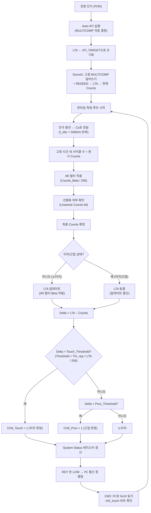
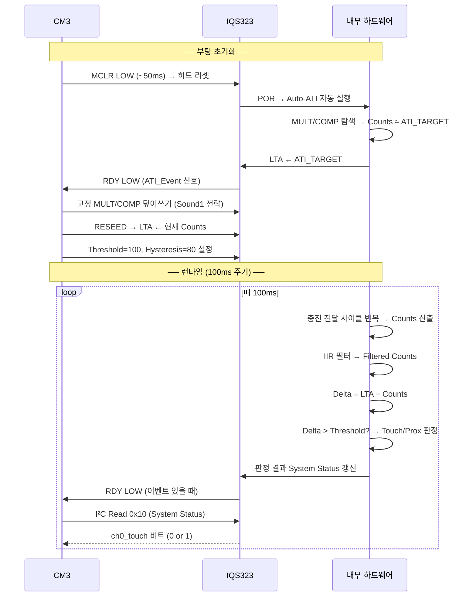

# IQS323 개념 종합 가이드

**TL;DR**: IQS323은 3채널 정전용량 터치 IC로, 각 채널이 "충전 횟수(Counts)"를 측정한다. Counts는 정전용량에 반비례한다. ATI는 기기마다 다른 기생 용량을 자동으로 보정해 Counts를 목표값(ATI Target)으로 맞추는 캘리브레이션 알고리즘이고, LTA는 노터치 기준선을 환경 변화에 따라 천천히 추적하는 필터다. autoATI는 런타임 중 LTA가 ATI Band를 벗어날 때 재캘리브레이션을 자동 발동시키는 기능이다. Rxs·CTx·CRx 등 약어는 모두 신호 방향과 번호의 조합이다.

---

> [!NOTE]
> **읽는 방법 (레벨별 가이드)**
>
> | 레벨 | 추천 읽기 순서 |
> |---|---|
> | 초보 — 처음 접하는 분 | §1 용어 사전 → §2 채널/센서 → §3.1~3.2 카운트 기초 → §4.1 LTA 역할 → §5.1 ATI 필요성 |
> | 중급 — 기본은 아는 분 | §3 카운트 전체 → §4 LTA 전체 → §5 ATI 전체 → §6 autoATI → §7 전체 흐름 |
> | 고급 — 레지스터 수준 필요 | §3.3 필터 Beta → §4.2~4.5 LTA 종류 → §5.3~5.5 ATI 수렴 → §6.3~6.4 ATI Error → §8 오개념 |

---

## 1. 용어 사전 — 약어·핀 이름 완전 해설

IQS323 데이터시트에는 약어가 매우 많습니다. 처음 보는 분은 용어가 낯설어 이해가 막히는 경우가 많으므로, 사용 빈도 높은 것부터 모두 정리합니다.

### 1.1 핀(Pin) · 신호(Signal) 이름

> [!TIP]
> **핀 이름 읽는 법**: `C` = Capacitive(정전용량), `R` = Receive(수신), `T` = Transmit(송신), 뒤 숫자는 채널 번호. 끝에 `s`가 붙으면 복수형.

| 약어 | 풀네임 | 의미 | 비고 |
|---|---|---|---|
| **CRx** | Capacitive Receive | 정전용량 **수신** 핀 | 전하를 받아서 측정. CRx0·CRx1·CRx2 3개 |
| **CTx** | Capacitive Transmit | 정전용량 **송신** 핀 | 전압 파형을 전극에 인가. CTx0·CTx1·CTx2 3개 |
| **CRx/CTx** | 공유 핀 | Self-Cap 모드에서 **수신·송신을 한 핀이 겸함** | Sound1: B2(CRx0/CTx0) 하나만 사용 |
| **TxA** | Transmit A | **공통 송신** 핀 | Mutual-Cap/Inductive에서 외부 전극에 신호를 쏘는 핀 |
| **Rxs** | Receive channels (복수) | **수신 채널들 전체** 또는 **비활성 수신 채널들** | "Inactive Rxs" = 현재 변환에서 선택되지 않은 Rx 핀들 |
| **Txs** | Transmit channels (복수) | **송신 채널들 전체** | 패턴 선택·설정 맥락에서 등장 |
| **RDY** | Ready | IQS323이 **통신 준비 완료** 시 LOW | RDY/MCLR 핀을 겸용 |
| **MCLR** | Master Clear | **하드웨어 리셋** 신호 | RDY/MCLR 핀 겸용. LOW → 하드 리셋 |
| **SDA / SCL** | Serial Data / Serial Clock | I²C 데이터 / 클럭 라인 | |
| **OutA** | Output A | **이벤트 출력** 핀 | 터치/근접 이벤트를 외부 MCU에 알림 |
| **VDD** | Supply Voltage | **공급 전압** (1.71 V~3.6 V) | |
| **VSS** | Voltage Supply Source (Ground) | **회로 GND** | |
| **VREG** | Voltage REGulator output | 내부 **아날로그 레귤레이터** 출력 (~1.53 V) | 외부 디커플링 커패시터 필요 |
| **TAB** | Thermal pad | 패키지 방열 패드 | VSS에 연결 권장 (floating 허용) |

```
IQS323 핀 연결 예시 (Sound1, DFN12 기준)

  MCU ──SDA──┐
  MCU ──SCL──┤         ┌─────────────────────────┐
  MCU ──RDY──┤    VDD──┤ VDD           CRx0/CTx0 ├── 터치 전극 (470Ω 직렬)
             │    GND──┤ VSS           CRx1/CTx1 ├── NC
             │         │               CRx2/CTx2 ├── NC
             └─────────┤ SDA               TxA   ├── NC
                       │ SCL            RDY/MCLR  ├── MCU (인터럽트 + 리셋)
                       │ VREG──100pF──GND          │
                       └─────────────────────────┘
```

#### "Rxs"가 등장하는 맥락 — 상세 설명

데이터시트 §6.1에 **"Inactive Rxs"** 라는 표현이 나옵니다.

IQS323은 한 번에 하나의 채널을 순차적으로 측정합니다. 예를 들어 채널 0을 측정하는 동안, 채널 1과 채널 2의 CRx 핀(Rx 핀들, 즉 Rxs)은 **"비활성(Inactive)"** 상태입니다.

이 비활성 Rx 핀들을 어떤 전위에 두느냐가 노이즈에 영향을 줍니다.
- **VSS(GND)로 묶기**: 노이즈 유입 차단 → 가장 권장 옵션
- **Floating**: 공중 부유 상태 → 안테나 효과로 노이즈 유입 가능
- **Bias voltage / VREG**: 특수 용도

> [!NOTE]
> **실무 요점**: `Inactive Rxs = VSS` 설정이 일반 애플리케이션 표준입니다. Sound1도 이 설정을 사용합니다.

---

### 1.2 동작 관련 약어

| 약어 | 풀네임 | 의미 |
|---|---|---|
| **Counts** | (없음, 단위 없는 측정값) | 정전용량 변환 결과 숫자. 정전용량과 **반비례** |
| **LTA** | Long-Term Average | 노터치 기준선. 환경 변화를 천천히 추적하는 이동 평균 |
| **Delta** | (LTA − Counts) | LTA와 현재 카운트의 차이. 터치 판정 핵심 값 |
| **ATI** | Automatic Tuning Implementation | 자동 캘리브레이션 알고리즘. MULT/COMP를 조정 |
| **Prox** | Proximity | 근접 감지 (손이 가까이 왔지만 아직 닿지 않은 상태) |
| **POR** | Power-On Reset | 전원 투입 시 발생하는 자동 리셋 |
| **IIR** | Infinite Impulse Response | 무한 임펄스 응답 필터. LTA·카운트 스무딩에 사용 |
| **ProxFusion** | Proximity Fusion | Azoteq 특허 센싱 엔진 기술 브랜드명 |
| **Self-Cap** | Self-Capacitance | **자기 정전용량** 방식. 한 핀이 Tx·Rx를 겸함 |
| **Mutual-Cap** | Mutual Capacitance | **상호 정전용량** 방식. Tx와 Rx가 분리된 핀 |
| **ULP** | Ultra Low Power | 초저전력 동작 모드 |
| **NP / LP** | Normal Power / Low Power | 일반 / 저전력 동작 모드 |

---

### 1.3 ATI 관련 파라미터 약어

| 약어 | 풀네임 | 역할 |
|---|---|---|
| **ATI_BASE** | ATI Base Value | ATI 알고리즘 기준 입력값 (레지스터 0x37, 기본 100) |
| **ATI_TARGET** | ATI Target Count | ATI가 수렴할 목표 카운트값 = BASE × (Resolution Factor / 16) |
| **MULT** | Multiplier / Divider | 카운트 배율 보정값. ATI가 자동 결정 (레지스터 0x38) |
| **COMP** | Compensation | 미세 용량 보상값. ATI가 자동 결정 (레지스터 0x39) |
| **CFD** | Coarse Fractional Divider | MULT 내 거친 분주비 |
| **CFM** | Coarse Fractional Multiplier | MULT 내 거친 배율 |
| **FFD** | Fine Fractional Divider | MULT 내 세밀한 분주비 |
| **FFM** | Fine Fractional Multiplier | MULT 내 세밀한 배율 |
| **f_xfer** | Charge Transfer Frequency | **충전 전달 주파수** = 초당 충방전 사이클 속도 (기본 500 kHz) |
| **f_OSC** | Oscillator Frequency | 마스터 클럭 주파수 (14 MHz) |
| **Cs** | Sampling Capacitor | 내부 기준 커패시터. 충전 전달의 기준으로 사용 |
| **PXS Mode** | ProxFusion Sensing Mode | Self-Cap / Mutual-Cap / Inductive 측정 방식 선택 |

---

## 2. 채널(Channel)과 센서(Sensor)

### 2.1 "채널"이란 무엇인가

**채널(Channel)** = IQS323 내부의 독립된 측정 단위 하나.

IQS323은 최대 **3개의 채널(Channel 0, 1, 2)**을 가집니다. 각 채널은:
- 물리 핀 하나(또는 한 쌍)에 연결됩니다
- 독립적인 Counts, LTA, ATI 파라미터를 가집니다
- 독립적인 터치/근접 임계값을 가집니다
- 독립적으로 활성화/비활성화 가능합니다

"센서(Sensor)"는 채널과 혼용되기도 하지만, 엄밀히는 **물리적 전극(전극 패드)**을 가리킵니다. 채널은 IC 내부 회로, 센서는 PCB 위 물리 전극이라고 구분하면 됩니다.

```
물리 전극 (PCB 위 구리 패드)
       ↓
  470Ω 직렬 저항 (ESD 보호 + 시정수 조정)
       ↓
  CRx0/CTx0 핀 (IC 핀)
       ↓
  채널 0 (IQS323 내부)
  ├─ ProxFusion ADC
  ├─ ATI MULT/COMP 레지스터
  ├─ LTA 레지스터
  ├─ Threshold/Hysteresis 레지스터
  └─ 터치/근접 판정 논리
```

### 2.2 IQS323의 3채널 구조

```
             ┌──────────────────────────────────────────┐
             │              IQS323 내부                 │
CRx0/CTx0 ───┤  채널 0 (Channel 0)                      │
             │  ┌──────────────────────────────────┐    │
CRx1/CTx1 ───┤  │  채널 1 (Channel 1)              │    │
             │  │  ┌──────────────────────────┐    │    │
CRx2/CTx2 ───┤  │  │  채널 2 (Channel 2)      │    │    │
      TxA ───┤  │  │                          │    │    │
             │  │  └──────────────────────────┘    │    │
             │  └──────────────────────────────────┘    │
             │  ProxFusion 엔진 (단일 ADC, 순차 측정)     │
             └──────────────────────────────────────────┘
```

> [!IMPORTANT]
> IQS323은 ADC 하나로 채널을 **순차적으로 측정**합니다. 채널 0을 측정하는 동안 채널 1·2는 대기 상태입니다. 따라서 채널이 많을수록 전체 측정 주기가 길어집니다.

| 채널 | 물리 핀 | Sound1 사용 여부 |
|---|---|---|
| Channel 0 | CRx0/CTx0 | ✅ 사용 (유일한 터치 전극) |
| Channel 1 | CRx1/CTx1 | ❌ 미사용 |
| Channel 2 | CRx2/CTx2 | ❌ 미사용 |

### 2.3 측정 방식별 채널 구성

IQS323은 같은 물리 핀을 다른 방식으로 설정해 세 가지 측정 방식을 지원합니다.

#### Self-Capacitance (자기 정전용량) — Sound1이 사용하는 방식

```
손가락
  │
  ▼
전극 패드 ─── CRx0/CTx0 ─── IC 내부
(한 핀이 Tx + Rx 모두 담당)
```

- **원리**: 전극 자체에 전압을 인가하고, 그 전극에 축적된 전하를 다시 받아서 측정
- **장점**: 배선 단순, 전력 소모 낮음, 단일 핀으로 구현 가능
- **단점**: 주변 노이즈에 상대적으로 취약
- **PXS Mode 설정값**: `0x10` (Self-Capacitance)
- **Sound1 설정**: `Sensor Setup 0x30 = 0x0101` — Channel 0 활성, CTx0 선택

#### Mutual Capacitance (상호 정전용량)

```
손가락
  │
  ▼
전극 A ─── TxA/CTxN ─── IC (송신: 파형 출력)
전극 B ─── CRxN     ─── IC (수신: 전하 측정)
(Tx와 Rx가 분리된 두 전극)
```

- **원리**: Tx 전극에서 신호를 쏘고, Rx 전극에서 Tx→Rx 결합 용량을 측정. 손가락이 오면 결합 용량이 감소 → Counts 감소
- **장점**: 노이즈 제거 효과 우수, 멀티터치 가능
- **단점**: 전극이 2개 필요, 배선 복잡

#### Inductive (유도성)

- **원리**: 코일의 인덕턴스 변화로 금속 물체 근접 감지
- **활용**: 방수 버튼(금속 케이스 관통 불필요), 금속 감지
- Sound1은 사용하지 않음

---

## 3. 카운트(Counts) — 정전용량을 숫자로 변환하는 원리

### 3.1 충전 전달 방식(Charge Transfer)

IQS323 내부에는 **작은 기준 커패시터(Cs)**가 있습니다. 측정은 다음 사이클을 반복합니다:

```
한 측정 사이클:

① 전극(Cx)에 전압 인가 → 전하 축적
         │
         ▼
② Cx의 전하를 기준 커패시터(Cs)로 전달
         │
         ▼
③ Cs 전압이 임계값에 도달?
   YES → Cs 방전 후 1회 카운트 기록, ①부터 반복
   NO  → 계속 전달
```

**측정 시간은 고정**입니다. 이 고정된 시간 동안 몇 번의 사이클이 완료되었는지가 최종 Counts 값입니다.

```
측정 시간 (고정)
│                        │
▼                        ▼
──┬──┬──┬──┬──┬──        사이클 5회 → Counts = 5 (용량 작음)
──┬───────┬───────┬─     사이클 2회 → Counts = 2 (용량 큼)
```

### 3.2 카운트와 정전용량의 반비례 관계

> **데이터시트 §5.4**: *"Count values are inversely proportional to capacitance"*
>
> 카운트는 정전용량에 **반비례**한다.

**왜 반비례인가?**

정전용량이 클수록:
- 전극(Cx)에 더 많은 전하가 축적됩니다
- Cs로 전달되는 전하가 많아져서 Cs가 빨리 충전됩니다
- ⚡ **(모순처럼 보임)**: Cs가 빨리 충전되면 오히려 더 많은 사이클이 가능하지 않나?

실제로는 이렇게 됩니다:
- Cx의 용량이 크면 Cs에 전달할 전하가 많지만, 동시에 Cx 자체가 충전되는 데도 더 오래 걸립니다
- ProxFusion 방식에서는 Cx → Cs 전달 시 Cx의 용량이 크면 한 번의 전달로 Cs를 채우는 데 더 많은 "시간"이 소모됩니다
- 결과적으로 고정 측정 시간 내 완성되는 사이클 수(카운트)가 줄어듭니다

```
노터치 상태: Cx = 기생 용량만 (작음) → 사이클 빠름 → Counts 높음
터치 상태:   Cx = 기생 용량 + 손가락 용량 (큼) → 사이클 느림 → Counts 낮음

      Counts (높음)
      ↑
  500 ┤ ···········  ← 노터치 LTA (기준선)
  400 ┤
  300 ┤ ─────────  ← 터치 중 Counts (낮아짐)
      │
      └───────────────→ 시간
```

| 상태 | 정전용량 | Counts |
|---|---|---|
| 노터치 | C_기생 (낮음) | **높음** (~ATI_TARGET = 400) |
| 근접 | C_기생 + C_근접 (중간) | **중간** |
| 터치 | C_기생 + C_손가락 (높음) | **낮음** (100~200 감소) |

> [!IMPORTANT]
> **Self-Capacitance에서 터치하면 Counts가 _내려갑니다_.** 이것이 직관과 반대되어 혼동하기 쉬운 핵심입니다. 터치 감지 공식은 `(LTA − Counts) > Threshold`입니다.

### 3.3 카운트 필터링 (IIR Filter Beta)

측정마다 Counts에는 노이즈가 포함됩니다. IQS323은 **IIR(무한 임펄스 응답) 필터**로 노이즈를 제거합니다.

**필터 공식**:
```
Counts_filtered = Counts_filtered_prev + (Counts_raw − Counts_filtered_prev) × (Beta / 256)
```

| Beta 값 | 업데이트 비율 (Beta/256) | 특성 |
|---|---|---|
| 0 | 0% | 완전 고정 (필터 없음의 반대) |
| 4 | ~1.6% | 강한 필터링, 느린 추적 |
| 16 | ~6.3% | 중간 |
| 64 | 25% | 약한 필터링, 빠른 추적 |
| 0 (특수) | 데이터시트 의미: 필터 없음 | 레지스터 값에 따라 다름 |

> [!NOTE]
> **파워 모드별 다른 Beta**: Normal Power(NP)와 Low Power(LP) 모드에서 각각 다른 Beta 값을 사용할 수 있습니다. 저전력 모드에서는 측정 주기가 길어지므로 더 강한 필터링을 적용하는 것이 일반적입니다.
>
> 레지스터 위치: `0xB0` (Counts Filter Betas) — 상위 바이트: LP Beta, 하위 바이트: NP Beta

**Fast Filter Band (빠른 필터 밴드)**:

LTA가 정상적인 방향(터치 방향)이 아닌 반대 방향으로 너무 많이 벗어나면 — 예를 들어 Self-Cap에서 노터치인데 Counts가 LTA보다 훨씬 높아지는 경우 — Fast Filter가 자동으로 활성화되어 LTA가 빠르게 Counts를 추적합니다. 경계값은 `0xB4` 레지스터(Fast Filter Band)로 설정합니다.

```
Fast Filter 동작 예시 (Self-Cap):

LTA = 500 (기준선)
Counts = 600 (LTA보다 높음 = 반대 방향 drift)

[LTA - Counts] = 500 - 600 = -100 (음수: 반대 방향)

Fast Filter Band 이상 벗어났다면 → Fast Beta로 빠르게 추적
Fast Filter Band 이내라면 → 일반 Beta로 천천히 추적
```

### 3.4 카운트 선형화 (Linearise Counts)

기본 Counts는 정전용량에 **반비례**하기 때문에 터치 시 값이 내려갑니다. 일부 애플리케이션(특히 슬라이더)에서는 터치 시 값이 올라가는 선형 표현이 더 편리합니다.

`Sensor Setup` 레지스터의 `Linearise Counts` 비트를 1로 설정하면:

```
선형화 전: 터치 → Counts 낮아짐 (반비례)
선형화 후: 터치 → 선형화된 Counts 높아짐 (비례)
```

> [!NOTE]
> 선형화를 켜면 `Invert` 비트도 함께 설정해야 올바른 터치 판정이 됩니다. Sound1은 **선형화를 사용하지 않습니다.**

### 3.5 Max Counts (최대 카운트 제한)

각 채널은 Counts 최대값을 제한할 수 있습니다. ATI 설정이 잘못되거나 하드웨어 문제로 Counts가 비정상적으로 높아지면 IC가 오동작할 수 있기 때문입니다.

`Prox Control` 레지스터의 `Max Counts` 필드로 설정:
- 00: 최대 1023
- 01: 최대 2047
- 10: 최대 4095
- 11: 최대 16383

정상 동작 범위보다 약간 높은 값으로 설정하는 것이 권장됩니다.

---

## 4. LTA (Long-Term Average) — 노터치 기준선 심화

### 4.1 LTA의 역할

LTA는 **"지금 이 센서의 노터치 상태 Counts는 얼마인가"**를 추적하는 기준선입니다.

터치 판정은 절대값이 아닌 **LTA와의 차이(Delta)**로 합니다:
```
터치 진입: (LTA − Counts) > Touch Threshold    → ✅ TOUCH
터치 유지: (LTA − Counts) > (Touch Threshold − Touch Hysteresis)
터치 해제: (LTA − Counts) ≤ (Touch Threshold − Touch Hysteresis) → ❌ RELEASE
```

LTA가 없다면 온도·습도·노화 등으로 Counts가 서서히 변할 때 매번 임계값을 재조정해야 합니다. LTA가 이 환경 변화를 자동으로 흡수합니다.

```
환경 변화에 따른 LTA의 자동 추적:

    Counts
    │
600 ┤       ←── 여름(습도 높음): 기생 용량 증가 → Counts 낮아짐
500 ┤  ···  ←── LTA도 함께 낮아짐 (천천히 추적)
400 ┤       ←── 겨울(습도 낮음): 기생 용량 감소 → Counts 높아짐
    │
    └───────────────────────────────→ 시간 (일~주 단위)

결과: 계절이 바뀌어도 (LTA − Counts) ≈ 0 유지 → 재캘리브레이션 불필요
```

### 4.2 IIR 업데이트 공식과 Beta

```
LTA_new = LTA_old + (Counts − LTA_old) × (LTA_Beta / 256)
```

`LTA Filter Betas` 레지스터(`0xB1`)로 Beta 값을 설정합니다.

```
LTA_Beta = 4 일 때:

측정값 | LTA_old | Counts | 업데이트량 | LTA_new
  1회  |  400   |  398   | (398-400)×4/256 = -0.03 | 399.97
  2회  |  399.97|  398   | -0.03 | 399.94
 ...   | ...    | ...    | ...   | ...
 수십회 후 LTA가 서서히 398로 수렴
```

LTA Beta가 클수록 LTA가 빠르게 변화를 추적합니다. 하지만 너무 빠르면 손가락을 천천히 올리는 동작을 LTA가 따라가버려 터치를 못 잡는 문제가 생길 수 있습니다.

**파워 모드별 별도 Beta**:

| 레지스터 | 항목 | 특성 |
|---|---|---|
| 0xB1 상위 | LP LTA Beta | 저전력 모드용. 측정 주기가 길므로 별도 설정 권장 |
| 0xB1 하위 | NP LTA Beta | 일반 전력 모드용 |

### 4.3 LTA 동결 (터치·근접 상태)

채널이 터치 또는 근접 상태에 들어가면 **LTA 업데이트가 중단(동결)**됩니다.

**왜 동결하는가?**

터치 중에도 LTA를 업데이트하면:
```
시나리오: 손가락을 5초간 올려둔 경우

LTA 동결 없을 때:
  터치 중 Counts = 300 (낮음)
  LTA가 300을 향해 서서히 감소
  몇 초 후 LTA ≈ 300
  (LTA − Counts) ≈ 0 → 터치 해제 판정! ← 오동작

LTA 동결할 때:
  터치 중 Counts = 300
  LTA = 500 그대로 유지 (동결)
  (LTA − Counts) = 200 > Threshold → 계속 터치 판정 ✅
```

**동결이 야기하는 부작용**:

손가락을 뗀 직후에도 LTA는 이전 값(동결 전)으로 복귀해야 합니다. 만약 터치 중에 환경이 변해서 노터치 Counts가 바뀌었다면, LTA가 맞지 않는 상태가 됩니다. 이때는 LTA가 천천히 새 환경 Counts를 추적하는 수렴 시간이 필요합니다.

### 4.4 LTA의 종류 (표준 / Activation / Movement)

IQS323에는 목적별로 다른 LTA가 있습니다:

| LTA 종류 | 레지스터 주소 | 터치 중 업데이트 | 용도 |
|---|---|---|---|
| **표준 LTA** | 0x14 (CH0), 0x16 (CH1), 0x18 (CH2) | ❌ 동결 | 기본 터치/근접 판정 기준선 |
| **Activation LTA** | 0x20 (CH0), 0x21 (CH1), 0x22 (CH2) | ✅ 계속 업데이트 | Release UI — 장기 터치 해제 판정용 |
| **Movement LTA** | 0x20 (CH0), 0x21 (CH1), 0x22 (CH2) | ✅ 계속 업데이트 | Movement UI — 착용 감지용 |

> [!NOTE]
> Activation LTA와 Movement LTA는 주소가 같습니다 (0x20~0x22). 어떤 LTA가 저장되는지는 주문 코드(Order Code)에 따라 다릅니다. `00x` 계열은 Release UI 코드라 Activation LTA, `A01` 계열은 Movement UI 코드라 Movement LTA를 사용합니다.

**Activation LTA (Release UI)**:

장기 터치(몇 분~몇 시간 지속)를 정상적으로 해제하기 위한 추가 LTA입니다. 표준 LTA는 동결되어 장기 터치 후 갑자기 환경 변화가 생기면 영원히 터치 상태에서 못 빠져나올 수 있습니다. Activation LTA는 터치 중에도 계속 업데이트되어, Counts가 자연스럽게 변화하는 양을 추적합니다.

**Movement LTA (Movement UI)**:

착용 감지 애플리케이션용입니다. 손목에 착용한 워치는 착용 중에도 Counts가 계속 움직이고(혈류·움직임), 테이블에 올려두면 Counts가 정지합니다. Movement LTA와 현재 Counts의 차이로 "움직임 있음/없음"을 판정합니다.

### 4.5 Sound1의 LTA 설정

Sound1은 **LTA 자동 업데이트를 의도적으로 느리게 또는 정지**시켜 사용합니다.

- **이유**: 천천히 손가락을 올리는 동작(slow approach)을 LTA가 따라가면 Delta가 커지지 않아 터치를 못 잡음
- **부작용**: 절전 모드 전환 시 환경이 바뀌어도 LTA가 고정 → False Touch 원인
- **해결책**: 절전 모드 진입 전 RESEED로 LTA를 현재 Counts로 강제 초기화

---

## 5. ATI (Automatic Tuning Implementation) — 자동 캘리브레이션 심화

### 5.1 ATI가 필요한 이유

같은 설계도로 만든 PCB라도 개체별로 전극 주변의 기생 정전용량이 미세하게 다릅니다.

```
동일 설계, 다른 기기:

기기 A: PCB 재질 좋음, 배선 짧음  → 기생 용량 낮음 → 노터치 Counts = 900
기기 B: 기준 환경               → 기생 용량 중간 → 노터치 Counts = 600
기기 C: 조립 시 납땜 조금 다름   → 기생 용량 높음 → 노터치 Counts = 300

단일 Threshold 설정으로 모두를 커버할 수 없음 ← ATI 없으면 이 문제
```

ATI는 각 기기의 노터치 Counts를 **동일한 목표값(ATI_TARGET)**으로 맞춰서 모든 기기가 같은 감도를 갖도록 합니다.

```
ATI 적용 후:

기기 A: MULT/COMP 조정 → 노터치 Counts ≈ 400
기기 B: MULT/COMP 조정 → 노터치 Counts ≈ 400
기기 C: MULT/COMP 조정 → 노터치 Counts ≈ 400

단일 Threshold = 156 카운트로 모든 기기 동일 감도 ✅
```

### 5.2 ATI 목표값 계산

```
ATI_TARGET = ATI_BASE × (ATI_Resolution_Factor / 16)
```

| 파라미터 | 레지스터 | Sound1 값 | 계산 |
|---|---|---|---|
| ATI_BASE | 0x37 | 100 (0x0064) | 기준값 100 |
| ATI_Resolution_Factor | 0x36 bits[15:4] | 64 | — |
| **ATI_TARGET** | — | **400** | 100 × (64/16) = 400 |

ATI_Resolution_Factor가 클수록:
- ATI_TARGET이 높아짐 → Counts 범위가 넓어짐 → **감도 향상** (더 섬세한 구분 가능)
- 하지만 ADC 변환 시간이 길어지거나 노이즈 영향이 커질 수 있음

### 5.3 ATI 수렴 과정 — MULT와 COMP의 역할

ATI 알고리즘은 두 단계로 Counts를 ATI_TARGET에 수렴시킵니다:

```
ATI 알고리즘 흐름:

1단계: MULT 조정 (거친 조정)
  현재 Counts 측정
       ↓
  ATI_BASE와 비교
       ↓
  Coarse Fractional Divider/Multiplier 조정 (CFD/CFM)
       ↓
  Fine Fractional Divider/Multiplier 조정 (FFD/FFM)
       ↓
  Counts ≈ ATI_BASE 달성

2단계: COMP 조정 (정밀 조정)
  현재 Counts 측정
       ↓
  ATI_TARGET과 비교
       ↓
  Compensation Value 조정 (내부 보상 용량 추가/감소)
       ↓
  Compensation Divider 조정
       ↓
  Counts ≈ ATI_TARGET 달성 ✅
```

**MULT 구조**:

```
ATI Multipliers and Dividers 레지스터 (0x38):

상위 바이트 (ATI_FINE):
  [15:13] Fine Fractional Multiplier (FFM)
  [12: 8] Fine Fractional Divider   (FFD)
  [ 8   ] Coarse Fractional Multiplier (CFM, 1비트만)

하위 바이트 (ATI_COARSE):
  [7:5] Coarse Fractional Multiplier (CFM)
  [4:0] Coarse Fractional Divider   (CFD)
```

- **CFD/CFM**: 큰 범위의 배율 조정 → "기어 단수" 변경에 비유
- **FFD/FFM**: 미세한 배율 조정 → 기어 내에서의 미세 조정

**COMP 구조**:

```
Compensation 레지스터 (0x39):

ATI_COMPENSATION_1: [15:12] Compensation Divider
                    [10: 8] (Reserved)
                    [ 8: 8] Compensation Value (MSB 부분)

ATI_COMPENSATION_0: [7:0] Compensation Value (전체)
```

- **Compensation Value**: 내부에서 측정에 더하거나 빼는 보상 용량
- **Compensation Divider**: 보상 용량을 나누는 비율

> [!TIP]
> **MULT vs COMP 비유**
>
> - MULT = 전체 음량(볼륨) 조절 → 수백 카운트 단위의 큰 조정
> - COMP = EQ(이퀄라이저) 미세 조정 → 수십 카운트 단위의 정밀 조정
>
> ATI는 먼저 MULT로 대략 맞추고, COMP로 정확히 맞춥니다.

**Sound1 MULT/COMP 실측값 해석**:

| 상태 | MULT MSB | COMP | 의미 |
|---|---|---|---|
| 정상 노터치 | 0x5E | 0x63E4 | ← 기준점. LTA가 여기 고정됨 |
| 절전 노터치 | 0x5C | 0x6000 | 주변 소자 OFF → 기생 용량 감소 → Counts 더 높음 → MULT 더 낮게 |
| 터치 (공통) | 0x64 | 변동 | 손가락 용량 추가 → Counts 낮아짐 → MULT 더 높게 보상 |

ATI가 실행될 때마다 현재 환경에 맞는 MULT/COMP를 새로 계산합니다. MULT/COMP 값을 읽으면 "ATI 당시 기생 용량이 얼마였는지"를 역산할 수 있습니다.

### 5.4 ATI Mode 선택지

`ATI Setup 레지스터(0x36)` bits[2:0]으로 설정합니다:

| ATI Mode | 값 | 조정 대상 | 용도 |
|---|---|---|---|
| **Disabled** | 000 | 없음 (수동) | **Sound1 사용**. ATI 알고리즘 실행 안 함 |
| Compensation Only | 001 | COMP만 | Coarse/Fine가 고정된 경우 |
| ATI from Comp. Divider | 010 | COMP Divider부터 | 중간 단계 시작 |
| ATI from Fine Fractional Divider | 011 | FFD부터 조정 | Fine 단계부터 시작 |
| **Full** | 100 | MULT + COMP 전체 | **일반 권장**. 처음부터 완전 자동 |

**Full Mode**가 권장되는 이유: 환경 편차 범위가 어떻든 최적의 MULT/COMP를 찾습니다.

### 5.5 ATI Band와 ATI Error

**ATI Band**:

ATI가 "수렴했다"고 판정하는 허용 범위입니다.

```
ATI Band 설정 (ATI Setup 0x36 bit3):

Small (bit3 = 0): 수렴 범위 = ATI_TARGET ± (ATI_TARGET / 16)
                  예) TARGET = 400 → 허용 범위 375~425

Large (bit3 = 1): 수렴 범위 = ATI_TARGET ± (ATI_TARGET / 8)
                  예) TARGET = 400 → 허용 범위 350~450  ← Sound1 사용
```

**ATI Error**:

ATI 알고리즘이 완료된 후에도 Counts가 Re-ATI Boundary를 벗어나 있으면 `ATI_Error` 비트가 System Status(0x10)에 세팅됩니다.

```
Re-ATI Boundary = ATI_TARGET ± ATI_Band

예) ATI_TARGET = 400, ATI_Band = Large(±50)
    Boundary: 350 ~ 450

    ATI 완료 후 Counts = 300 → ATI Band 밖 → ATI_Error = 1
```

**ATI Error 발생 시 처리**:
- autoATI가 자동으로 재시도하지 **않습니다**
- SW가 System Control 레지스터의 `Re-ATI` 비트를 1로 써서 수동 트리거해야 합니다
- ATI가 물리적으로 수렴 불가능한 환경이라면 반복 트리거해도 해결되지 않습니다

### 5.6 Sound1의 ATI 전략

Sound1은 일반적인 ATI Flow와 다른 방식을 사용합니다:

```
일반 권장 흐름:              Sound1 실제 흐름:

POR                         POR
↓                           ↓
Auto ATI (Full Mode)        Auto ATI (Full Mode, 단 한 번)
↓                           ↓
MULT/COMP 자동 결정          MULT/COMP 읽기 (참고용)
↓                           ↓
LTA ← ATI_TARGET            고정 MULT/COMP 덮어쓰기 (대표 환경값)
↓                           ↓
런타임                       RESEED → LTA ← 현재 Counts
↓                           ↓
autoATI로 환경 변화 추적     ATI Mode = Disabled (이후 자동 재ATI 없음)
                            ↓
                            런타임 (LTA로만 환경 변화 흡수)
```

**왜 고정 MULT/COMP를 쓰는가?**

Auto ATI 결과는 그날의 온도·조립 상태에 따라 달라집니다. 기기마다 LTA 위치가 달라지면 감도가 불일정해집니다. 대표 환경에서 측정한 고정 MULT/COMP를 쓰면 **모든 기기의 LTA가 동일한 위치**에 오도록 보장됩니다.

**왜 ATI Mode를 Disabled로 하는가?**

이전에 Full Mode를 사용했을 때 문제가 발생했습니다:
```
문제 시나리오:
1. Stuck-Touch (터치가 고착된 상태) 감지
2. IQS323 내부에서 자동 re-ATI 발동
3. COMP 값이 변경됨
4. ATI_ERROR 비트 세팅
5. I2C 통신 무응답 발생
```

이를 방지하기 위해 ATI Mode = Disabled로 고정하고, ATI는 부팅 시 한 번만 실행합니다.

---

## 6. Auto Re-ATI (autoATI) — 런타임 자동 재캘리브레이션

### 6.1 autoATI란?

런타임 중 환경이 ATI 수행 당시와 많이 달라졌을 때, IQS323이 스스로 MULT/COMP를 재조정하는 기능입니다.

ATI는 노터치 Counts를 ATI_TARGET으로 맞추는 작업이므로, LTA가 ATI_TARGET 근처에 있어야 정상입니다. 그런데 시간이 지나 LTA가 ATI Band를 벗어나면 "환경이 너무 많이 바뀌었으니 재캘리브레이션이 필요하다"고 판단합니다.

### 6.2 발동 조건

```
Re-ATI 발동 조건:

  LTA > ATI_TARGET + ATI_Band   (LTA가 너무 높음)
  OR
  LTA < ATI_TARGET − ATI_Band   (LTA가 너무 낮음)
```

예를 들어 ATI_TARGET = 400, ATI_Band = Large(±50)이면:

```
정상 범위: LTA = 350 ~ 450

LTA = 500 → 범위 초과 → re-ATI 자동 발동
LTA = 280 → 범위 미달 → re-ATI 자동 발동
```

re-ATI가 발동되면:
1. `ATI_Event` 비트가 System Status에 세팅됨
2. MULT/COMP 재조정 수행
3. 새로운 Counts ≈ ATI_TARGET으로 수렴
4. LTA가 새 ATI_TARGET 기준으로 재초기화

### 6.3 ATI Error와 autoATI의 관계

```
autoATI 실행
    ↓
ATI 알고리즘 수행
    ↓
완료 후 Counts가 ATI_Band 안에 있는가?
    YES → 정상 완료. ATI_Event = 1
    NO  → ATI_Error = 1. 자동 재시도 없음 (SW가 수동 트리거 필요)
```

> [!IMPORTANT]
> **ATI Error 발생 시 autoATI는 재시도하지 않습니다.** 물리적으로 수렴 불가능한 경우(하드웨어 문제, 비정상적 환경)라면 SW도 수동 트리거를 반복해도 해결되지 않으므로, 근본 원인을 파악해야 합니다.

### 6.4 Sound1에서 autoATI를 끈 이유

Sound1은 `ATI Mode = Disabled`로 설정하여 autoATI를 완전히 차단합니다.

**배경**:
- 이전 펌웨어에서 ATI Mode = Full(autoATI 허용) 사용 시 I2C 무응답 발생
- 원인: Stuck-Touch → re-ATI → COMP 급변 → ATI_Error → 통신 이상

**대신 사용하는 방식**:
- LTA만으로 환경 변화 흡수 (BETA 필터로 천천히 추적)
- 절전 모드 진입/해제 시 RESEED로 LTA 강제 재초기화
- MULT/COMP는 대표 환경값으로 고정

**트레이드오프**:
- 장점: 안정적 동작, 예측 가능한 동작
- 단점: 환경 변화 허용 범위가 LTA의 추적 능력에 제한됨. 극단적 환경(매우 높은 습도, 부품 노화)에서는 감도가 변할 수 있음

---

## 7. 종합: 측정 사이클 전체 흐름

IQS323이 "지금 터치 중인가?"를 판단하는 전체 흐름입니다.





> [!NOTE]
> CM3는 터치 판정 **결과(ch0_touch 비트)**만 읽습니다. Counts 계산, LTA 비교, ATI 수렴은 **IQS323 하드웨어가 자율적으로 수행**합니다.

---

## 8. 오개념 정리

| 오개념 | 실제 |
|---|---|
| "터치하면 Counts가 올라간다" | Self-Cap에서 터치하면 Counts가 **내려간다** (정전용량에 반비례). 터치 판정은 `LTA − Counts > Threshold`로 처리 |
| "ATI = 감도 조절" | ATI는 **노터치 기준선 맞추기**. 감도(민감도)는 Threshold 레지스터로 조절 |
| "MULT/COMP를 크게 하면 더 잘 잡힌다" | MULT/COMP는 LTA 기준선 위치 조정값. 감도와 직접 관계 없음 |
| "Threshold = 80은 Counts 80 차이면 터치" | Threshold는 LTA 비율: 실제 카운트 임계 = `(register / 256) × LTA` |
| "CM3가 Counts를 읽어서 터치를 판단한다" | IQS323 내부에서 판단 완료. CM3는 **ch0_touch 비트(0 or 1)**만 읽음 |
| "ATI를 하면 모든 감도 문제가 해결된다" | ATI는 노터치 기준선만 맞춤. 환경 변화 대응은 LTA의 역할 |
| "Rxs = Rx 한 개 핀" | `Rxs` = **Receive channels 복수형**. 선택되지 않은 Rx 핀들 전체 |
| "autoATI가 항상 ATI 오류를 재시도한다" | ATI_Error 발생 시 autoATI **재시도하지 않음**. SW가 수동 트리거 필요 |
| "LTA는 항상 Counts를 따라간다" | 터치/근접 상태에서는 **LTA가 동결**됨. 노터치 상태에서만 업데이트 |
| "고정 MULT/COMP = ATI 안 하는 것" | ATI를 부팅 시 **한 번 실행**한 후 결과를 고정값으로 교체. 이후 autoATI만 차단 |

---

## 부록 A. 주요 레지스터 빠른 참조

| 주소 | 이름 | Sound1 설정 | 역할 |
|---|---|---|---|
| 0x10 | System Status | 읽기 전용 | **ch0_touch**, ATI_Error 등 상태 비트 |
| 0x13 | Channel 0 Filtered Counts | 읽기 전용 | 현재 CH0 카운트값 |
| 0x14 | Channel 0 LTA | 읽기 전용 | 현재 CH0 LTA값 |
| 0x30 | Sensor Setup 0 | 0x0101 | CH0 활성, Self-Cap(CTx0 선택) |
| 0x31 | Conversion Freq. Setup | 0x057F | f_xfer = 500 kHz, FRAC = 127 |
| 0x32 | Prox Control | 0x1290 | Max Counts = 4095, PXS = Self-Cap |
| 0x33 | Prox Input and Control | 0x01CF | CRx0 활성, Dead Time 활성, Internal Ref. 비활성 |
| 0x34 | Pattern Definitions | 0x030A | Inactive Rxs = VSS, Wav Pattern 0 = 0x03 |
| 0x36 | ATI Setup | 0x0408 | Mode = **Disabled**, Resolution = 64, Band = Large |
| 0x37 | ATI Base | 0x0064 | ATI 기준값 100 → TARGET = 400 |
| 0x38 | ATI MULT | 0x5C82 (절전) / 0x5E82 (정상) | 배율 보정 |
| 0x39 | ATI COMP | 0x6000 (절전) / 0x63E4 (정상) | 미세 보상 |
| 0x62 | Touch Settings (CH0) | Thr=100, Hys=80 | 터치 임계값 / 히스테리시스 |
| 0xB0 | Counts Filter Betas | 설정에 따름 | 카운트 IIR 필터 Beta |
| 0xB1 | LTA Filter Betas | 설정에 따름 | LTA IIR 필터 Beta |
| 0xC0 | System Control | — | **RESEED**, Re-ATI, 전력 모드 등 제어 |
| 0xC0 | System Control (RESEED) | 0x08 쓰기 | LTA ← 현재 Counts (즉시, 1클럭) |

---

## 부록 B. 관련 문서

| 문서 | 내용 |
|---|---|
| [IQS323-RESEED.md](IQS323-RESEED.md) | RESEED 개념, 필요 시점, Sound1 코드 구현 상세 |
| [IQS323-동작원리.md](IQS323-동작원리.md) | 정전용량 원리, ATI/LTA 기초, Sound1 흐름도, 절전 모드 False Touch 분석 |
| [IQS323-회로-구성.md](IQS323-회로-구성.md) | Sound1 하드웨어 회로 구성 상세 |
| iqs323_datasheet.pdf | Azoteq 공식 데이터시트 (v1.11, 2025-08) |
