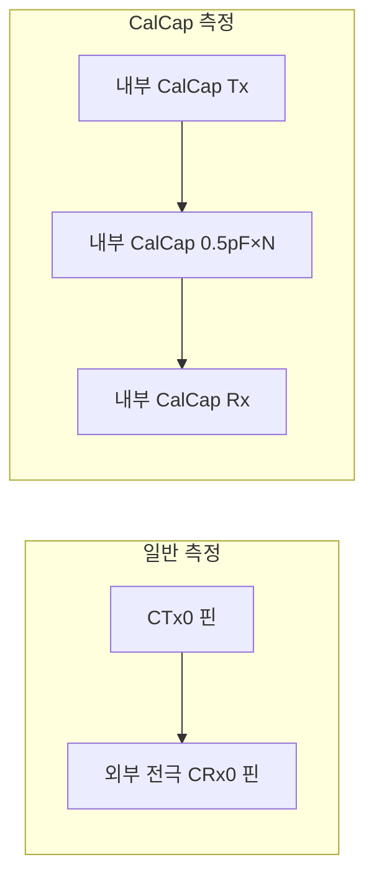

> **TL;DR**: IQS323 레지스터별 reset value·비트맵과 ATI/CalCap/ATI Error 동작을 데이터시트(v1.11) 기준으로 정리한 레퍼런스. 레지스터 쓰기 값은 **반드시 reset value를 베이스로 산출**해야 하며(reserved 비트 보존), ati_error는 채널 구분 없는 **전역 비트**다.

원본 데이터시트: `../iqs323_datasheet.pdf` (Azoteq v1.11, 2025-08). 실제 활용 사례: [[issue-2026-06-crx1-esd-dummy]]

---

## 1. 레지스터 reset value 맵 (Sensor 1 기준, Page 35)

| 주소 | 레지스터 | reset | Appendix |
|---|---|---|---|
| 0x10 | System Status | — | A.2 |
| 0x30 | Sensor 0 Setup | 0x0101 | A.5 |
| 0x36 | Sensor 0 ATI Setup | 0x040C | A.12 |
| 0x38 | Sensor 0 ATI Multipliers | — | A.13 |
| 0x39 | Sensor 0 Compensation | — | A.14 |
| 0x40 | Sensor 1 Setup | 0x0101 | A.5 |
| 0x41 | Conversion Frequency Setup | 0x057F | A.6 |
| 0x42 | Prox Control | 0x1290 | A.7/A.8 |
| 0x43 | Prox Input and Control | 0x01CF | A.9 |
| 0x44 | Pattern Definitions | 0x030A | A.10 |
| 0x45 | Pattern Selection / Bias | 0x0000 | A.11 |
| 0x46 | Sensor 1 ATI Setup | 0x040C | A.12 |
| 0x50 | Sensor 2 Setup | 0x0101 | A.5 |
| 0x70 | Channel 1 Setup | — | A.15 |

> 동일 기능 레지스터는 채널마다 0x10 간격: Sensor0=0x3x, Sensor1=0x4x, Sensor2=0x5x. Channel Setup은 0x60/0x70/0x80.

---

## 2. System Status (0x10) — A.2

칩 **전역** 상태 비트(LSB)와 **채널별** 터치/근접 비트(MSB)로 나뉜다.

| 바이트·비트 | 필드 | 의미 |
|---|---|---|
| LSB bit6 | **ati_error** | ATI 완료 후 counts가 범위 밖이면 SET — **전역(채널 구분 없음)** |
| LSB bitx | ati_active | ATI 진행 중 |
| LSB bitx | reset_event | 리셋 발생 (ACK Reset로 클리어) |
| MSB bit9 | ch0_touch | CH0 터치 (채널별) |
| MSB | ch1_touch / ch2_touch | CH1/CH2 터치 (채널별) |

> [!IMPORTANT]
> **`ati_error`는 전역 비트, 채널 구분 불가.** 활성 채널 중 하나라도 ATI 실패 시 SET되며, **채널별 ATI error 레지스터는 없다**(A.2 전체에서 Touch/Prox만 채널별, ATI/Reset/Power 등은 전역). 따라서 read_status로는 CH0/CH1 기원을 구분할 수 없다. **단 터치 판정(CH0 Touch, MSB bit9)은 채널별로 정확**하므로, ATI를 운용에서 쓰지 않으면(ATI Disabled + 고정 보상값) ati_error를 무시해도 CH0 터치는 무손상이다. → [[issue-2026-06-crx1-esd-dummy]] §7.

---

## 3. Sensor Setup (0x30/0x40/0x50, reset 0x0101) — A.5

| 비트 | 필드 | 의미 |
|---|---|---|
| 15 | Reserved | 0 |
| 14 | **CalCap Rx** | 1=CalCap을 Rx 입력으로 |
| 13 | **CalCap Tx** | 1=CalCap을 Tx 부하로 |
| 12 | Reserved | 0 |
| 11 | TxA | active shield Tx |
| 10-8 | CTx2/CTx1/CTx0 | 외부 Tx 핀 enable |
| 6 | Release/Movement UI | |
| 5 | FOSC Tx Frequency | 1=14MHz 고정 |
| 4 | Vbias | |
| 3 | Invert | |
| 2 | Dual Direction | |
| 1 | Linearise Counts | |
| 0 | **Enable Channel** | 1=채널 활성 |

§5.12.1: self-capacitance 측정은 **같은 CRx·CTx를 짝지어** 선택해야 한다(예: CRx0/CTx0면 0x43의 CRx0 + 0x40의 CTx0 모두 set). CalCap은 이 자리에 내부 캐패시터를 대입한다.

---

## 4. ATI Setup (0x36/0x46/0x56, reset 0x040C) — A.12

| 비트 | 필드 | 값 |
|---|---|---|
| 15-4 | ATI Resolution Factor | ATI TARGET 계산 |
| 3 | ATI Band | 0=Small(1/16), 1=Large(1/8) |
| 2-0 | **ATI Mode** | 000=Disabled, 001=Compensation Only, 010=from Comp Divider, 011=from Fine Frac Divider, 100=Full |

**ATI Disabled (`LSB bits[2:0]=000`)**: 본 프로젝트는 운용 시 ATI를 끄고 고정 보상값을 쓴다. CH0는 0x36에 `LSB=0x08`(Mode=000, Large Band)·`MSB=0x04`를 기록. ATI가 실행되지 않으므로 §5.11의 ATI Error 체크도 스킵된다.

> 더미 채널(CH1)도 0x46에 동일하게 `0x08/0x04`를 써서 auto-ATI를 꺼야 전역 ati_error를 막는다. → [[issue-2026-06-crx1-esd-dummy]] 해결 2.

---

## 5. Prox Input and Control (0x33/0x43/0x53, reset 0x01CF) — A.9

> [!CAUTION]
> **reserved 비트 강제값 위반 시 IC가 비정상 상태로 빠져 통신이 먹통이 된다.** reset value `0x01CF`를 베이스로, 바꿀 비트만 조작하라.

| 비트 | 필드 | 강제값 |
|---|---|---|
| 15-14 | Reserved | **Set to 0** |
| 13 | Internal Reference | 0=disabled (온도/전류 측정 off) |
| 12 | Prox Engine Bias Current | |
| 11 | Calibration Capacitor Select | 0=enabled, 1=disabled (※ §7 모순) |
| 10-8 | CRx2/CRx1/CRx0 | 외부 Rx 핀 enable |
| 7 | Reserved | **Set to 1** |
| 6 | Dead Time Enable | |
| 4 | Reserved | **Set to 0** |
| 3-2 | Auto Prox Cycle Select | 00=4,…,11=32 |
| 1-0 | Reserved | **Set to 11** |

- reset `0x01CF` = MSB `0x01`(CRx0 enable) + LSB `0xCF`(bit7=1, bit6=1, bit3-2=11, bit1-0=11). 모든 reserved 비트가 reset에서 올바르다.
- **Internal Reference(bit13)는 외부 온도/전류 측정용**(§5.12.2, "부정확, 대개 비활성 권장"). "내부 기준 캐패시턴스 측정"이 아니다 — 더미 채널 용도로 오해 금지.

---

## 6. Pattern Definitions (0x34/0x44/0x54, reset 0x030A) — A.10

| 비트 | 필드 | 의미 |
|---|---|---|
| 15-12 | Wav Pattern 1 | §5.12 측정 타입별 |
| 11-8 | Wav Pattern 0 | 0x3=Self-Cap, 0xE=Mutual, 0xB=Inductive |
| 7-4 | **Calibration Capacitor** | CalCap 크기 = 0.5pF × N (max N=7 → 3.5pF) |
| 3-0 | **Inactive Rxs** | 0x00=Float, 0x05=Bias, 0x0A=VSS, 0x0F=VREG |

§6.1: 노이즈 억제를 위해 Inactive Rxs는 **VSS** 권장.

---

## 7. CalCap 측정 메커니즘 — §5.12.3

내부 Calibration Capacitor를 변환 부하로 사용. 외부 CRx/CTx 핀 자리에 내부 캐패시터를 대입한다.

- 외부 핀(C52 부착 여부)과 **완전 무관** — 변환 경로가 IC 내부에서 닫힌다.
- 고정 부하라 ATI 수렴이 안정적(단, 부하·ATI 타겟 불일치 시 ATI Error 가능 → ATI Disabled 병행 권장).
- 데이터시트상 본래 "debugging and characterisation" 용도. 정식 측정 채널 용법은 미보증 → 실측 검증 필요.

설정 3종 (reset 기준): `0x44` LSB=0x2A(size 1pF + Inactive VSS)/MSB=0x03, `0x40` LSB=0x01(enable)/MSB=0x60(CalCap Rx/Tx), `0x46` LSB=0x08/MSB=0x04(ATI Disabled). `0x43`은 미수정(reset 유지).

---

## 8. ATI 동작 — §5.10 / §5.11

- **Auto-ATI**: MCLR 리셋 후 IC가 자동 수행. ATI Mode가 Disabled면 실행 안 됨.
- **Automatic Re-ATI (§5.10)**: 채널 LTA가 ATI Band를 벗어나면 자동 트리거. `Re-ATI Boundary = ATI Target ± ATI Band`. ATI 중에는 통신 윈도우를 계속 열면 ATI가 더 길어진다(Page 21).
- **ATI Error (§5.11)**: "ATI 실행 완료 후" counts가 Re-ATI Boundary 밖이면 **any channel** 기준으로 전역 ati_error SET. **ATI Error 시 자동 re-ATI는 트리거되지 않으며**, 마스터가 System Control(0xC0)의 Re-ATI 비트로 수동 트리거해야 클리어된다.
- **함의**: ATI Mode=Disabled면 "ATI 실행"이 없으므로 error 체크도 스킵 → ati_error가 뜨지 않는다. 이것이 더미 채널을 ATI Disabled로 두는 이유다.
- **auto-ATI 타이밍 함정**: MCLR 직후 IC auto-ATI는 마스터의 설정 적용(sensor_setup)보다 **먼저** 돈다. 이때 채널은 reset 기본값이므로, 더미 채널을 나중에 ATI Disabled로 만들어도 auto-ATI가 reset 설정(ATI Full, 외부 CRx)으로 먼저 돌아 ati_error를 set할 수 있다. **한 번 set된 ati_error는 설정 변경으로 안 지워지고**, 수동 re-ATI(§5.11) 또는 상위 레이어의 ati_error 무시로만 대응한다. → [[issue-2026-06-crx1-esd-dummy]] §6-7.

---

## 9. 핵심 함정 / 설계 원칙

1. **reset 기준 산출** — 레지스터 쓰기 값은 reset value를 베이스로 바꿀 비트만 OR/AND. 0부터 쌓으면 reserved 비트(특히 0x43 bit7=1, bit1-0=11) 누락 → IC 먹통.
2. **전역 ati_error** — 더미/보조 채널을 활성화하면 그 채널의 ATI도 전역 error에 합산된다. ATI Disabled로 차단.
3. **CalCap Select 모순(미해결)** — A.9는 "0=enabled", §5.12.3은 "미사용 시 cleared(0)"로 0의 의미가 상충. 현재는 reset(bit11=0) 유지. CalCap 측정 이상 시 토글 실험.

---

## 관련 문서

- [[iqs323-operating-principle]] — ATI/LTA/Threshold 기본 개념
- [[IQS323-RESEED]] — RESEED·절전 설정 순서
- [[IQS323-회로-구성]] — CRX0/CRX1·C52·J4 회로 경로
- [[issue-2026-06-crx1-esd-dummy]] — 본 레지스터 지식의 실전 적용(이슈→해결)
