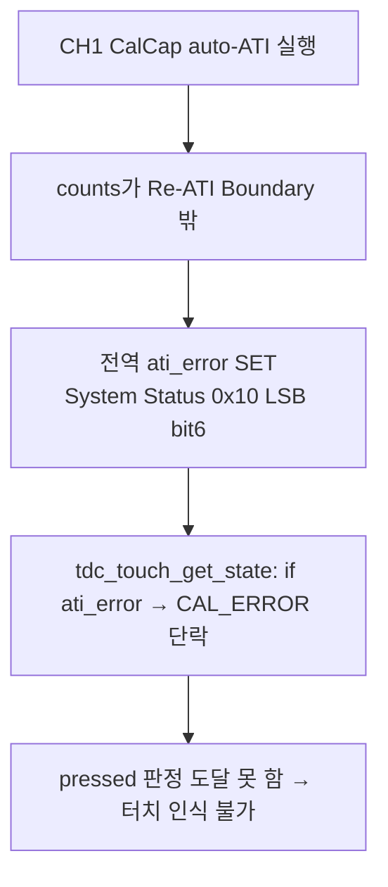
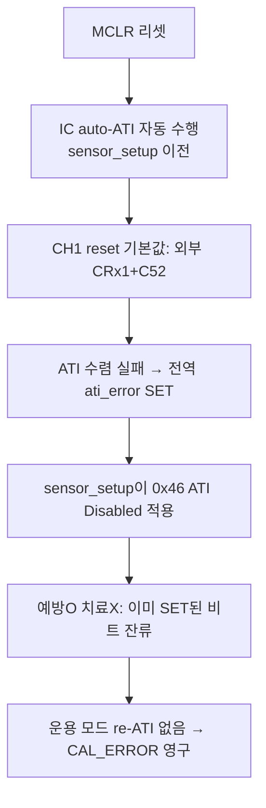

> **TL;DR**: ESD 터치 먹통을 풀려고 CH0를 VSS 방전하려 했으나 CH0가 유일 활성 채널이라 IC가 멈췄다. CH1을 더미로 살리며 ① Internal Reference 오용(0x43 reserved 위반) 먹통, ② CalCap으로 먹통은 풀었으나 auto-ATI가 sensor_setup보다 먼저 돌아 전역 ATI_ERROR가 set돼 터치 불가를 겪었다. 최종 해결은 **CalCap 더미 채널 + ATI error 무시**.

레지스터 상세 근거: [[iqs323-register-map]] · 작업 폴더: `docs/tasks/touch/20260609_crx1-esd-guard/`

---

## 0. 문제 배경

- 증상: 실제 제품에서 절전 2~3회 반복 후 **터치 먹통**. ESD 누적 → counts drift → 항시 TOUCH 오판.
- GND 쇼트로 방전하면 정상화 → ESD가 원인 확정. SW RESEED 3회로도 해결 불가(항시 TOUCH라 비터치 구간 없음).
- 대응 착안: 매 폴링마다 CH0(CRX0)을 잠깐 VSS로 방전(`TDC_TOUCH_CRX0_DISCHARGE_ENABLE`)해 누적 전하 제거.

---

## 1. 이슈 1 — 단일 활성 채널 방전 시 IC 정지

**현상**: `CRX0_DISCHARGE_ENABLE=1` 단독 적용 시 `WAIT WINDOW CLOSE: soft timeout (20ms)` 무한 반복, POWER-ON 초기화부터 먹통.

**원인**: CH0은 이 제품의 **유일한 활성 측정 채널**. `SENSOR0_SETUP(enable=0)`로 방전하는 순간 IC에 활성 채널이 0개가 되어 measurement cycle이 멈추고 RDY 윈도우가 닫히지 않는다. re-enable 후 ATI 재시작(~100ms+)도 겹쳐 `force_window_open` 45ms timeout 유발.

**결론**: CH0를 잠깐이라도 끄려면 **다른 활성 채널이 하나는 있어야 한다.** → CH1을 더미로 살리기로.

---

## 2. 이슈 2 — Internal Reference 오용 → 0x43 reserved 위반 먹통

**시도**: `0x43`(Prox Input and Control) Internal Reference(bit13)를 켜면 "외부 CRX1 무시, 내부 측정"이 될 것이라 추정하고 `write_and_verify(0x43, 0x00, 0x20)` 적용.

**실측 실패** (`tests/CRX1 Dummy, CRX0 Discharge 로그.md`): `WRITE 0x43` 직후 `force_window_open 45ms timeout` → SENSOR SETUP FAIL → 이후 touch/events/ATI/reseed 전부 연쇄 FAIL → 설정 미적용 → baseline 엉터리 → 무접촉 오감지 → LONG TOUCH → **스스로 절전**.

**데이터시트 검증으로 드러난 두 오류**:
1. **Internal Reference는 더미 채널 기능이 아님** — §5.12.2, 부정확한 외부 **온도/전류 측정**용. "대개 비활성 권장."
2. **reserved 비트 위반이 직접 먹통 원인** — `0x43` reset=`0x01CF`인데 `0x0020`은 bit7(Set to 1)·bit1-0(Set to 11)을 0으로 깸 → IC 동작 미정의.

| 비트 | 강제값 | reset | 쓴 값 | |
|---|---|---|---|---|
| bit7 | Set to 1 | 1 | 0 | ❌ |
| bit1-0 | Set to 11 | 11 | 00 | ❌ |

> [!CAUTION]
> **교훈**: 레지스터 쓰기 값은 반드시 reset value를 베이스로 산출하고 바꿀 비트만 조작한다. 0부터 쌓으면 reserved 비트를 누락한다.

---

## 3. 해결 1 — CalCap 더미 채널

**방식**: 외부 CRX1 핀(C52 부착)과 무관하게 CH1을 살리려면, 내부 **CalCap(Calibration Capacitor)을 변환 부하**로 쓴다(§5.12.3). 변환 경로가 IC 내부에서 닫혀 C52 유무·쇼트와 독립이고, 고정 부하라 measurement cycle이 안정적으로 유지된다.

**설정** (모두 reset 기준 산출, `0x43`은 미수정):

| 주소 | 값 LSB/MSB | 내용 |
|---|---|---|
| 0x44 | 0x2A / 0x03 | CalCap size=2(1.0pF), Inactive Rxs=VSS |
| 0x40 | 0x01 / 0x60 | Enable + CalCap Rx/Tx, 외부 CTx0 끔 |
| 0x70 | 0x00 / 0x00 | Channel Mode=Independent |

**실측 결과** (`tests/CRX1 Dummy, CRX0 Discharge 로그 2.md`): 초기화 FAIL **전부 소멸**. `0x44/0x40/0x70` 및 후속 touch/events/ATI/reseed 전부 성공, INIT 268ms 정상. → **0x43 먹통 문제 완전 해결.**

---

## 4. 이슈 3 — CalCap CH1 auto-ATI 실패 → 전역 ATI_ERROR

**현상**: 초기화는 성공했으나 `STATE: RESET -> CAL_ERROR` 발생, 터치해도 인식 안 됨.

**원인**: CH1을 더미로 살릴 때 **ATI를 끄지 않았다.** CH0는 운용 시 ATI Disabled(0x36)인데 CH1은 auto-ATI에 방치 → CalCap 부하 counts가 Re-ATI Boundary를 벗어나 ATI Error.

핵심: `ati_error`는 **전역 비트**(§5.11 "any channel")라 CH1 실패가 CH0 터치 판정을 막는다. 방전(0x30 패턴)은 정상 동작 중이었다 — 방전은 무관.

---

## 5. 시도 2 (부분 실패) — CH1 ATI Mode Disabled

CH1도 CH0처럼 ATI를 끄려 했다. `0x46`(Sensor1 ATI Setup) reset `0x040C`에서 ATI Mode(bits[2:0])만 `000`으로 → `WRITE 0x46: LSB=0x08 MSB=0x04`(CH0의 0x36과 동일). DUMMY 분기 순서: `0x44(CalCap)` → `0x40(enable+CalCap Rx/Tx)` → `0x46(ATI Disabled)` → `0x70(Independent)`.

**그러나 3차 실측(로그 3)에서 여전히 `CAL_ERROR`.** `WRITE 0x46`은 정상 적용됐으나 효과 없음.

---

## 6. 이슈 4 — auto-ATI 타이밍: 예방은 되나 치료가 안 됨

**원인**: IQS323은 MCLR 리셋 직후 IC가 auto-ATI를 자동 수행하는데, 이건 `sensor_setup()`보다 **먼저** 돈다. 그 시점 CH1은 아직 reset 기본값(`0x0101`=enable, ATI Full, 외부 CRx1)이라 C52 부하로 ATI 수렴 실패 → 전역 ati_error SET. 이후 sensor_setup이 0x46을 ATI Disabled로 바꿔도 "앞으로 ATI 안 함"일 뿐 **이미 SET된 ati_error 비트는 클리어 못 함**. 운용 모드엔 re-ATI가 없어(§5.11: 수동 re-ATI만이 클리어 수단) error가 영구 잔류한다.

즉 0x46 ATI Disabled는 "예방"(앞으로 ATI 실행 안 함)일 뿐, auto-ATI가 더 먼저 도는 타이밍 때문에 "치료"(선-error 클리어)가 안 된다.

---

## 7. 최종 해결 — ATI error 무시 (노말·절전 공통)

**판단**: 운용 모드는 ATI 기능 자체를 쓰지 않는다(ATI Disabled + 보드별 고정 보상값). 그러므로 ati_error 표시는 무의미하다. 데이터시트(A.2 System Status)로 확인한 두 사실이 이 판단을 안전하게 뒷받침한다:

1. ati_error는 **전역 비트**(0x10 LSB bit6) — 채널별 ATI error 레지스터는 없어 CH0/CH1 구분 불가.
2. 그러나 **터치 판정(CH0 Touch, MSB bit9)은 채널별로 분리** — ati_error를 무시해도 CH0 터치는 정확히 읽힌다.

**구현**: `tdc_touch_get_state()`에서 `if(ati_error) → CAL_ERROR` 단락을 제거하고 `CH0 Touch`(pressed)만으로 TOUCH/NOT_TOUCH 판정. get_state는 노말 폴링·절전 ULP 루프 **공통 경로**라 한 곳 수정으로 양쪽 커버(절전 진입 대기 main.c는 이미 pressed만 봄). `CALIBRATION_ERROR` enum은 문자열·호환 위해 유지(미발생).

**트레이드오프**: 잃는 것은 전역 ATI 이상 알림뿐. 운용 모드는 런타임에 ATI를 안 돌려 ati_error가 새로 날 일이 거의 없고(부팅 잔재만), ESD 먹통은 ATI Error가 아니라 counts drift(LTA/delta) 문제라 ati_error로는 어차피 안 잡힌다.

---

## 8. 현황 및 남은 검증

- 코드 구현 완료(CalCap 더미 채널 + CH1 ATI Disabled + **ati_error 무시**). 빌드·실측 대기.
- **실측 체크포인트**: ① 초기화 FAIL 없음, ② `CAL_ERROR` 미발생(이제 enum 자체를 안 냄), ③ 무접촉 시 NOT_TOUCH 유지·자동 절전 없음, ④ 실제 터치·롱터치 정상, ⑤ ESD 먹통 방전 회복.
- **미해결 불확실성**(실측 분기): CalCap size(현재 1pF) 적정성, CalCap Select 비트 모순([[iqs323-register-map]] §9), 외부 CRx 충돌.

---

## 9. 핵심 교훈 (재사용)

1. 단일 활성 채널을 끄려면 보조 활성 채널이 필요(measurement cycle 유지).
2. 레지스터 값은 reset 기준 산출 — reserved 비트 보존(0x43 먹통의 근본 원인).
3. **MCLR 직후 auto-ATI는 설정 적용보다 먼저 돈다** — 설정으로 "예방"은 되나 이미 set된 상태 비트는 "치료" 못 함(re-ATI 필요).
4. ATI를 운용에서 안 쓰면 ati_error는 무의미 — 전역 비트라도 터치 판정(CH0 Touch)은 채널별로 정확해 무시 가능.
5. 데이터시트 비트 "용도"를 추측하지 말 것(Internal Reference=온도측정 오해 사례).
