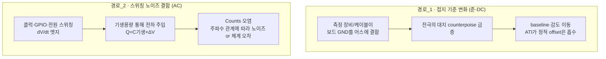

# 터치 센서 계측 시 관측 교란 (Observation Disturbance)

**TL;DR**: 정전용량 터치는 전하 기반 측정(sub-pF)이라, 관측 장비·시스템 클럭이 두 경로(① 접지 기준 변화 → baseline 이동, ② 스위칭 엣지의 전하 주입 → counts 오염)로 측정을 교란한다. "클럭 주파수가 영향을 준다"는 은수님 질문의 답은 **그렇다**이며, 메커니즘은 결합 임피던스·샘플링 윈도우 일치·에일리어싱 3가지다. Sound1은 절전 시 SYSCLK가 12배 낮아져 파생 클럭이 통째로 이동 → 노이즈 환경이 정상 모드와 완전히 달라진다.

> [!NOTE]
> 은수님과의 대화(2026-07-02)를 실시간으로 문서화한 학습 노트. "물리 원리"는 확립된 사실이고, "Sound1 보드 고유값·지배 소스"는 실측으로 확정해야 할 **가설·후보**임을 구분해 표기한다.

---

## 1. 질문 재정의

> "하이젠베르크(관측이 대상을 바꿈)가, 시스템에서 쓰는 각종 IC의 클럭 주파수에 영향을 받는다는 말인가?"

**답: 그렇다. 단, "클럭이 정전용량을 바꾼다"가 아니다.** 정확히는 —

- 클럭·데이터 라인이 스위칭하며 만드는 **전압 변화(dV/dt)가 기생용량을 통해 전극에 전하를 주입**하고,
- 그 주입 타이밍·주파수가 센서의 **샘플링과 맺는 관계**에 따라 오차가 랜덤 노이즈로 평균화될지, 아니면 **체계적 오차(baseline 이동·드리프트)**로 남을지가 갈린다.

즉 "주파수" 자체가 독립 변수로 작용하는 게 맞다. 이하에서 왜 그런지 단계적으로 푼다.

---

## 2. 왜 정전용량 센싱은 이렇게 취약한가

IQS323 같은 정전용량 센서는 전극을 **알려진 방식으로 충·방전하며 전하량/시간을 세어(Counts)** 전극의 커패시턴스를 역산한다. 손가락이 접근하면 전극 커패시턴스가 수백 fF~수 pF 늘고, 그만큼 Counts가 변한다.

문제는 **측정 단위가 fF~pF 수준**이라는 점이다. 외부에서 아주 작은 전하만 끼어들어도 Counts가 흔들린다. 주입 전하의 크기는 다음 한 줄로 요약된다:

```
Q_주입 = C_기생 × ΔV_애그레서
```

- `C_기생`: 애그레서 노드(클럭 트레이스·GPIO·전원 스위칭 노드)와 전극 사이의 기생 커패시턴스(레이아웃·거리 의존, 보통 fF~pF).
- `ΔV_애그레서`: 그 노드가 스윙하는 전압 폭.

전극이 재려는 신호 자체가 fF~pF급이므로, `C_기생`이 비슷한 규모면 주입 전하가 신호와 대등해져 측정을 오염시킨다.

---

## 3. 교란의 두 경로 — 접지(DC) vs 스위칭(AC)



- **경로_1(접지)**: 앞선 대화의 J-Link 어스 결합이 여기 해당. 관측 장비가 보드 GND를 (실효적) 어스에 묶으면 baseline과 **터치당 ΔC(감도)까지** 바뀐다. → [[별도: J-Link 접지 결합 논의]] 참조(이 문서 §7·이전 대화).
- **경로_2(스위칭)**: 이번 §의 주제. **클럭 주파수가 변수로 등장하는 곳이 바로 여기다.**

두 경로는 독립이다. 디퍼런셜(플로팅) 프로브는 경로_1을 없애지만 경로_2는 그대로다.

---

## 4. 왜 "클럭 주파수"가 변수인가 — 3가지 세부 메커니즘

### 메커니즘_1 — 결합 임피던스 (높은 주파수일수록 잘 새어든다)

기생용량을 통한 결합 임피던스는

```
Z_결합 = 1 / (2π · f · C_기생)
```

`f`(애그레서 주파수)가 높을수록 `Z_결합`이 작아져, **같은 작은 기생용량으로도 더 많은 전하가 결합**한다. 그래서 빠른 엣지(고주파 하모닉이 수백 MHz까지 뻗음)를 갖는 디지털 스위칭이 특히 위험하다. → **엣지를 느리게(slew-rate 제한) 하면 결합이 줄어든다.**

### 메커니즘_2 — 샘플링 윈도우 일치 (타이밍이 전부다)

센서는 특정 시간 창(변환 윈도우) 동안만 전하를 적분한다. 애그레서 엣지가 —

- **윈도우 밖**에 떨어지면 → 측정에 거의 영향 없음.
- **윈도우 안**에 떨어지면 → 그 전하가 고스란히 Counts에 더해짐(체계적 오차).

그래서 "노이즈 총량"보다 **애그레서와 샘플링의 위상 관계**가 더 중요할 때가 많다.

### 메커니즘_3 — 에일리어싱 / 비트(맥놀이)

센서는 일정 레이트(변환율)로 샘플링하므로, 애그레서 주파수 `f_agg`는 샘플레이트 `f_s`로 **에일리어싱**된다. 특히 `f_agg`가 `f_s`의 정수배 근처면 둘의 차주파수(`|f_agg − N·f_s|`)가 **느린 맥놀이**로 나타난다.

- 이 느린 맥놀이는 랜덤 노이즈처럼 평균화되지 않고 **LTA(장기 평균) 필터를 교란**한다 — LTA가 못 쫓거나(미수렴), 잘못된 방향으로 쫓는다(드리프트).
- 은수님이 이전 작업에서 관측한 **"LTA 미수렴·느린 드리프트"** 현상과 물리적으로 연결될 수 있는 지점이다(가설).

> [!IMPORTANT]
> 핵심 구분: **랜덤 광대역 노이즈**는 대체로 평균화되어 노이즈 플로어만 약간 올린다. 진짜 문제를 일으키는 건 **주기적·코히런트(clock 유래) 간섭** — 이게 체계적 offset·드리프트·발산의 주범이다. 그래서 "어떤 IC의 클럭이냐"가 실제로 중요하다.

---

## 5. Sound1의 실제 클럭·스위칭 소스 (코드 확인 기반)

| 소스 | 정상 모드 | 절전(ULP) 모드 | 절전 시 상태 | 근거 |
|---|---|---|---|---|
| **SYSCLK** (CM3) | 30.72 MHz | **2.56 MHz** | 12× 하강 | `ci_power_sleep()` `SYS_FREQ_2M56` |
| ADCCLK·SDMCLK·SLOWCLK·UARTCLK·UCLK | SYSCLK 파생 | **전부 12× 하강** | 유지(비율 고정) | `D_CLK->CFG_*` 전부 `*_SRC_SYSCLK` |
| **I2C SCL** | 128 kHz (PRESCALE_240) | **≈426.7 kHz** (PRESCALE_6) | 활발(100ms마다 status read) | `driver_i2c.h` 공식, main.c `func_sleep()` |
| ULP HW 타이머 | — | 100 ms 주기 웨이크 | 활성 | `tdc_touch_time.h` |
| **PMIC (ISL9122, 스위칭 레귤레이터)** | 3.3V·1.2V 공급 | **OFF** | 차단 | `OnOff_3V_PMIC_CM3_to_CFX(false)` |
| FPGA / nRF / QCC | 동작 | **OFF/셧다운** | 차단 | `func_sleep()` 진입 시퀀스 |
| **IQS323 내부 오실레이터** | 자체(비동기) | 자체, LP report rate 100ms | 활성 | 데이터시트 §5, `tdc_touch_iqs323.c` |

> [!NOTE]
> SLOWCLK가 `SLOWCLK_SRC_SYSCLK | SLOWCLK_PRESCALE_2`로 설정되는데, 이는 `tdc_touch_time.h`가 HW 타이머 공식에서 가정한 "SLOWCLK 40kHz"와 액면상 불일치한다(2.56MHz/2 = 1.28MHz). 타이머 클럭 소스/분주 실제값은 **실측 확인 필요 항목**(§8). 본 문서의 노이즈 논의에는 영향 없음.

---

## 6. 핵심 통찰 — 절전에서 노이즈 환경이 통째로 바뀐다

§5에서 가장 중요한 사실: **절전 진입 시 SYSCLK가 12배 낮아지고, 거의 모든 파생 클럭이 SYSCLK에서 나오므로 함께 12배 낮아진다.** 동시에 PMIC 스위칭·FPGA·QCC·nRF가 꺼진다.

즉 **정상 모드와 절전 모드는 서로 완전히 다른 노이즈 스펙트럼**을 갖는다:

- 정상: 30.72MHz 계열 + PMIC 스위칭 + FPGA/QCC/nRF 활동 → 고주파·다중 애그레서.
- 절전: 2.56MHz 계열 + I2C 426.7kHz 버스트 + IQS323 내부 클럭만 → 저주파·소수 애그레서, 그러나 **주파수가 IQS323 변환율(§4 메커니즘_3)과 새로운 비트 관계**를 맺을 수 있음.

> [!WARNING]
> **가설**: 은수님이 쫓고 있는 "절전에서만 발생하는 ATI 에러·재부팅·LTA 미수렴"이, 코드 로직 버그가 아니라 **절전 모드 특유의 노이즈 스펙트럼 변화**(특히 I2C 426.7kHz·저속 SYSCLK가 IQS323 샘플링과 맺는 에일리어싱)에서 비롯됐을 가능성. 이는 §8 실측으로 검증해야 한다. (참고: 이전 작업에서 확정한 root cause "PM Timeout 자동 LP 강하"와는 별개의 잔여 가설.)

이 관점이 실용적으로 중요한 이유: **정상 모드에서 멀쩡하던 센서가 절전에서 이상해지는 것**이 물리적으로 자연스럽다는 뜻이고, "정상 모드에서 재현 안 됨"이 곧 "코드 문제 없음"을 의미하지 않는다.

---

## 7. 하이젠베르크로 돌아와서 — GPIO 비트스트림이 더하는 새 애그레서

앞서 논의한 "디퍼런셜 프로브로 GPIO 비트스트림 출력" 계획을 §4 틀로 다시 보면:

- 비트스트림 토글은 **새로운 주기적 스위칭 애그레서**를 전극 근처에 추가하는 것이다.
- 그 비트레이트(또는 하모닉)가 IQS323의 민감 대역·변환 윈도우와 겹치면, **보고하려는 바로 그 Counts를 오염**시킨다 — 관측이 대상을 바꾸는 전형.
- 디퍼런셜 프로브가 해결하는 건 경로_1(접지)뿐, 이 경로_2(스위칭)는 **프로브 종류와 무관**하다.

**완화책**:
1. 스트리밍 GPIO를 **전극·CRX 트레이스에서 물리적으로 최대한 멀리**(C_기생 ↓).
2. **엣지를 느리게**(slew-rate 제한, 저드라이브 설정 — §5의 `DIO_LOW_DRIVE` 활용)(메커니즘_1 ↓).
3. **IQS323 변환 윈도우 밖에서만 토글**(예: status read 완료 직후~다음 WFI 전)(메커니즘_2 회피).
4. **비트레이트를 IQS323 샘플레이트의 배수 근처가 아닌 값**으로(메커니즘_3 회피).
5. 원시 비트열 대신 **펄스 개수/폭 인코딩** → 짧은 버스트로 끝나 노출 시간 최소화.

---

## 8. 확인 필요 (실측 게이트)

| 항목 | 내용 | 확인 방법 |
|---|---|---|
| 확인_1 | 절전 모드에서 실제 지배적 애그레서가 무엇인지(I2C? IQS323 내부? 잔류 스위칭?) | 전극/CRX 노드를 저용량 프로브로 관측, 각 소스 on/off 시 Counts 변화 |
| 확인_2 | IQS323 내부 변환율·오실레이터 주파수(에일리어싱 계산의 f_s) | IQS323 데이터시트 §5, report rate 레지스터 실제값 |
| 확인_3 | I2C 426.7kHz 버스트가 IQS323 변환 윈도우와 겹치는지 | RDY 타이밍 vs I2C 트랜잭션 타이밍 스코프 동시 관측 |
| 확인_4 | SLOWCLK 실제 주파수(40kHz 가정 vs SRC_SYSCLK 파생 불일치) | `tdc_Trims_SetOperatingFrequency`·`D_CLK` 레지스터 맵, 타이머 실측 주기 |
| 확인_5 | 절전 vs 정상 LTA baseline·노이즈 차이 정량 | 두 모드에서 LTA·Counts 표준편차 비교(계측 로그) |

---

## 요약 (한 줄)

정전용량 터치는 전하 기반 sub-pF 측정이라 관측·시스템 클럭이 접지(baseline)와 스위칭(counts) 두 경로로 교란하며, 클럭 주파수는 결합 임피던스·샘플링 윈도우 일치·에일리어싱 3메커니즘으로 실제 변수가 된다. Sound1은 절전 시 SYSCLK 12× 하강으로 노이즈 환경이 통째로 바뀌므로, 절전 특유 증상이 로직 버그가 아닌 노이즈 스펙트럼 변화일 가설을 실측으로 검증해야 한다.
