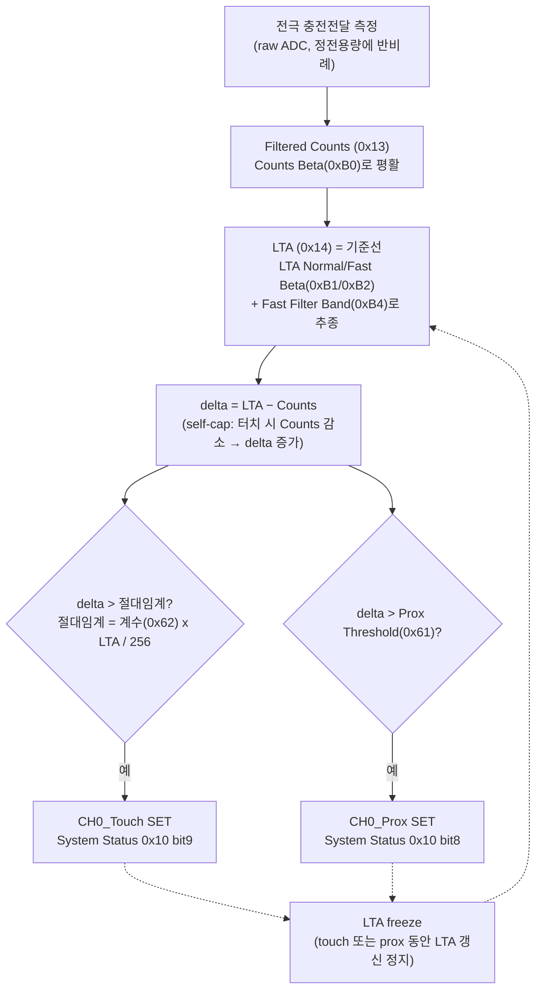

# 터치 임계·계수 레지스터 동작 레퍼런스

**TL;DR**: Sound1 터치(IQS323)의 코드 상수가 레지스터로 들어가는 경로, IC가 그 값을 내부에서 어떻게 계산해 실제 터치 임계로 쓰는지, 그리고 계산에 쓰이는 LTA·Counts·ATI Target·Beta 같은 값들이 어디서 오는지를 한곳에 정리한다. 핵심 공식 하나만 기억하면 된다 — **터치 절대임계 = 계수 × LTA ÷ 256**. 모든 수치·공식·코드 라인은 데이터시트(`데이터시트/06·02`)와 소스(`tdc_touch_iqs323.c/.h`)를 직접 인용했고, 페르소나 4 + adversarial 검증 1로 교차검증했다(할루시네이션 0).

> [!NOTE]
> 본 문서는 조사·분석·검증 결과 레퍼런스다. **코드를 수정하지 않았다.** 조사 중 발견된 코드 주석 불일치 3건은 §7에 "발견사항"으로만 기록한다(실제 수정은 별도 작업). 한눈 요약은 같은 폴더 [`index.html`](index.html) 참조.

---

## 1. 큰 그림 — 측정값이 흐르는 경로

IQS323은 전극의 정전용량을 "카운트(Counts)"로 측정하고, 평상시 기준선 "LTA"와 비교해 터치를 판정한다. 코드 상수들은 이 비교의 **임계와 필터 속도**를 정하는 설정값이다.



- **Counts(0x13)**: 지금 이 순간의 정전용량 측정값(노이즈를 Counts Beta로 다듬은 값).
- **LTA(0x14)**: "아무것도 안 닿은 상태"의 기준선. 환경 변화를 천천히 따라간다.
- **delta = LTA − Counts**: 터치하면 정전용량이 늘어 Counts가 **줄고**, 그래서 delta가 **커진다**.
- **터치 판정**: `delta > 절대임계`면 터치. 절대임계는 고정 숫자가 아니라 **LTA에 비례**한다(아래 §3).

---

## 2. 한눈에 보는 상수 → 레지스터 매핑표

| 코드 상수 / 설정 | 현재 값 | 레지스터 | 코드에서 변환? | IC 내부 계산 |
|---|---|---|---|---|
| `TDC_TOUCH_IQS323_THRESHOLD` | 80 | 0x62 bits[7:0] | **그대로** | 절대임계 = 80 × LTA ÷ 256 ≈ **125** @LTA400 |
| `TDC_TOUCH_IQS323_HYSTERESIS` | 8 | 0x62 bits[15:12] | **코드 변환** `(8 & 0x0F) << 4` = 0x80 | 실제 hyst = (8 ÷ 256) × 절대임계 ≈ **3.9** @abs125 |
| `TDC_TOUCH_IQS323_PROX_THRESHOLD` | 255 | 0x61 bits[7:0] | **그대로** | 진입 = delta > 255 (사실상 불가 → prox 무력화) |
| Counts Beta | 2 / 2 (NP/LP) | 0xB0 | 그대로 | Counts IIR 평활 계수 |
| LTA Normal Beta | 6 / 6 | 0xB1 | 그대로 | LTA 통상 추종 속도 (해석 §6) |
| LTA Fast Beta | 2 / 2 | 0xB2 | 그대로 | LTA 급변 추종 속도 |
| Fast Filter Band | 10 | 0xB4 | 그대로 | Normal↔Fast 전환 임계 |
| ATI Resolution Factor | 64 | 0x36 bits[15:4] | 0x040C 비트분해 | ATI Target = Base × (64 ÷ 16) |
| ATI Base | 100 | 0x37 | **코드 미기입(기본값)** | ATI 수렴 기준 |
| ATI Band | Large(1/8) | 0x36 bit3 | 0x040C | Re-ATI 경계 = Target ± (1/8 × Target) |
| Conversion Freq | 0x057F (1MHz) | 0x31 | 그대로 | 측정 주파수 |
| Power Mode | Auto No ULP | 0xC0 bits[6:4] | 그대로 | 전력 모드 |

> 출처: `tdc_touch_iqs323.c`(beta_power_settings ~L304-310, apply_settings의 touch_settings·prox·ATI write), `tdc_touch_iqs323.h`(L46·49·52). 공식: `데이터시트/06_레지스터레퍼런스.md` A.12·A.16·A.17·A.26~28.

**핵심 분류 3가지**
1. **레지스터에 그대로** — 코드 숫자가 그 레지스터 비트에 직접 들어감(THRESHOLD·PROX·Beta·Fast Band 등).
2. **코드에서 변환** — 코드가 비트 위치/형식을 바꿔 기입(HYSTERESIS의 `<<4`, ATI의 0x040C 비트조립).
3. **IC가 내부에서 재계산** — 레지스터의 "계수"를 IC가 LTA 등과 곱해 실제 동작값으로(절대임계·hysteresis·ATI Target).

---

## 3. Touch Threshold — 절대임계는 LTA에 비례한다

### 코드
- 정의: `TDC_TOUCH_IQS323_THRESHOLD 80` (`tdc_touch_iqs323.h:46`)
- write: `touch_settings(80, 8)` → `write_register(0x62, 0x50, 0x80)` (`tdc_touch_iqs323.c:289,408`). LSB `0x50`(=80)이 0x62 bits[7:0]에 **그대로** 저장.

### IC 내부 계산 (데이터시트 A.17)
```
절대 터치임계(counts) = (Touch Threshold 계수 × LTA) / 256
```
- LTA=400이면 절대임계 = 80 × 400 ÷ 256 = **125 counts**.
- **진입**: `delta > 절대임계` → CH0_Touch SET (`02_proxfusion동작.md §5.7`)

> [!IMPORTANT]
> 임계가 **고정 숫자가 아니라 LTA에 비례**한다는 점이 핵심이다. LTA가 변하면(환경 드리프트·grounding) 절대임계도 같이 변한다. 그래서 보드별 기생용량이 달라 LTA가 달라져도 "LTA의 약 31%(=80/256)"라는 **상대 감도**는 일정하게 유지된다.

---

## 4. Hysteresis — 해제 임계, 그리고 4비트라는 한계

### 코드
- 정의: `TDC_TOUCH_IQS323_HYSTERESIS 8` (`tdc_touch_iqs323.h:49`)
- write: `touch_settings`에서 **`(hysteresis & 0x0F) << 4`** = `(8 & 0x0F) << 4` = `0x80` → 0x62 MSB 상위 니블(bits[15:12]) (`tdc_touch_iqs323.c:284-289`).

> [!WARNING]
> Hysteresis 필드는 0x62의 **bits[15:12]**(MSB 상위 니블)다. 과거에는 MSB를 통째로(`0x08`) 써서 bits[11:8]에 들어가 **실제 hysteresis=0**이었던 버그가 있었고, 지금은 `<<4`로 올바른 위치에 넣는다.

### IC 내부 계산 (데이터시트 A.17)
```
실제 hysteresis(counts) = (Hysteresis 필드 / 256) × 절대 터치임계
이탈(해제): delta < (절대임계 − hysteresis)
```
- H=8, 절대임계=125 → 실제 hyst = 8 ÷ 256 × 125 ≈ **3.9 counts** → 해제 하한 ≈ 121.

> [!NOTE]
> **구조적 한계**: Hysteresis 필드는 4비트(0~15)다. 최대 H=15여도 hyst = 15 ÷ 256 × 절대임계 ≈ **절대임계의 5.9%**뿐이다. 즉 해제 임계를 임계의 ~94% 밑으로는 못 내린다. "터치 stuck(delta가 임계보다 낮아도 안 풀림)"은 이 hysteresis로 해결되지 않으며, 그 원인은 보통 **LTA가 터치 counts를 흡수해 임계 자체가 따라 내려가는 것**이다(별도 분석).

---

## 5. Prox Threshold — touch와 한 채널을 공유, 지금은 무력화

### 코드
- 정의: `TDC_TOUCH_IQS323_PROX_THRESHOLD 255` (`tdc_touch_iqs323.h:52`)
- write: `write_register(0x61, 0xFF, 0x00)` (`tdc_touch_iqs323.c:415`). LSB `0xFF`(=255)가 0x61 bits[7:0]에 **그대로**. MSB=0 → Prox Debounce 0(즉시).

### IC 내부 (데이터시트 A.16 / §5.7)
```
prox 진입 = (LTA − Counts) > Prox Threshold = delta > 255
```
- LTA≈400에서 delta>255이려면 Counts<145여야 해 사실상 불가 → **prox 거의 진입 안 함**.

> [!IMPORTANT]
> **prox는 touch와 같은 Counts·LTA를 공유**한다(전용 카운터/LTA 없음). 같은 delta를 prox 임계·touch 임계와 **각각** 비교한 판정 결과일 뿐이다. 그런데 LTA freeze 조건이 "touch **또는** prox"라(§6), Prox Threshold가 낮으면(기본 0) 약결합에도 prox가 떠 LTA가 얼어붙는다. 255로 둔 이유 = **prox를 사실상 끄고 LTA freeze를 touch 이벤트에만 맡기기 위함**.
>
> **[실측 게이트]**: Prox Threshold의 단위가 "절대 delta(counts)"인지 "touch처럼 ×LTA/256 계수"인지 데이터시트(A.16 "8-bit value")가 명시하지 않는다. §5.7 진입식은 절대 delta 해석에 가깝지만 확정은 실측 필요.

---

## 6. 연관 계수들 — 어디서 오나

### 6.1 LTA(0x14) · Filtered Counts(0x13) — IC가 실시간 산출 (read-only)
- **Counts**: 충전전달 엔진이 매 측정마다 자동 산출. self-cap이라 정전용량↑ → Counts↓.
- **LTA**: Counts를 IIR 필터로 천천히 따라가는 기준선. 코드가 값을 쓰지 않고 읽기만 한다.
- 갱신식(데이터시트 §5.6): `LTA_new = LTA_old + (Counts − LTA_old) × damping`

### 6.2 Beta — LTA가 Counts를 따라가는 "속도"
| 레지스터 | 값 | 역할 |
|---|---|---|
| 0xB0 Counts Beta | 2/2 | raw → Filtered Counts 평활(노이즈 억제) |
| 0xB1 LTA Normal Beta | 6/6 | **평상시 LTA 추종 속도(수렴의 핵심)** |
| 0xB2 LTA Fast Beta | 2/2 | 급변(환경) 시 빠른 LTA 추종 |
| 0xB4 Fast Filter Band | 10 | Normal↔Fast 전환 임계(Counts가 LTA에서 반대 방향으로 10 이상 벗어나면 Fast) |

> [!CAUTION]
> **Beta 해석은 두 자료가 정반대다 — 실측 결과 AZD004가 우세.**
> - 데이터시트 §5.6: `damping = Beta / 256` → β 클수록 **빠름**
> - 앱노트 AZD004(코드 설계 근거): `α = 1 / 2^β` → β 클수록 **느림**
>
> 실기 로그(20260622 작업)에서 β=16일 때 LTA가 6초에 −1만 움직여 사실상 동결됐는데, 이는 AZD004 해석(α=1/2¹⁶≈0)과 일치하고 데이터시트 해석(α=0.0625, −78 예상)과 불일치한다. **→ AZD004(β 클수록 느림)가 실측상 맞다.** 그래서 "빠른 수렴"을 위해 β를 키우지 않고 **줄인다**. 현재 β=6은 약 12.8초 시정수(롱터치 2.4초의 ~5배)로, 터치 중 LTA 흡수를 막으면서 약결합은 결국 흡수하는 절충값이다. (단 IC 내부 구현 공식의 100% 확정은 β=1 설정 실측이 필요 — 잔여 [실측 게이트].)

### 6.3 ATI Target / Band — IC가 자동으로 baseline을 정규화
- write: `write_register(0x36, 0x0C, 0x04)` = 0x040C (`tdc_touch_iqs323.c:429`)
  - bits[15:4] = 64 → **ATI Resolution Factor**
  - bit3 = 1 → **Large ATI Band(1/8)**
  - bits[2:0] = 100 → **Full Mode**
- **ATI Target** = ATI Base × (Resolution Factor ÷ 16) = 100 × (64 ÷ 16) = **400 counts** (데이터시트 §5.9, A.12)
  - Full ATI가 끝나면 노터치 Counts가 ≈400이 되도록 IC가 **Multiplier·Compensation(0x38·0x39)을 자동 산출**(코드 미기입).
- **ATI Band(Large)** = 1/8 × 400 = 50 → **Re-ATI 경계 = [350, 450]** (비교 대상은 **LTA**)
  - LTA가 [350,450]을 벗어나면 IC가 자동 Re-ATI. ATI 완료 시 Counts가 경계 밖이면 ATI Error 비트가 서고, 이때 Re-ATI는 **마스터가 0xC0 bit2를 수동으로** 걸어야 한다(§5.10·§5.11).
- **ATI Base(0x37=100)**: 코드가 쓰지 않아 IC 기본값(데이터시트 §9: 0x0064) 그대로. **[실측 게이트]** POR 후 실제 보존 여부는 레지스터 덤프로 확인 권장.

> [!IMPORTANT]
> **ATI가 보정하는 것 vs 못 하는 것**: ATI는 노터치 baseline(Counts)을 Target(400)으로 맞춰 **보드별 기생용량(Cp) 산포**를 흡수한다. 하지만 **터치 변화량(delta) 자체는 손가락–대지 결합(grounding)에 의존**하므로, PC+GND 연결(delta 큼)과 독립(floating, delta 작음)의 차이는 ATI가 보정하지 못한다. 즉 임계는 **실사용 grounding 환경에서 측정한 delta** 기준으로 잡아야 한다.

---

## 7. 조사 중 발견된 코드 주석 불일치 (참고 — 코드 미수정)

> [!NOTE]
> 본 작업은 코드를 수정하지 않는다. 아래는 adversarial 검증이 찾아낸 **주석↔실제 값 불일치**로, 후속 정리 시 참고용. 동작에는 영향 없으나 주석을 믿으면 오해할 수 있다.

| # | 위치 | 주석 내용 | 실제 | 비고 |
|---|---|---|---|---|
| 1 | `tdc_touch_iqs323.c:300` (beta_power_settings 선두 주석) | `0xB1=0x0808` (β=8) | `write_register(0xB1, 0x06, 0x06)` = β6 (c:305) | β 8→6 변경 시 함수 주석 미갱신. 검증이 유일하게 포착 |
| 2 | `tdc_touch_iqs323.h:49` | `실제 hyst ≈ 5cnt` | (8/256)×125 ≈ **3.9cnt** | 약 28% 과대 표기 |
| 3 | `tdc_touch_iqs323.c:412` | `Prox = Touch 동일 계수(진입점 일치)` | 실제 255(무력화) | 102→255 변경 시 주석 미갱신 |

---

## 8. 미해결 [실측 게이트] 요약

| 항목 | 내용 | 판별 방법 |
|---|---|---|
| Prox 단위 | 절대 delta vs ×LTA/256 계수 (A.16 미명시) | 0x61 값 바꿔가며 CH0_Prox 진입 delta 관찰 |
| Beta 공식 | DS(Beta/256) vs AZD004(1/2^β) — 실측상 AZD004 우세 | β=1 설정 후 LTA 수렴 시정수 측정 |
| ATI Base(0x37) | 코드 미기입 기본값 100 보존 여부 | POR 후 0x37 레지스터 덤프 |
| Hysteresis 상한 | 4비트 최대(15) 실효 동작 | H=15 설정 후 해제 delta 관찰 |

---

## 부록 — 계측 출력 `[T]` 줄이 보여주는 것

```
[T] LTA=399  CNT=355  D= 44  THR=125 (k= 80  H=  8)  .   PTHR=397 (pk=255)  .
```
| 필드 | 의미 | 출처 |
|---|---|---|
| `LTA` | 기준선 (0x14) | IC read-only |
| `CNT` | 현재 Counts (0x13) | IC read-only |
| `D` | delta = LTA − CNT | SW 계산 (`tdc_touch.c`) |
| `THR` | 절대 터치임계 = k×LTA/256 | SW 미러링 (디버그용) |
| `k` | Touch Threshold 계수 (현재 80) | `TDC_TOUCH_IQS323_THRESHOLD` |
| `H` | Hysteresis 필드값 (현재 8) | `TDC_TOUCH_IQS323_HYSTERESIS` |
| 첫 `. / T` | CH0_Touch 비트 (0x10 bit9) | IC 판정 |
| `PTHR` | prox 절대임계 = pk×LTA/256 (디버그 계산) | SW 미러링 |
| `pk` | Prox Threshold (현재 255) | `TDC_TOUCH_IQS323_PROX_THRESHOLD` |
| 끝 `. / P` | CH0_Prox 비트 (0x10 bit8) | IC 판정 |

> `THR`·`PTHR`은 SW가 IC 공식을 흉내 낸 **디버그 표시값**이고, 실제 터치/prox 판정은 IC 하드웨어(System Status 비트)가 한다.
