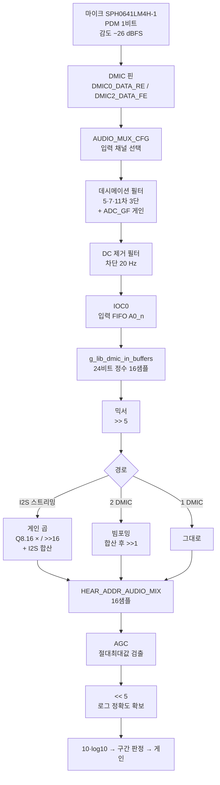

# 02. 입력 경로 - IOC 에서 AGC 까지

**TL;DR**: 마이크 PDM 이 AGC 입력 숫자가 되기까지 **9단계**를 거친다. 배율이 바뀌는 곳은 넷 — **데시메이션 `ADC_GF`(미확정) · 믹서 `>>5` · 믹서 게인 · AGC `<<5`** 이고, **`>>5` 와 `<<5` 는 정확히 상쇄**된다.

## 1. 전체 흐름



## 2. 단계별 상세

### 2.1 ① 마이크 → PDM

| 항목 | 값 | 근거 |
|---|---|---|
| 출력 | 1비트 PDM, ½ Cycle | 데이터시트 |
| 극성 | 음압 ↑ = 1의 밀도 ↑ | 데이터시트 |
| 클럭 | Normal 2.4 MHz 대역 | |
| **감도** | **−26 dBFS @ 94 dB SPL** | → `0x7FFFFF` = 120 dB SPL |

두 마이크(DMIC1 = U7 E8300 쪽, DMIC2 = U9 QCC 쪽)가 **rising / falling edge** 로 나뉘어 한 데이터 선을 공유한다.

```c
// lib_audio_in.h:98
#define LIB_DMIC_AUDIO_MUX_CFG_INPUT_CH_SRC (ADC3_OUT | DMIC2_DATA_FE | ADC1_OUT | DMIC0_DATA_RE)
```

| 상수 | 뜻 |
|---|---|
| `LIB_DMIC_IDX_DMIC1 = 0` | **U7, EZ/E8300** (FIFO MIC0), `DMIC0_DATA_RE` (rising edge) |
| `LIB_DMIC_IDX_DMIC2 = 1` | **U9, QCC** (FIFO MIC1), `DMIC2_DATA_FE` (falling edge) |

### 2.2 ② 데시메이션 필터 - **배율이 바뀐다**

E8300 하드웨어 레퍼런스 **§14.4 (p.444~445)**.

- 저역통과 3단(**5차·7차·11차**)
- 출력에 **디지털 게인 `ADC_DEC_CTRL_ADC_GF`** 를 곱한다 (12비트 필드, `0xFFF` 마스크)
- 이어서 **DC 제거 필터** (차단 20 Hz 설정)

데이터시트가 주는 **유니티 게인 공식**:

```
ADC_DEC_CTRL_ADC_GF = 2^(11 + log2(SFCR)) / (SFCR + 1)
```

현재 설정:

| 항목 | 값 | 근거 |
|---|---|---|
| 샘플레이트 | **16 kHz** | `SYS_SET_ADC_SAMPLE_FREQ_CFG(AUDIO, LIB_AUDIO_SFCR_16K)` (`lib_audio_in.c:25`) |
| `SFCR` | **29** (`ADC_MODDIV_BY30 = 0x1D`) | SDK `sk5_cfx_hw_flat_cid101.h:4298` |
| **공식이 주는 유니티** | **1979.7 ≈ 1979** | 위 식에 SFCR=29 대입 |
| **펌웨어가 쓰는 값** | **1092** | `lib_audio_in.h:112` `#define LIB_SYS_CALC_GF 1092  // 1092//1979` |

> [!CAUTION]
> **유니티(1979)가 아니라 1092 다. 비율로 −5.17 dB.**
>
> 주석 `// 1092//1979` 가 **두 값을 다 써 봤다**는 흔적이다. `main.h:119` 에는 아직 `#define SYS_CALC_GF 1979` 가 남아 있다(이쪽은 미사용).
>
> **이것이 실재하는 감쇠라면 이 문서 묶음의 모든 SPL 값이 5.17 dB 씩 밀린다.** 판단 근거와 **10분 측정 절차**는 [`07`](07_미확정%20사항과%20측정%20절차.md).
>
> 아래 §3 이후는 **«1092 가 DMIC 경로의 실효 유니티» 라는 가정**으로 쓴다. 그 가정을 받치는 정황은 AGC 게이트가 마이크 잡음 바닥과 0.2 dB 안에서 맞는다는 것이다.

### 2.3 ③~④ IOC → FIFO → 버퍼

```c
// lib_audio_in.h:88·99
#define LIB_DMIC_AUDIO_MUX_CFG_IOC_SRC (IOC0_SRC3_DEC_FILTER | ... | IOC0_SRC0_DEC_FILTER)
// lib_audio_in.h:67
#define LIB_IOC_ADC_CFG_VAL (IOC_INPUT_CFG_IN0_FA0_0 | IOC_INPUT_CFG_IN1_NONE | IOC_INPUT_CFG_IN2_FA0_1 | ...)
```

IOC0 가 데시메이션 필터 출력을 **입력 FIFO(A0_0, A0_1 …)** 로 옮긴다. FIFO 는 **더블 액세스**로 설정돼 있다(`LIB_IOC_FIFO_ACCESS_VALUE`).

| 항목 | 값 |
|---|---|
| 데이터 폭 | **24비트 정수** (`INT24_MAX = 0x7FFFFF`) |
| 블록 길이 | **16 샘플** (`df_inputADC_DataBuffLength`) |
| 블록 주기 | 16 / 16 kHz = **1 ms** |
| 버퍼 | `g_lib_dmic_in_buffers[마이크][블록][샘플]`, 블록 2개 링 |

**이 지점의 값이 §3 이후 모든 표의 «마이크 코드» 다.**

### 2.4 ⑤ 믹서 `>> 5` - **배율이 바뀐다**

```c
// definitionsForAlgorithm.h:103
#define AUDIO_INPUT_RSHIFT 5
// audioMixer.c:302 (U2 단일)
p_mix[i] = (p_buf1[i] >> AUDIO_INPUT_RSHIFT);
```

| 항목 | 값 |
|---|---|
| 배율 | **÷32 = −30.10 dB** |
| 최대값 | 8,388,607 → **262,143** ← **시프트 단독. 게인 이전 값이다** |
| **목적** | 여러 입력을 더해도 24비트를 넘지 않도록 **헤드룸 확보** |
| **대가** | **하위 5비트 소실** — 되돌릴 수 없다. → [05](05_포화와%20절삭.md) §3 |

> [!IMPORTANT]
> **위 262,143 은 «`>>5` 만 거친» 값이다. 게인은 별개 단계(§2.5)에서 나중에 곱한다.**
>
> 인용한 코드는 `tdc_audio_mix_1_buffer`(U2, 단일 DMIC)인데 **이 경로에는 게인 곱 자체가 없다** — «유니티 게인» 이라는 개념이 성립하지 않고 262,143 이 그대로 최종 믹스값이다.
>
> 게인이 붙는 것은 **I2S 스트리밍 경로(U14)뿐**이고, 거기서는 262,143 이 **게인을 곱하기 직전의 값**이다. 마침 유니티(인덱스 128)일 때 결과가 262,143 으로 같아 **두 경우의 숫자가 겹친다.**

#### 경로·게인별 믹서 출력 최대값 (마이크 풀스케일 입력, 1채널 기준)

| 경로 | 게인 | 계산 | **최대값** |
|---|---|---|---|
| **U2 단일 DMIC** | **없음** | `8,388,607 >> 5` | **262,143** |
| **빔포밍 (U1)** | 없음 (2채널 합 후 `>>1`) | 레벨 보존 | **262,143** |
| U14 (I2S) · 인덱스 0 | **뮤트** | `(262,143 × 0) >> 16` | **0** |
| U14 · 인덱스 1 | −17.86 dB | `(262,143 × 8,385) >> 16` | 33,539 |
| **U14 · 인덱스 128** | **유니티 0 dB** | `(262,143 × 65,536) >> 16` | **262,143** |
| U14 · 인덱스 255 | +17.86 dB | `(262,143 × 512,211) >> 16` | **2,048,836** |

2입력(마이크 + I2S) 합산의 최악값과 포화 여유는 [05](05_포화와%20절삭.md) §4 에서 다룬다 — **결론은 어떤 조합에서도 포화하지 않는다.**

### 2.5 ⑥ 경로 분기 - 여기서 게인이 갈린다

`main.c:434` `PCM_LiveStimulation_Mode()`

| 조건 | 호출 | **게인 테이블** |
|---|---|---|
| **I2S 스트리밍** | `tdc_audio_mix_2_buffers_with_gain(DMIC1, I2S, gain_a, gain_b)` | **적용된다** |
| 비스트리밍 · DMIC 2개 · front mic 지정 | `tdc_audio_mix_2_buffers_for_beamforming(...)` | **없다** |
| 비스트리밍 · DMIC 1개 | `tdc_audio_mix_1_buffer(DMIC1)` | **없다** |
| 비스트리밍 · DMIC 2개 · front mic 미지정 | `tdc_audio_mix_1_buffer(DMIC1)` | **없다** |

> [!IMPORTANT]
> **믹서 게인은 I2S 스트리밍 중에만 작동한다.** 스트리밍이 아니면 `gain_table_index_a` 를 아무리 바꿔도 아무 일도 일어나지 않는다. → [06](06_게인%20상호작용과%20역전%20현상.md) §5

#### 게인 적용 방식 (`audioMixer.c:329~`)

```c
gained_value  = ((long) gain_a_q8_16) * (p_mic_buf[i] >> AUDIO_INPUT_RSHIFT);
gained_value += ((long) gain_b_q8_16) * (p_i2s_buf[i] >> AUDIO_INPUT_RSHIFT);
gained_value  = gained_value >> TDC_GAIN_Q8_16_SHIFT;   // >>16
// INT24 포화
```

**`>>5` 가 먼저, 게인이 나중이다.** 작은 신호는 이미 하위 5비트를 잃은 뒤에 증폭되므로 **게인으로 해상도를 되찾을 수 없다.**

#### 게인 테이블

```c
// audioMixer.h
#define TDC_GAIN_TABLE_SIZE        256
#define TDC_GAIN_TABLE_INDEX_MUTE  0
#define TDC_GAIN_TABLE_INDEX_UNITY 128
```

| 인덱스 | Q8.16 값 | dB |
|---|---|---|
| **0** | 0 | **뮤트 (무음)** |
| 1 | 8,385 | −17.8594 |
| **128** | **65,536** | **0.0000 (유니티)** |
| 255 | 512,211 | **+17.8594** |

**1칸 = 0.140625 dB**, 범위 **±17.86 dB**. 범위 밖 인덱스는 유니티로 처리한다(`tdc_audio_gain_lookup_q8_16`).

#### 게인 선택 규칙 (`main.c:445~458`)

| 상황 | 마이크(A) | I2S(B) |
|---|---|---|
| **매핑 프로그램 연결 중** | **유니티 강제** | **유니티 강제** |
| I2S 소스 = 크래들 마이크 | `gain_table_index_a` | `gain_table_index_b` |
| I2S 소스 = 스마트폰 스트리밍 | `gain_table_index_a` | **유니티** (폰이 볼륨 제어) |

> [!NOTE]
> **매핑 중에는 게인이 무시된다.** 청각사가 자극 레벨을 측정하는 구간이라 의도적으로 뺀 것이고, 공유메모리의 인덱스는 그대로 두므로 **매핑이 끝나면 자동으로 원래 게인으로 돌아온다.**

### 2.6 ⑦ 빔포밍 정규화 `>>1`

```c
// audioMixer.h:24
#define AUDIO_MIX_NORMALIZE_RSHIFT 1
// audioMixer.c:419
p_mix[0] = ((p_no_delay[0] >> 5) + (p_delay[1] >> 5)) >> AUDIO_MIX_NORMALIZE_RSHIFT;
```

두 마이크를 더한 뒤 **÷2** 한다. 위상 정렬된 같은 음원은 더하면 2배가 되므로 **÷2 로 단일 마이크와 레벨이 맞는다.**

> [!IMPORTANT]
> **빔포밍이어도 AGC 가 보는 레벨은 단일 마이크와 같다.** 게이트 위치가 바뀌지 않는다.
>
> 단, **정렬이 어긋난 성분(측면·후방 음원)은 상쇄되어 레벨이 낮아진다.** 그게 빔포밍의 목적이다.

### 2.7 ⑧ AGC `<< 5` - **배율이 바뀐다 (⑤와 상쇄)**

```c
// definitionsForAlgorithm.h:93
#define NORMALIZE_SHIFT_BIT_NUM_FOR_10DB_LIBRARY 5
// agc.c:181
normalized_agc_input = agc_input << NORMALIZE_SHIFT_BIT_NUM_FOR_10DB_LIBRARY;
```

목적은 로그 라이브러리의 정확도다. 코드 주석:

> `cfx_pwr_to_dB()` : 입력 m1p47, 출력 m8p16 / 단, **23 이상부터 정상적인 계산 가능** / m8 의 경우 −128 보다 작은 값 출력 불가능 / **Lshift 5 를 적용하여 항상 32 이상의 값이 입력되도록 구현**

| 배율 | ×32 = **+30.10 dB** |
|---|---|
| ⑤ 와의 관계 | **정확히 상쇄** (−30.10 + 30.10 = 0) |

> [!IMPORTANT]
> **두 시프트의 목적은 전혀 다른데 배율이 우연히 같다.** 그래서 **AGC 가 로그를 취하는 값은 마이크 24비트 원본과 같은 눈금**이 된다.
>
> **이 상쇄를 놓치면 30 dB 를 통째로 틀린다.** 어느 한쪽만 보고 계산하면 안 된다.

### 2.8 ⑨ AGC 입력 - 절대 최대값

```c
// agc.c:97
input_audio_mix_max_value = ((int _XMEM *) HEAR_ADDR_AUDIO_MIX_ABS_MAX_VALUE)[0];
// agc.c:105 — 공유메모리로 CM3 에 노출된다 (디버깅용)
Addr_SharedMem->maxAudioInput = input_audio_mix_max_value;
```

> [!IMPORTANT]
> **AGC 는 RMS 가 아니라 «16샘플 중 절대 최대값(피크)» 을 본다.**
>
> 말소리는 피크가 평균보다 **10~15 dB 높다**(파고율). 따라서 «평균 60 dB SPL 대화» 를 AGC 는 **70~75 dB SPL 로 본다.** 이 문서의 모든 «SPL» 은 **정현파 기준**이고, 실제 소리에서는 파고율만큼 위로 읽힌다.
>
> **`Addr_SharedMem->maxAudioInput` 을 찍으면 실제 파고율이 바로 나온다.** → [07](07_미확정%20사항과%20측정%20절차.md)

## 3. 배율 총정리

| 단계 | 배율 (dB) | 누적 (dB) | 비고 |
|---|---|---|---|
| 마이크 (기준) | 0 | 0 | `0x7FFFFF` = 120 dB SPL |
| 데시메이션 `ADC_GF` | **−5.17 ?** | −5.17 ? | **미확정** — [07](07_미확정%20사항과%20측정%20절차.md) |
| 믹서 `>>5` | **−30.10** | −35.27 ? | |
| 믹서 게인 | −∞ ~ +17.86 | | I2S 경로만 |
| 빔포밍 `>>1` | −6.02 (2채널 합 +6.02 로 상쇄) | | 실효 0 |
| AGC `<<5` | **+30.10** | −5.17 ? | **믹서 `>>5` 와 상쇄** |

**미확정분(−5.17)을 빼면 마이크 → AGC 로그 입력의 순 배율은 0 dB, 즉 같은 눈금이다.**

## 4. 근거

| 주장 | 위치 |
|---|---|
| `AUDIO_INPUT_RSHIFT = 5` | `signalProcessing/definitionsForAlgorithm.h:103` |
| 믹서 적용 지점 | `systemControl/audioMixer.c:302` · `:317` · `:341` · `:419` |
| `NORMALIZE_SHIFT = 5` | `signalProcessing/definitionsForAlgorithm.h:93` |
| AGC 적용 지점 | `signalProcessing/agc.c:181` |
| 유니티 게인 공식 | E8300 HW Reference **p.445** |
| `SFCR = 29` | SDK `sk5_cfx_hw_flat_cid101.h:4298` (`ADC_MODDIV_BY30 = 0x1D`) |
| `ADC_GF = 1092` | `lib_cfx/lib_audio_in.h:112` |
| 경로 분기 | `systemControl/main.c:434`·`461`·`480`·`490`·`495`·`500` |
| 게인 테이블 | `systemControl/audioMixer.c:23~` · `audioMixer.h` |
| 게인 선택 규칙 | `systemControl/main.c:445~458` |
| 블록 16샘플 | `definitionsForAlgorithm.h:56` |
