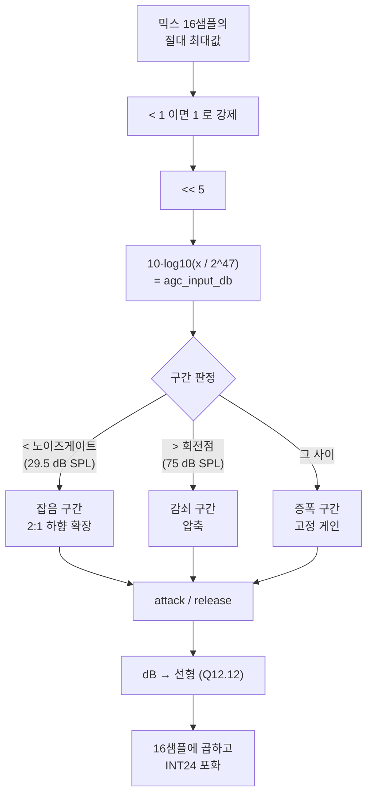

# 04. AGC 동작 상세

**TL;DR**: AGC 는 **음압 29.5 / 75 dB SPL 을 경계로 3구간**(잡음 확장 · 고정 게인 · 압축)으로 동작한다. 볼륨 0~9 가 **3.3 dB 씩** 게인을 올리면서 동시에 압축을 강하게 하고, **10개 곡선이 120 dB SPL 에서 한 점으로 모여 볼륨 효과가 0 이 된다.** 게인은 **1.1 ms 만에 줄고 100 ms 걸려 돌아온다.**

`src/1__cfx/signalProcessing/agc.c`

## 1. 전체 구조



## 2. 두 경계

| 경계 | 저장값 (Q8.16) | 내부값 | 마이크 코드 | dBFS | **dB SPL** | 소스 주석 |
|---|---|---|---|---|---|---|
| **노이즈 게이트** | `-7700296` | −117.4972 | **250** | −90.50 | **29.50** | *"29.5dB SPL"* |
| **회전점** | `-6209352` | −94.7472 | **47,173** | −45.00 | **75.00** | *"75dB SPL"* |

> [!IMPORTANT]
> **저장값에서 역산한 값이 주석과 소수점 둘째 자리까지 맞는다.** 이 대응은 다시 의심할 필요가 없다.
>
> 역산 절차: `내부값 = 저장값 / 65536` → `코드 = 10^(내부값/10) × 2^47` → `dBFS = 20·log10(코드/8388607)` → `SPL = dBFS + 120`.

**두 경계는 볼륨과 무관하게 고정**이다(배열이 아니라 단일 값). 볼륨은 게인 곡선의 모양만 바꾼다.

## 3. 세 구간의 수식

기호: `in` = `agc_input_db`(내부 10log10 눈금), `v` = `m_audio_volume`(0~9).

### 3.1 잡음 구간 (`in` < 노이즈 게이트, 즉 29.5 dB SPL 미만)

```c
// agc.c:203~206
long_acc = ((noise_slope × in) >> 20) + noise_ybias[v] − in_Q12_12;
```

```
게인 = (noise_slope − 1) × in + noise_ybias[v]
     = 1.0 × in + noise_ybias[v]           (noise_slope = 2.0)
출력 = in + 게인 = 2 × in + noise_ybias[v]
```

**출력 기울기 2 → 2:1 하향 확장(downward expansion).** 입력이 1 dB 내려가면 출력은 2 dB 내려간다.

| `v` | `noise_ybias` (Q12.12) | 실제값 | 게이트에서의 게인 |
|---|---|---|---|
| 0 | 481,268 | 117.4972 | **0 dB** |
| 1 | 488,027 | 119.1473 | 3.30 dB |
| … | (6,758.6 씩 증가) | (1.65 씩) | (3.3 dB 씩) |
| 9 | 542,096 | 132.3478 | 29.70 dB |

**게이트 지점에서 게인이 증폭 구간과 정확히 이어진다** (v=0 이면 −117.4972 + 117.4972 = 0).

**목적**: 마이크 자체 잡음을 증폭하지 않는다. 게이트 아래로 내려갈수록 더 강하게 눌러 «쉬-» 소리를 죽인다.

### 3.2 증폭 구간 (게이트 ~ 회전점, 29.5 ~ 75 dB SPL)

```c
// agc.c:251~252
long_acc = (in + amplify_ybias[v]) − in;
```

```
게인 = amplify_ybias[v]      (입력과 무관한 상수)
출력 = in + amplify_ybias[v]  → 기울기 1 (선형)
```

**이 구간에서는 압축이 없다.** 원음의 크기 비율이 그대로 보존된다. **볼륨이 곧 게인**이다.

### 3.3 감쇠 구간 (회전점 초과, 75 dB SPL 초과)

```c
// agc.c:229~231
long_acc = ((atten_slope[v] × in) >> 16) + atten_ybias[v] − in;
```

```
게인 = (atten_slope[v] − 1) × in + atten_ybias[v]
출력 = atten_slope[v] × in + atten_ybias[v]   → 기울기 = slope < 1
압축비 = 1 / atten_slope[v]
```

**입력이 1 dB 올라도 출력은 `slope` dB 만 오른다.**

## 4. 볼륨 10단계 전개

| `v` | 증폭 구간 게인 | `atten_slope` | **압축비** | `atten_ybias` (실제) | 120 dB SPL 출력 |
|---:|---:|---:|---:|---:|---:|
| 0 | **0.00 dB** | 0.73241 | **1.37 : 1** | −25.3529 | −78.267 |
| 1 | 3.30 dB | 0.65909 | 1.52 : 1 | −30.6513 | −78.267 |
| 2 | 6.60 dB | 0.58574 | 1.71 : 1 | −35.9496 | −78.268 |
| 3 | 9.90 dB | 0.51241 | 1.95 : 1 | −41.2480 | −78.268 |
| 4 | 13.20 dB | 0.43907 | 2.28 : 1 | −46.5463 | −78.267 |
| 5 | 16.50 dB | 0.36573 | 2.73 : 1 | −51.8447 | −78.267 |
| 6 | 19.80 dB | 0.29240 | 3.42 : 1 | −57.1430 | −78.267 |
| 7 | 23.10 dB | 0.21906 | 4.57 : 1 | −62.4414 | −78.268 |
| 8 | 26.40 dB | 0.14572 | 6.86 : 1 | −67.7397 | −78.268 |
| 9 | **29.70 dB** | 0.07239 | **13.81 : 1** | −73.0380 | −78.268 |

**볼륨 1칸 = 3.3 dB.** 전체 범위 **0 ~ 29.7 dB**.

> [!IMPORTANT]
> **맨 오른쪽 열을 보라 — 10개 볼륨의 120 dB SPL 출력이 전부 −78.267 로 같다.**
>
> **모든 볼륨 곡선이 최대 입력에서 한 점으로 모인다.** 즉 **아주 큰 소리에서는 볼륨을 아무리 올려도 출력이 똑같다.** 설계 의도로 보인다 — 출력 상한을 볼륨과 무관하게 고정한다.
>
> 그 결과가 [06](06_게인%20상호작용과%20역전%20현상.md) §2 의 «볼륨 효과 소멸» 이다.

### 4.1 곡선이 이어지는지 확인

경계에서 양쪽 식이 같은 값을 주어야 한다. 계산으로 확인했다.

| `v` | 회전점에서 증폭식 | 회전점에서 감쇠식 | 일치 |
|---|---|---|---|
| 0 | 0.00 dB | 0.00 dB | ✓ |
| 1 | 3.30 dB | 3.30 dB | ✓ |
| 9 | 29.70 dB | 29.70 dB | ✓ |

게이트에서도 잡음식과 증폭식이 일치한다. **불연속 없음.**

### 4.2 감쇠 구간 `ybias` 주석이 틀렸다

> [!CAUTION]
> `agc.c:10~21` `m_attenuation_region_ybias_db_Q8_16[]` 의 **주석 숫자가 저장값과 다르다.**
>
> | 인덱스 | 저장값 | **실제 (÷65536)** | 주석 | 차이 |
> |---|---|---|---|---|
> | 0 | `-1661530` | **−25.3529** | −23.4197 | 1.93 |
> | 1 | `-2008762` | **−30.6513** | −28.1882 | 2.46 |
> | 9 | `-4786621` | **−73.0380** | −66.3363 | 6.70 |
>
> **저장값이 맞고 주석이 낡았다.** 실제 값을 쓰면 §4.1 처럼 곡선이 정확히 이어지지만 주석 값을 쓰면 어긋난다. **동작에는 문제가 없다.**
>
> 다른 세 배열(`amplify_region_ybias` · `noise_region_ybias` · `attenuation_region_slope`)의 주석은 **전부 정확하다.** 이 하나만 틀렸다.

## 5. 입력 음압별 실제 게인과 출력

믹스 도메인 출력값. 괄호는 24비트 풀스케일 대비 dBFS 상당.

| 입력 dB SPL | **볼륨 0** 게인 → 출력 | **볼륨 9** 게인 → 출력 |
|---|---|---|
| 30 | 0.00 dB → 8 (−120.1 dBFS) | +29.70 dB → 253 (−90.4) |
| 50 | 0.00 dB → 83 (−100.1) | +29.70 dB → 2,533 (−70.4) |
| 60 | 0.00 dB → 262 (−90.1) | +29.70 dB → 8,009 (−60.4) |
| **75** (회전점) | 0.00 dB → 1,474 (−75.1) | +29.70 dB → 45,040 (−45.4) |
| 90 | **−4.01 dB** → 5,223 (−64.1) | +15.79 dB → 51,038 (−44.3) |
| 100 | **−6.69 dB** → 12,137 (−56.8) | +6.51 dB → 55,474 (−43.6) |
| 110 | **−9.36 dB** → 28,205 (−49.5) | **−2.77 dB** → 60,295 (−42.9) |
| **120** | **−12.04 dB** → 65,544 (−42.1) | **−12.04 dB** → 65,535 (−42.1) |

> [!IMPORTANT]
> **AGC 출력 상한은 믹스 코드 약 65,535 (−42.1 dBFS 상당)** 이고 **볼륨과 무관**하다.
>
> 볼륨 9 에서도 90 dB SPL 이상에서는 게인이 이미 15.8 dB 로 떨어지고, 110 dB SPL 에서는 **음수(−2.77 dB)** 가 된다. **큰 소리에서는 볼륨 9 도 감쇠기로 동작한다.**

## 6. attack / release

```c
// agc.c:125
if (m_prev_agc_10db_gain <= current_agc_10db_gain)   // 게인을 올려야 함
    → release 경로, coeff = 0.01
else                                                  // 게인을 내려야 함
    → attack 경로, coeff = 0.95
```

**1차 IIR 평활**: `new = coeff × target + (1 − coeff) × prev`

| 동작 | 계수 | 시정수 | 63 % 도달 | 정착 (5τ) |
|---|---|---|---|---|
| **attack** (게인 **감소**) | 0.95 | 1.05 블록 | **약 1.1 ms** | **약 5 ms** |
| **release** (게인 **증가**) | 0.01 | 100 블록 | **약 100 ms** | **약 500 ms** |

블록 = 16 샘플 @ 16 kHz = **1 ms**.

> [!IMPORTANT]
> **게인은 빨리 줄고 천천히 돌아온다.** 압축기의 정석이다 — 갑작스러운 큰 소리에 즉시 대응하고, 조용해져도 급하게 게인을 올려 «펌핑» 이 생기지 않게 한다.
>
> **부작용**: 큰 소리 한 번에 게인이 떨어지면 **약 0.5초 동안 소리가 작게 들린다.** 손뼉·문 닫는 소리 뒤에 대화가 잠깐 묻히는 현상이 이것이다. → [06](06_게인%20상호작용과%20역전%20현상.md) §4.2

### 6.1 dB 도메인에서 평활한다

attack/release 가 **선형 게인이 아니라 dB 값에 걸린다**(`agc.c:278`). dB 도메인 평활은 **지수적 감쇠**를 만들어 청감상 자연스럽다. 선형 도메인에서 하면 큰 게인 변화가 왜곡되어 들린다.

## 7. 출력 적용

```c
// agc.c:318~335
gained_value = ((long) agc_gain_linear) * p_mix[i];   // Q12.12 × Q24.0 = Q36.12
gained_value = gained_value >> 12;                     // Q36.0
// INT24 포화
p_agc_output[i] = (int) gained_value;
```

**AGC 출력은 믹스 도메인(÷32)에 머문다.** 마이크 눈금으로 되돌리지 않는다. 소비처는 둘이다.

| 소비처 | 위치 |
|---|---|
| FFT / 주파수 분석 | `FrequencyAnalysis.c:34` |
| DAC1 루프백 (디버깅) | `main.c:531` `lib_loopback_AGC_out()` |

## 8. 그 밖의 상수

| 상수 | 값 | 용도 |
|---|---|---|
| `m_mathlib_gain_db_Q8_16` | 1,972,830 (=30.103) | 로그 라이브러리 정규화. **빼고 나중에 ×1024 로 복원** — 순 배율 0 |
| `m_mathlib_gain_linear_Q12_12` | 4,194,304 (=1024.0) | 위의 복원 계수 |
| `df_maxAudioForLogarithm` | 21,892 (≈ 98.4 dB SPL) | **정의만 있고 쓰는 곳이 없다 (죽은 상수)** |

> [!NOTE]
> `m_mathlib_gain_*` 쌍은 **서로 상쇄**된다. `agc.c:279` 에서 dB 에서 30.103 을 빼고, `:289` 에서 선형값에 1024 를 곱한다. `10·log10(1024) = 30.103` 이므로 순 효과는 0 이다. 로그/지수 라이브러리의 입력 범위를 맞추려는 장치일 뿐이다.
