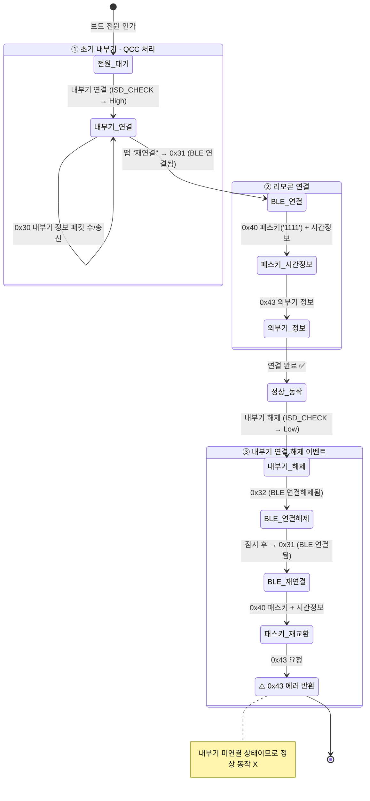

# 리모콘 연결 상태 다이어그램

> [!NOTE]
> **TL;DR** — 보드 전원 인가 → 내부기(ISD) 연결 → 리모콘 앱 BLE 연결 → 정상 동작 → 내부기 해제 이벤트까지를 **상태 전이**로 표현. 시스템이 머무는 상태는 노드, 패킷(0x30·0x31·0x32·0x40·0x43)·`ISD_CHECK` 신호 변화는 전이로 표기. 원본: [`리모콘 연결 테스트.md`](리모콘%20연결%20테스트.md).

## 상태 다이어그램

## 상태 설명

| 상태 | 의미 |
|---|---|
| **전원_대기** | 보드 전원 인가 직후, 내부기 미연결 |
| **내부기_연결** | `ISD_CHECK` High. `0x30`으로 내부기 정보 패킷 교환 |
| **BLE_연결** | 앱 "재연결" 트리거 → `0x31`로 BLE 링크 수립 |
| **패스키_시간정보** | `0x40` 교환. 패스키는 더미 `'1111'`, 실제 목적은 **시간 정보 획득** |
| **외부기_정보** | `0x43`으로 외부기 정보 교환 |
| **정상_동작** | 내부기 + 리모콘 모두 연결된 정상 상태 |
| **내부기_해제 → 연결_오류** | `ISD_CHECK` Low. BLE는 재연결되나, 내부기 미연결로 `0x43`이 **에러 반환** |

## 패킷 범례

| 패킷 | 의미 | 비고 |
|---|---|---|
| `0x30` | 내부기 정보 패킷 | 내부기 연결 직후 정보 교환 |
| `0x31` | BLE 연결됨 | 리모콘 앱 ↔ 외부기 BLE 링크 수립 |
| `0x32` | BLE 연결 해제됨 | 내부기 해제 시 외부기가 통지 |
| `0x40` | 패스키 + 시간정보 | 패스키 더미 `'1','1','1','1'` (무의미). 기존 절차 유지 + **시간 정보 획득**이 실제 목적 |
| `0x43` | 외부기 정보 | 내부기 미연결 상태에서는 **에러 반환** |

> [!IMPORTANT]
> 마지막 분기(`내부기_해제` → `연결_오류`)가 정상/비정상 동작의 경계입니다. 내부기 해제 후 BLE 자동 재연결(`0x31`/`0x40`)은 정상 수행되지만, 내부기가 연결되지 않은 상태에서의 `0x43`은 에러로 응답됩니다.
